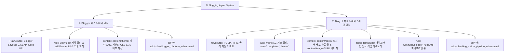

# [AI Blogging Agent 통합 지침 및 시스템 스키마] (AGENTS.md)

본 문서는 AI Blogging Agent가 본 프로젝트에서 블로그 시스템을 운용할 때 준수해야 하는 **최상위 진입점**입니다. 규칙의 단일 진실 출처(SSOT)는 각 `wiki/rules/*.md` 문서이며, 본 문서는 그 인덱스와 핵심 요약만 유지합니다 — 전문을 확인하려면 아래 백링크를 따라가세요.

---

## 1. 2대 시스템 영역 구성 지도 (System Architecture Schema)

**영역별 SSOT 문서 백링크**:
- 1. Blogger 배포 & 테마 영역 → [`wiki/rules/blogger_platform_schema.md`](wiki/rules/blogger_platform_schema.md)
- 2. Blog 글 작성 & 파이프라인 영역 → [`wiki/rules/blog_article_pipeline_schema.md`](wiki/rules/blog_article_pipeline_schema.md)
- 파이프라인 공통 운영 규칙(승인 게이트/라이프사이클) → [`wiki/rules/blogger_rules.md`](wiki/rules/blogger_rules.md)
- 콘텐츠 작성 규칙 → [`wiki/Blog_Writing_Rules.md`](wiki/Blog_Writing_Rules.md)
- 테마 트러블슈팅 지식 → [`wiki/theme/blogger_layout_thema_widget.md`](wiki/theme/blogger_layout_thema_widget.md)

---

## 2. 관리자 컨펌 & 배포 선택 — 절대 불가침 수칙 🛑

전문은 [`wiki/rules/blogger_rules.md` §1](wiki/rules/blogger_rules.md)이 SSOT입니다. 요약:

1. **관리자 컨펌 본문 절대 불가침**: 관리자가 승인한 `final.md` 본문(코드·다이어그램 포함)은 AI가 임의로 축약·수정·삭제·재작성할 수 없다. 검증 오류는 컨펌 본문이 아니라 `src/` 소스 코드나 게이트 검증 로직 쪽을 고쳐서 해결한다.
2. **post 이관 시 배포 방식 재질의**: "승인/배포/post로 옮겨라" 지시를 받아도 단독 판단하지 않고, **Blogger / Naver / Manual(수동)** 중 지정 방식을 반드시 다시 물어본 뒤 진행한다.

---

## 3. Agent 필수 절대 수칙 (요약 — 전문은 각 백링크 참고)

1. **관리자 컨펌 내용 변경 절대 금지** — [`blogger_rules.md` §1](wiki/rules/blogger_rules.md)
2. **일회성 스크립트 절대 금지**: 오직 **`python main.py` 정식 오케스트레이터 파이프라인**만 구동한다 — [`blog_article_pipeline_schema.md` guardrails.no_one_off_scripts](wiki/rules/blog_article_pipeline_schema.md)
3. **6단계 라이프사이클 100% 이행**: `created → researched → drafted → fact_checked → 🛑[관리자 리뷰/승인] → approved → published (플랫폼 선택 후 배포 & content/posts/ 이관)` — [`blogger_rules.md` §2](wiki/rules/blogger_rules.md)
4. **`temp/runs/${run_id}/final.md` 100% 필수 보관**: 파이프라인 구동 시 로컬 검증 원본을 타임스탬프 실행 폴더에 의무적으로 보관한다 — [`blog_article_pipeline_schema.md` steps.new_run](wiki/rules/blog_article_pipeline_schema.md)
5. **Hyperlink 자동화 & Complete Code**: 본문 내 모든 URL은 클릭 가능한 하이퍼링크 `[명칭](URL)`로 작성하며, 소스코드는 줄임표(`...`) 없는 `main()` 포함 Complete Runnable Code로 제공한다.
6. **Blogger XML SAXParseException 예방 & 위키 지식 누적 의무**: Blogger 테마 XML 내의 `&` 문자는 100% `&amp;&amp;` 이스케이프 또는 CDATA 처리하며, 트러블슈팅 경험 및 구글 특화 위젯/가젯 개편 지식은 발생 즉시 위키에 지속 기록 누적한다 — [`blogger_rules.md` §3](wiki/rules/blogger_rules.md), [`blogger_platform_schema.md` §1.2](wiki/rules/blogger_platform_schema.md)
7. **차별화 없는 신규 글 작성 금지**: Google이 "가치 없음"으로 판정하는 대량생산·검색엔진-우선 콘텐츠 패턴(동일 템플릿 반복, 이미 포화된 주제 재서술)을 피하기 위해, 새 글은 반드시 `## 차별화 포인트`(상위 검색결과 대비 부가가치)를 먼저 명시하고 실제 라이브 URL로 내부링크를 연결한다 — [`Blog_Writing_Rules.md` 14/15번 수칙](wiki/Blog_Writing_Rules.md)

---

## 4. `wiki/` vs `report/` — 지식 관리와 관리자 보고의 분리 (2026-08-22 추가)

- **`wiki/`**: Agent가 관리하는 지식 저장소. 세션 이력, 규칙, 스킬 관련 데이터의 유지관리·lint를 여기서
  수행한다(전문/근거/코드 대조 자료 — 상세하고 길어도 됨). SSOT는 여전히 `wiki/rules/*.md`.
- **`report/`**: 관리자가 결단을 내려야 하는 사안을 **keyword + diagram** 위주로 압축해 보여주는 보고
  경로. 산문 설명 대신 스캔하기 쉬운 스키마로 작성하고, `wiki/` 쪽 전문 문서를 백링크한다. 관리자가
  수정 지시를 내릴 때 이 파일의 항목(`id` 등)을 지목하는 기준점이 된다.
- 예: 글 작성 파이프라인 전체 현황 → [`report/blog-article-pipeline.md`](report/blog-article-pipeline.md)
  (전문은 [`wiki/rules/blog_article_pipeline_schema.md`](wiki/rules/blog_article_pipeline_schema.md)).

## 5. 세션 핸드오프 위치 — `wiki/Session_Handoff.md` (2026-08-26 이전됨)

큐레이션된 최신 작업 상태(진행 상황, 남은 작업, 다음 에이전트를 위한 메모)의 SSOT는
[`wiki/Session_Handoff.md`](wiki/Session_Handoff.md)다. `.agent/session-handoff.md`는 이 파일을
가리키는 리다이렉트 스텁만 남아있다(다른 AI 툴의 고정 경로 관행 호환용) — 실제 읽기/쓰기는
`wiki/Session_Handoff.md`에서 할 것. `wiki/Session_Index.md`(세션 원본 아카이브 인덱스)와는 별개
문서다.
