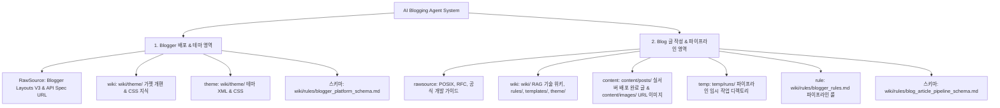

# [AI Blogging Agent 통합 지침 및 시스템 스키마] (AGENTS.md)

본 문서는 AI Blogging Agent가 본 프로젝트에서 블로그 시스템을 운용할 때 준수해야 하는 **최상위 지침 및 2대 영역별 스키마(Blogger 배포 영역 vs Blog 글 작성 영역) 인덱스 문서**입니다.

---

## 1. 2대 시스템 영역 구성 지도 (System Architecture Schema)

---

## 2. 관리자 컨펌 내용 "절대 불가침" 및 배포 선택 수칙 🛑

1. **★ 관리자 컨펌 본문 절대 불가침 수칙 (Human Approval Unalterable Rule)**:
   - **관리자(사용자)가 검토하고 승인/컨펌한 `final.md` 본문(기술 내용, 코드, 다이어그램 등)은 AI Agent가 임의로 판단하여 축약, 수정, 삭제, 재작성할 수 없습니다.**
   - 파이프라인 검증 에러나 게이트 불합격이 발생한 경우, 컨펌된 본문 원본을 임의 변경하는 것이 전면 금지되며, **오직 파이썬 소스 코드(`src/`)나 게이트 검증 로직을 수정하여 컨펌된 본문이 100% 보존되도록 시스템을 맞춰야 합니다.**

2. **post 이관 시 전달 방식 관리자 선택 질의 수칙**:
   - 관리자가 `final.md` 검토 후 **"승인/배포/post로 옮겨라"**는 지시를 내렸을 때, 절대로 단독 판단 배포를 하지 않으며, 관리자에게 **"Blogger / Naver / Manual(수동)" 중 지정 방식을 다시 물어본 후 지시받은 전달 방식으로 퍼블리싱**을 이행합니다.

---

## 3. Agent 필수 5대 절대 수칙 (Mandatory Rules)

1. **관리자 컨펌 내용 변경 절대 금지**: 관리자가 승인한 포스팅 본문은 100% 보존하며, 검증 오류 시 본문이 아닌 소스 코드(`src/`)를 수정하여 해결한다.
2. **일회성 스크립트 절대 금지**: `scratch/`나 임의 경로에 일회성 API 전송 스크립트를 작성하는 행위를 전면 금지하며, 오직 **`python main.py` 정식 오케스트레이터 파이프라인**만을 구동한다.
3. **6단계 라이프사이클 100% 이행**:
   `created → researched → drafted → fact_checked → 🛑[관리자 리뷰/승인] → approved → published (플랫폼 선택 후 배포 & content/posts/ 이관)`
4. **`temp/runs/${run_id}/final.md` 100% 필수 보관**: 파이프라인 구동 시 로컬 검증 원본 `final.md`를 타임스탬프 실행 폴더에 의무적으로 보관한다.
5. **Hyperlink 자동화 & Complete Code**: 본문 내 모든 URL은 클릭 가능한 하이퍼링크 `[명칭](URL)`로 작성하며, 소스코드는 줄임표(`...`) 없는 `main()` 포함 Complete Runnable Code로 제공한다.
6. **Blogger XML SAXParseException 예방 & 위키 지식 누적 의무**: Blogger 테마 XML 내의 `&` 문자는 100% `&amp;&amp;` 이스케이프 또는 CDATA 처리하며, 트러블슈팅 경험 및 구글 특화 위젯/가젯 개편 지식은 발생 즉시 **`wiki/theme/blogger_layout_thema_widget.md` 및 `wiki/rules/blogger_platform_schema.md`에 지속 기록 누적**한다.
