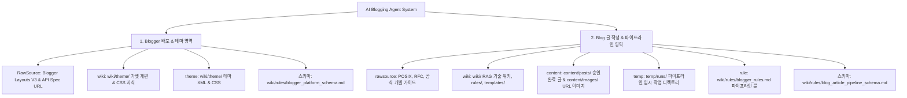

# [AI Blogging Agent 통합 지침 및 시스템 스키마] (Agent.md)

본 문서는 AI Blogging Agent가 본 프로젝트에서 블로그 시스템을 운용할 때 준수해야 하는 **최상위 지침 및 2대 영역별 스키마(Blogger 배포 영역 vs Blog 글 작성 영역) 인덱스 문서**입니다.

---

## 1. 2대 시스템 영역 구성 지도 (System Architecture Schema)

---

## 2. [영역 1] Blogger 배포를 위한 룰 및 구조

구글 Blogger 테마, 가젯, 글 배포를 검토하고 외부 플랫폼(Naver, Tistory 등)으로의 확장을 대비한 표준 구조입니다.

- **상세 스키마 파일**: [`wiki/rules/blogger_platform_schema.md`](file:///d:/coding-project/2026-project/ai-blogging/wiki/rules/blogger_platform_schema.md)

| 구성 요소 | 설명 및 관련 자산 파일 |
| :--- | :--- |
| **RawSource** | **참고 URL & 공식 규격**: [Blogger Layouts V3 Guide](https://developers.google.com/blogger/docs/3.0/reference), [Blogger REST API v3](https://developers.google.com/blogger/docs/3.0/getting_started) |
| **wiki** | **개편 & 테스트 지식**: [`wiki/theme/blogger_layout_thema_widget.md`](file:///d:/coding-project/2026-project/ai-blogging/wiki/theme/blogger_layout_thema_widget.md) |
| **theme** | **테마 템플릿 자산**: [`wiki/theme/blogger_site_theme.xml`](file:///d:/coding-project/2026-project/ai-blogging/wiki/theme/blogger_site_theme.xml), [`wiki/theme/blogger_post_style.css`](file:///d:/coding-project/2026-project/ai-blogging/wiki/theme/blogger_post_style.css) |
| **스키마 (Schema)** | **플랫폼 확장 인덱스**: [`wiki/rules/blogger_platform_schema.md`](file:///d:/coding-project/2026-project/ai-blogging/wiki/rules/blogger_platform_schema.md) |

---

## 3. [영역 2] Blog 글 작성을 위한 룰 및 파이프라인 구조

- **상세 스키마 파일**: [`wiki/rules/blog_article_pipeline_schema.md`](file:///d:/coding-project/2026-project/ai-blogging/wiki/rules/blog_article_pipeline_schema.md)

| 구성 요소 | 설명 및 관련 자산 파일 |
| :--- | :--- |
| **rawsource** | **원천 레퍼런스**: POSIX 표준, RFC 규격 (RFC 9114/9000), Linux Kernel Docs, 공식 프레임워크 가이드 |
| **wiki** | **에이전트 RAG 지식 & 룰/템플릿/테마**: [`wiki/`](file:///d:/coding-project/2026-project/ai-blogging/wiki/) 디렉터리, [`wiki/rules/`](file:///d:/coding-project/2026-project/ai-blogging/wiki/rules/), [`wiki/templates/`](file:///d:/coding-project/2026-project/ai-blogging/wiki/templates/), [`wiki/theme/`](file:///d:/coding-project/2026-project/ai-blogging/wiki/theme/) |
| **content** | **승인완료 글 & 이미지 자산**: `content/posts/` (최종 승인/배포 글 원본), `content/images/` (URL 연결 이미지 자산) |
| **temp** | **임시 작업 공간**: `temp/runs/${run_id}/final.md` (파이프라인 구동 시 관리자 검토용 로컬 원본 보관) |
| **rule** | **사용자 제약 룰**: [`wiki/rules/blogger_rules.md`](file:///d:/coding-project/2026-project/ai-blogging/wiki/rules/blogger_rules.md) 1. 일회성 스크립트 전면 금지 (`python main.py` 정식 오케스트레이터 필수) 2. 6단계 라이프사이클: `created → researched → drafted → fact_checked → 🛑[관리자 명시적 승인] → approved → published` 3. `temp/runs/${run_id}/final.md` 로컬 검토 원본 100% 필수 생성 4. 배포 시 내부 검증 메모 (`## 사실 검증 결과` 표 등) 자동 Sanitization 전면 제거 및 `content/posts/`로 자동 이관 |
| **스키마 (Schema)** | **파이프라인 인덱스**: [`wiki/rules/blog_article_pipeline_schema.md`](file:///d:/coding-project/2026-project/ai-blogging/wiki/rules/blog_article_pipeline_schema.md) |
