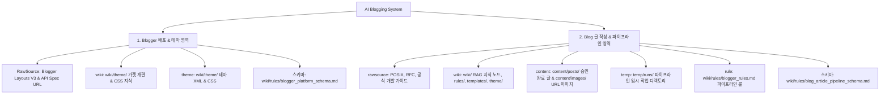

# AI Blogging System (AI 기반 자동화 블로그 파이프라인)

본 프로젝트는 기술 포스팅의 수집, 작성, 팩트체크, 승인 및 Blogger 배포까지의 과정을 완전 자동화하고, 단일 규칙과 스키마를 통해 관리하는 **AI 기반 엔지니어링 블로그 파이프라인 프로젝트**입니다.

---

## 🏗️ 2대 시스템 영역 아키텍처 (System Architecture)

본 시스템은 **① Blogger 배포 & 테마 영역**과 **② Blog 글 작성 & 파이프라인 영역** 2개 축으로 분리되어 관리됩니다:



---

## 📂 파일 및 디렉터리 경로 구조 (Directory Structure)

```text
ai-blogging/
├── AGENTS.md               # [최상위 지침] 2대 영역 스키마 및 AI Agent 필수 5대 수칙
├── README.md               # [프로젝트 가이드] 2대 구조 및 파이프라인 실행법
├── wiki/                   # ★ [AI Agent RAG 지식 & 룰/템플릿/테마 통합 저장소]
│   ├── rules/              # [1. 규칙 & 스키마 응집 폴더]
│   │   ├── blogger_rules.md                  # [통합 규칙] 단일 진실 출처 파이프라인 룰
│   │   ├── blogger_platform_schema.md        # [영역 1 스키마] Blogger 배포 및 테마 확장 인덱스
│   │   └── blog_article_pipeline_schema.md   # [영역 2 스키마] Blog 글 작성 파이프라인 인덱스
│   ├── templates/          # [2. 마크다운 글 생성 템플릿] article.md
│   ├── theme/              # [3. 웹 퍼블리싱 사이트 테마] blogger_site_theme.xml, post_style.css
│   ├── Blog_Writing_Rules.md  # 에이전트 필독 작성 룰 위키 노드
│   ├── Blog_Post_Template.md  # 에이전트 필독 표준 템플릿 위키 노드
│   └── README.md           # RAG 지식 위키 가이드
├── content/                # [글 자산 디렉토리]
│   ├── posts/              # ★ 최종 검토/승인 및 배포 완료된 포스팅 마크다운 이관 보관소
│   └── images/             # 배포 시 URL 링크로 연결되는 완성형 이미지 저장소
├── temp/                   # [임시 보관 디렉토리] runs/${run_id}/ (타임스탬프별 final.md 보관)
└── src/                    # [파이프라인 소스 모듈] publish_gate.json, main.py 오케스트레이터
```

---

## 🚀 빠른 시작 (Quick Start)

### 1. 신규 포스팅 작성 파이프라인 구동
```bash
python main.py --topic "주제명" --category "카테고리명"
```
* `fact_checked` 단계 완출 후 `temp/runs/${run_id}/final.md` 생성 ➔ 관리자 검토 요청 대기

### 2. 관리자 리뷰 후 배포 승인 (Human Approval)
```bash
# 관리자 검토 완료 후 명시적 승인 지시 시 실행
python main.py approve --run-id ${run_id}
```
