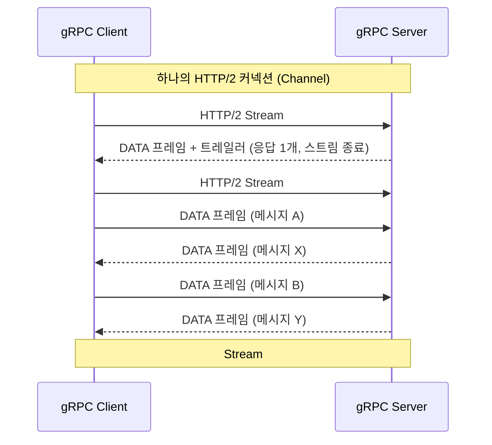

# gRPC와 Protocol Buffers: HTTP/2 기반 스트리밍과 직렬화 원리

## 요약

REST + JSON 조합은 여전히 대다수 공개 API의 표준이지만, 마이크로서비스 내부 통신처럼 지연 시간과 처리량이 중요한 구간에서는 gRPC가 널리 쓰입니다. gRPC의 성능 이점은 두 가지 축에서 나옵니다 — Protocol Buffers(Protobuf)의 컴팩트한 바이너리 직렬화, 그리고 HTTP/2 위에서 동작하는 4가지 RPC 스트리밍 모드입니다. 이 글은 [HTTP/1.1 vs HTTP/2 vs HTTP/3](https://beji-tech.blogspot.com/2026/08/http11-vs-http2-vs-http3.html) 글에서 다룬 HTTP/2 자체의 원리는 짧게만 전제하고, Protobuf의 와이어 포맷(varint, 필드 태그 인코딩)과 gRPC의 unary/server-streaming/client-streaming/bidirectional-streaming이 HTTP/2 스트림·프레임 위에서 구체적으로 어떻게 매핑되는지에 집중합니다.

## 차별화 포인트

<!-- 내부 전용 섹션, 라이브 배포 시 자동 제거됨 -->

"gRPC는 바이너리라서 빠르다"는 단순화된 통념을 Protobuf의 varint/태그 인코딩 공식(`(field_number << 3) | wire_type`)과 gRPC 공식 블로그의 Channel/RPC/Message 3계층 모델을 근거로 분해해, 실제 성능 이점이 "바이너리 직렬화"와 "HTTP/2 멀티플렉싱"이라는 두 개의 독립적 요인이 결합된 결과임을 논증한다. 4가지 RPC 타입이 HTTP/2 스트림·DATA 프레임 위에 구체적으로 어떻게 매핑되는지를 시퀀스 다이어그램으로 보여주는 점도, 대부분의 "gRPC vs REST" 비교글이 다루지 않는 부분이다.

## 본문

### 1. 왜 JSON 대신 Protobuf인가

REST API에서 흔히 쓰는 JSON은 사람이 읽기 쉬운 텍스트 포맷입니다. `{"userId": 42, "name": "Alice"}`처럼 키와 값을 문자열로 그대로 담기 때문에, 필드 이름 자체가 페이로드에 반복적으로 포함되고 숫자도 텍스트로 표현되어 공간을 낭비합니다. Protocol Buffers는 이 문제를 스키마 기반 바이너리 인코딩으로 해결합니다. `.proto` 파일에 메시지 구조를 먼저 정의하고, 각 필드에 이름 대신 **필드 번호**를 부여합니다.

```protobuf
syntax = "proto3";

message User {
  int32 user_id = 1;
  string name = 2;
  repeated string roles = 3;
}
```

이 스키마를 컴파일하면 각 언어별 직렬화/역직렬화 코드가 자동 생성됩니다. 필드 이름(`user_id`, `name`)은 컴파일 시점에만 쓰이고, 실제 와이어(네트워크로 전송되는 바이트)에는 필드 번호만 실립니다.

### 2. Protobuf 와이어 포맷 — Varint와 태그 인코딩

Protobuf 공식 문서("Encoding")는 와이어 포맷의 핵심을 두 가지로 설명합니다.

**Varint(가변 길이 정수)**: 부호 없는 64비트 정수를 1~10바이트로 인코딩하는 방식입니다. 각 바이트의 최상위 비트(MSB)는 "다음 바이트가 이어지는가"를 나타내는 연속 비트이고, 나머지 7비트가 실제 데이터를 리틀 엔디안 순서로 담습니다. 작은 숫자일수록(예: 0~127) 1바이트로 끝나기 때문에, 실무에서 자주 등장하는 작은 값들을 효율적으로 표현합니다.

**태그(필드 번호 + Wire Type)**: 각 필드는 `(field_number << 3) | wire_type` 공식으로 만들어진 하나의 varint를 태그로 갖습니다. 태그를 디코딩하면 하위 3비트가 Wire Type(값이 뒤에 오는 바이트를 어떻게 해석할지), 나머지 비트가 필드 번호입니다. 대표적인 Wire Type은 정수/불리언용 Varint(0), 8바이트 고정 길이(1), 문자열·바이트열·중첩 메시지용 길이-지정(Length-delimited, 2)입니다.

```protobuf
// User { user_id: 42, name: "Alice" } 를 직렬화하면 대략:
// [태그(user_id=1, Varint)] [42]
// [태그(name=2, Length-delimited)] [길이=5] ["Alice"]
```

이 구조 덕분에, 필드가 비어있으면(기본값이면) 애초에 와이어에 아무것도 쓰지 않아도 되고, 필드 순서도 자유로우며, 새 필드를 추가해도 기존 필드 번호만 유지하면 구버전 파서가 낯선 필드를 안전하게 건너뛸 수 있습니다(전방/후방 호환성).

### 3. gRPC의 4가지 RPC 타입

gRPC 공식 문서("Core concepts, architecture and lifecycle")는 RPC 통신 패턴을 네 가지로 정의합니다.

- **Unary RPC**: 클라이언트가 요청 하나를 보내고 응답 하나를 받는, 일반 함수 호출과 같은 가장 단순한 형태.
- **Server Streaming RPC**: 클라이언트가 요청 하나를 보내면 서버가 메시지 스트림으로 응답. 예: 대용량 조회 결과를 페이지 단위가 아니라 스트림으로 흘려보내기.
- **Client Streaming RPC**: 클라이언트가 메시지 스트림을 보내고, 서버는 (보통 스트림을 다 받은 뒤) 응답 하나를 반환. 예: 대용량 파일 업로드.
- **Bidirectional Streaming RPC**: 클라이언트와 서버가 각자 독립적인 읽기/쓰기 스트림으로 메시지를 자유롭게 주고받음. 예: 실시간 채팅, 양방향 센서 데이터 동기화.

```protobuf
service UserService {
  rpc GetUser(GetUserRequest) returns (User);                       // Unary
  rpc ListUsers(ListUsersRequest) returns (stream User);             // Server streaming
  rpc UploadEvents(stream Event) returns (UploadSummary);            // Client streaming
  rpc Chat(stream ChatMessage) returns (stream ChatMessage);         // Bidirectional streaming
}
```

### 4. 이 4가지 모드가 HTTP/2 위에서 실제로 어떻게 동작하는가

gRPC 공식 블로그("gRPC on HTTP/2: Engineering a Robust, High-performance Protocol")는 gRPC와 HTTP/2의 관계를 세 계층으로 명확히 정리합니다.

- **채널(Channel)**: 하나 이상의 HTTP/2 연결로 뒷받침되는, 특정 엔드포인트에 대한 가상 연결.
- **RPC**: HTTP/2의 **스트림(Stream)** 하나로 구현됩니다. HTTP/2는 단일 TCP 연결 위에서 여러 스트림을 동시에 다중화(Multiplexing)할 수 있으므로, 여러 개의 gRPC 호출이 커넥션 하나를 공유하면서도 서로 블로킹하지 않습니다.
- **메시지**: HTTP/2의 **DATA 프레임** 위에 계층화되어 전달됩니다. 하나의 DATA 프레임에 여러 gRPC 메시지가 담길 수도 있고, 메시지가 크면 여러 DATA 프레임에 걸쳐 나뉘어 전송될 수도 있습니다.

이 매핑을 4가지 RPC 타입에 대입하면 다음과 같습니다.

- **Unary**: 클라이언트가 HTTP/2 스트림을 하나 열고 요청 메시지를 담은 DATA 프레임을 보낸 뒤, 서버가 응답 메시지를 담은 DATA 프레임과 상태(트레일러)를 보내면 스트림이 종료됩니다.
- **Server streaming**: 같은 스트림 위에서 서버가 여러 개의 DATA 프레임(각각 하나 이상의 메시지)을 순차적으로 흘려보내고, 클라이언트는 스트림이 끝날 때까지 계속 읽습니다.
- **Client streaming / Bidirectional**: HTTP/2 스트림은 원래 클라이언트→서버, 서버→클라이언트 방향의 데이터 흐름이 독립적으로 열려있는(진짜 양방향인) 구조라서, 클라이언트가 계속 메시지를 보내는 동안 서버가 아직 응답을 시작하지 않아도 되고, Bidirectional의 경우 양쪽이 동시에 서로 다른 속도로 메시지를 주고받을 수 있습니다.



핵심은, HTTP/1.1 기반 REST에서는 요청-응답 하나에 커넥션(또는 최소한 하나의 순차 슬롯)이 묶이는 반면, gRPC는 HTTP/2의 멀티플렉싱 덕분에 하나의 커넥션 위에서 수많은 RPC(그리고 그 안의 스트리밍 메시지들)를 동시에 주고받을 수 있다는 점입니다. gRPC 메타데이터(헤더에 해당하는 정보) 역시 HTTP/2 헤더로 구현되어, HPACK 압축의 이점을 그대로 누립니다.

### 5. 언제 gRPC를, 언제 REST+JSON을 쓸까

gRPC가 유리한 상황은 서비스 간(server-to-server) 내부 통신처럼 양쪽 모두 gRPC를 지원하고, 스키마를 미리 공유할 수 있고, 지연 시간·처리량이 중요한 경우입니다. 반대로 REST+JSON이 여전히 유리한 상황은 브라우저에서 직접 호출해야 하는 공개 API(브라우저 네이티브 fetch가 gRPC의 트레일러 기반 프로토콜을 완전히 지원하지 않아 gRPC-Web 같은 별도 프록시 계층이 필요), 사람이 직접 curl로 디버깅해야 하는 API, 스키마 없이 유연한 필드를 주고받아야 하는 경우입니다.

## 사실 검증 결과

| Claim | 판정 | 근거 |
|---|---|---|
| Varint는 부호 없는 64비트 정수를 1~10바이트로 인코딩하며, 각 바이트의 MSB는 연속 비트, 나머지 7비트는 리틀 엔디안 데이터다 | verified | Protocol Buffers 공식 문서 "Encoding" (protobuf.dev/programming-guides/encoding/) 원문 대조 |
| 필드 태그는 `(field_number << 3) \| wire_type` 공식의 varint로 인코딩되며, 하위 3비트가 Wire Type, 나머지가 필드 번호다 | verified | Protocol Buffers 공식 문서 "Encoding" 원문 대조 |
| gRPC는 Unary, Server streaming, Client streaming, Bidirectional streaming 4가지 RPC 타입을 지원한다 | verified | gRPC 공식 문서 "Core concepts, architecture and lifecycle" (grpc.io/docs/what-is-grpc/core-concepts/) 원문 대조 |
| gRPC의 Channel은 하나 이상의 HTTP/2 연결로 뒷받침되며, RPC는 HTTP/2 스트림으로, 메시지는 HTTP/2 DATA 프레임 위에 계층화되어 전달된다 | verified | gRPC 공식 블로그 "gRPC on HTTP/2: Engineering a Robust, High-performance Protocol" (grpc.io/blog/grpc-on-http2/) 원문 대조 |
| HTTP/2 스트림은 단일 TCP 연결 위에서 여러 RPC를 동시에 다중화(Multiplexing)할 수 있게 한다 | verified | gRPC 공식 블로그 "gRPC on HTTP/2" 원문("Streams in HTTP/2 enable multiple concurrent conversations on a single connection") 대조 |

## 작성자의 견해

> 이 섹션은 사실 전달이 아니라 작성자의 해석과 견해를 담고 있습니다.

gRPC를 처음 접하는 실무자가 흔히 갖는 오해는 "gRPC가 빠른 이유는 순전히 바이너리라서"라고 단순화하는 것입니다. 실제로는 두 가지가 결합된 결과입니다. Protobuf의 바이너리 인코딩은 페이로드 크기를 줄여 전송 시간을 줄이고, HTTP/2의 멀티플렉싱은 여러 RPC가 커넥션 하나를 공유하면서도 서로 대기하지 않게 해 연결 수립 오버헤드와 헤드 오브 라인 블로킹을 줄입니다. 이 둘 중 하나만 있어도 REST+JSON 대비 이점은 있지만, 실무에서 체감하는 성능 차이의 상당 부분은 사실 스트리밍 모드 선택에서 나옵니다. 예를 들어 대량의 이벤트를 하나씩 Unary RPC로 보내는 것과, Client Streaming RPC 하나로 묶어 보내는 것은 같은 Protobuf 스키마를 쓰더라도 커넥션·요청 오버헤드 측면에서 크게 다릅니다. 개인적으로는 gRPC를 도입할 때 "어떤 상호작용 패턴인가"(한 번 묻고 한 번 답하는가, 서버가 계속 흘려보내는가, 클라이언트가 계속 보내는가, 둘 다 계속 주고받는가)를 먼저 명확히 정의하고 그에 맞는 RPC 타입을 고르는 설계 단계가, Protobuf 스키마 최적화보다 실무 성능에 더 큰 영향을 준다고 봅니다. 또한 `.proto` 파일이 사실상 서비스 간 계약(contract)이 되기 때문에, 필드 번호를 재사용하거나 삭제된 필드 번호를 다른 용도로 재활용하는 실수는 프로덕션에서 조용히 데이터가 잘못 해석되는 심각한 버그로 이어질 수 있다는 점도 함께 강조하고 싶습니다.

## 한계와 반론

**한계점**: 이 글에서 다룬 스트리밍-HTTP/2 매핑은 gRPC의 공식 설계 원리를 설명한 것이며, 실제 네트워크 환경(프록시, 로드밸런서, 방화벽)에서 HTTP/2 지원이 불완전하면 스트리밍 RPC, 특히 장시간 유지되는 Bidirectional 스트림이 중간 장비에서 예기치 않게 끊기는 문제가 실무에서 흔히 발생합니다. 또한 브라우저에서 직접 gRPC를 호출하려면 브라우저 fetch API의 제약(트레일러 헤더 접근 불가 등) 때문에 gRPC-Web이라는 별도 프로토콜과 프록시가 필요하며, 이는 이 글에서 다루지 않았습니다.

**반론**: "바이너리 포맷이라 사람이 읽을 수 없어 디버깅이 어렵다"는 비판이 흔하지만, `grpcurl`이나 리플렉션(Reflection) API를 활성화하면 스키마 없이도 커맨드라인에서 gRPC 서비스를 사람이 읽을 수 있는 형태로 호출·검사할 수 있어, 실무에서 이 단점은 상당 부분 완화됩니다. 다만 이런 도구를 미리 설정해두지 않으면 초기 디버깅 난이도가 REST+JSON보다 높은 것은 사실입니다.

## 참고문헌

1. Protocol Buffers, "Encoding", [https://protobuf.dev/programming-guides/encoding/](https://protobuf.dev/programming-guides/encoding/) (확인일: 2026-08-19)
2. gRPC, "Core concepts, architecture and lifecycle", [https://grpc.io/docs/what-is-grpc/core-concepts/](https://grpc.io/docs/what-is-grpc/core-concepts/) (확인일: 2026-08-19)
3. gRPC Blog, "gRPC on HTTP/2: Engineering a Robust, High-performance Protocol", [https://grpc.io/blog/grpc-on-http2/](https://grpc.io/blog/grpc-on-http2/) (확인일: 2026-08-19)

## 종합적 의견

> 이 섹션은 전체 주제에 대한 종합적 분석과 개인 견해를 담고 있습니다.

gRPC와 Protobuf는 개별 기술이 아니라 "스키마 기반 계약 + 효율적 직렬화 + 다중화 가능한 전송"이라는 하나의 설계 철학이 세 계층(인터페이스 정의, 데이터 포맷, 전송 프로토콜)에 걸쳐 일관되게 적용된 결과로 이해하는 것이 정확합니다. `.proto` 파일이 서비스 계약을 코드로 명시하고, 그 계약에서 파생된 필드 번호가 와이어 포맷의 태그가 되며, 그 메시지들이 HTTP/2 스트림 위에서 원하는 상호작용 패턴(단발성, 단방향 스트림, 양방향 스트림)에 맞춰 전달됩니다. REST+JSON과 gRPC 중 무엇을 쓸지는 "더 빠른 기술을 쓴다"는 접근보다, 통신 상대가 누구인지(브라우저인지 내부 서비스인지), 상호작용 패턴이 무엇인지, 스키마를 미리 공유할 수 있는 환경인지를 먼저 따져보고 결정하는 것이 실무적으로 더 안전한 접근입니다. 마이크로서비스 아키텍처가 보편화되면서 서비스 간 내부 통신에서 gRPC의 채택이 늘고 있지만, 외부에 공개하는 API 게이트웨이 레벨에서는 여전히 REST+JSON이나 gRPC-Web 같은 브릿지 계층을 함께 쓰는 하이브리드 구성이 흔합니다.

## 꼬리질문

1. **gRPC-Web은 브라우저의 HTTP/2 트레일러 접근 제약을 구체적으로 어떻게 우회하며, 일반 gRPC와 비교했을 때 어떤 기능(예: Client Streaming)이 제한되는가?**
   - 추천 참고 URL: https://grpc.io/docs/what-is-grpc/core-concepts/
2. **Protobuf에서 필드 번호를 삭제하거나 재사용할 때 발생하는 하위 호환성 문제를 방지하기 위한 `reserved` 키워드는 실제로 어떻게 동작하는가?**
   - 추천 참고 URL: https://protobuf.dev/programming-guides/encoding/
3. **HTTP/2를 지원하지 않는 구형 프록시/로드밸런서 환경에서 gRPC를 운영하려면 실무적으로 어떤 우회 전략(예: Envoy 같은 gRPC-aware 프록시 도입)이 쓰이는가?**
   - 추천 참고 URL: https://grpc.io/blog/grpc-on-http2/

## 백링크

- [HTTP/1.1 vs HTTP/2 vs HTTP/3: 프로토콜 발전사로 보는 웹 성능 최적화 원리](https://beji-tech.blogspot.com/2026/08/http11-vs-http2-vs-http3.html)
- [Spring WebFlux / Project Reactor 스레드 모델과 Schedulers 비동기 트러블슈팅](https://beji-tech.blogspot.com/2026/08/spring-webflux-project-reactor.html)