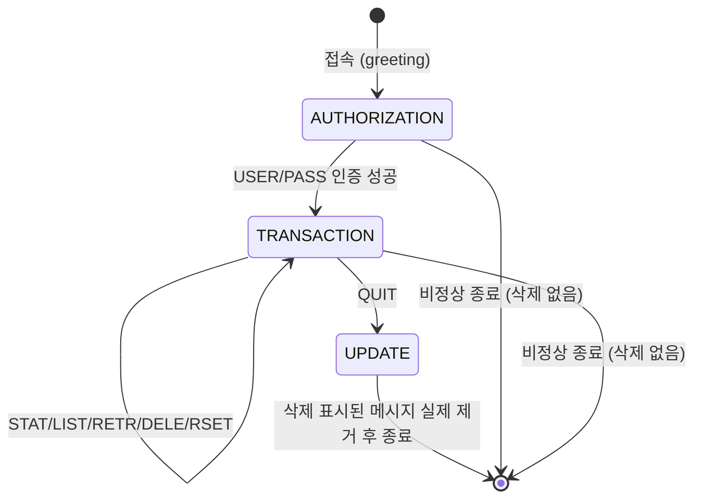
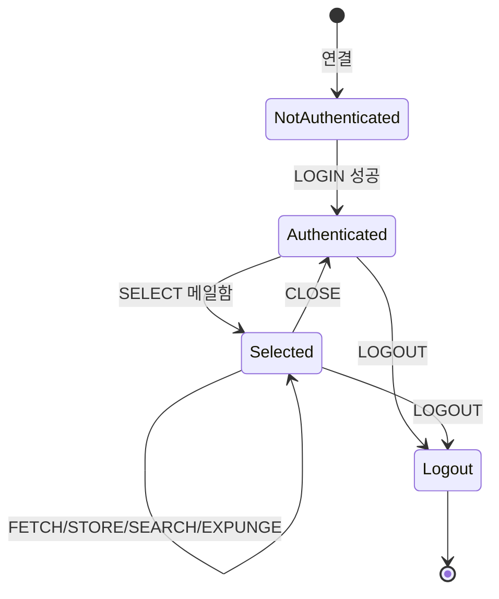

# IMAP vs POP3 이메일 통신 프로토콜 비교 및 동작 절차

## 요약

이메일 클라이언트가 메일 서버에서 편지를 가져올 때 쓰는 대표적인 두 프로토콜이 IMAP과 POP3입니다. 겉보기에는 둘 다 "메일함에서 편지를 읽어온다"는 같은 목적을 수행하지만, 내부 상태 모델과 메시지 보관 정책이 근본적으로 다릅니다. 본 아티클에서는 RFC 3501(IMAP4rev1)과 RFC 1939(POP3)의 공식 명세를 기준으로 두 프로토콜의 상태 머신, 명령어 시퀀스, 포트·암호화 구성을 비교하고, 왜 다중 기기 환경에서는 IMAP이 사실상 표준이 되었는지를 살펴봅니다.

## 본문

### 1. 두 프로토콜의 근본적인 설계 철학 차이

POP3(RFC 1939)는 "서버는 메일을 클라이언트가 가져갈 때까지만 임시로 보관하는 우체국 사서함"이라는 철학으로 설계되었습니다. 기본 동작은 클라이언트가 새 메일을 통째로 다운로드한 뒤, 서버에서는 해당 메일을 삭제하는 것입니다. 반면 IMAP(RFC 3501)은 "메일 자체는 서버에 원본으로 존재하고, 클라이언트는 그 상태를 동기화해서 보여주는 창구"라는 철학입니다. 읽음/안읽음, 삭제, 폴더 이동 같은 조작이 모두 서버 측 상태에 반영되므로, 스마트폰과 PC에서 같은 계정에 동시에 접속해도 어느 기기에서 메일을 읽었는지가 실시간으로 동기화됩니다. 이 설계 철학 차이가 이어지는 모든 기술적 차이(상태 모델, 명령어, 다중 기기 지원 여부)의 근본 원인입니다.

### 2. POP3의 3단계 상태 머신 (RFC 1939)

RFC 1939는 POP3 세션이 세 가지 상태를 순차적으로 거친다고 규정합니다[1].

- **AUTHORIZATION 상태**: 서버가 접속 인사(greeting)를 보낸 직후 진입하는 상태로, 클라이언트는 `USER`/`PASS` 명령(또는 `APOP`)으로 신원을 인증해야 합니다.
- **TRANSACTION 상태**: 인증에 성공하고 서버가 메일함(maildrop)에 대한 배타적 잠금(exclusive lock)을 획득하면 진입합니다. 이 상태에서 `STAT`(메일함 요약), `LIST`(메시지 목록), `RETR`(메시지 다운로드), `DELE`(삭제 표시), `RSET`(삭제 표시 취소) 같은 명령을 사용할 수 있습니다.
- **UPDATE 상태**: 클라이언트가 TRANSACTION 상태에서 `QUIT`을 보내면 진입합니다. RFC 1939는 이 시점에 서버가 "삭제 표시된 모든 메시지를 메일함에서 실제로 제거한다"고 명시합니다[1]. 중요한 것은, 세션이 `QUIT` 없이 비정상 종료되면 UPDATE 상태로 진입하지 않으며 어떤 메시지도 삭제해서는 안 된다는 점입니다[1] — 즉 `DELE`은 즉시 삭제가 아니라 "삭제 예약"이며, 실제 삭제는 정상적인 `QUIT` 처리 시점에만 확정됩니다.



### 3. IMAP4rev1의 4단계 상태 머신 (RFC 3501)

RFC 3501은 POP3보다 한 단계 더 세분화된 상태 모델을 규정합니다[2].

- **Not Authenticated**: 연결 직후의 초기 상태로, 자격 증명을 제공해야 다음 단계로 진행할 수 있습니다. 이 상태(및 모든 상태 공통)에서 `CAPABILITY`, `NOOP`, `LOGOUT`, `STARTTLS`, `LOGIN` 명령을 사용할 수 있습니다.
- **Authenticated**: `LOGIN` 성공 후 진입하며, 메일함 자체를 다루는 명령(`SELECT`, `CREATE`, `DELETE`, `RENAME`, `LIST`, `STATUS`, `APPEND`)을 사용할 수 있습니다. 이 상태에서는 아직 특정 메일함을 "열지" 않았으므로 개별 메시지를 조작할 수는 없습니다.
- **Selected**: `SELECT` 명령으로 특정 메일함을 지정하면 진입합니다. 서버는 `FLAGS`, `EXISTS`, `RECENT`, `UIDVALIDITY` 같은 태그 없는(untagged) 응답으로 메일함 상태를 알려줍니다. 이 상태에서만 `FETCH`(메시지 내용 조회), `STORE`(플래그 변경), `SEARCH`, `EXPUNGE`(삭제 표시된 메시지 실제 제거) 같은 메시지 단위 명령을 사용할 수 있습니다.
- **Logout**: 연결 종료가 진행 중인 상태입니다.

POP3가 "인증 → 트랜잭션 → 종료"라는 단선적인 흐름인 것과 달리, IMAP은 Authenticated와 Selected를 분리해 "여러 메일함(폴더)을 넘나들며 각 메일함의 상태를 독립적으로 조회"하는 시나리오를 자연스럽게 지원합니다.



POP3가 인증 후 바로 메시지 조작으로 이어지는 단선적 흐름인 것과 달리, IMAP은 Authenticated(메일함 자체 조작)와 Selected(메시지 단위 조작)를 분리해 여러 메일함을 자유롭게 넘나들 수 있게 합니다.

### 4. 포트와 암호화 구성

전통적으로 IMAP은 평문 143번, TLS 암호화(implicit TLS) 993번 포트를 사용하고, POP3는 평문 110번, TLS 암호화 995번 포트를 사용합니다[1][2]. 두 프로토콜 모두 평문 포트에서 `STARTTLS`로 암호화 연결로 전환할 수 있지만, 오늘날 대부분의 메일 서비스는 처음부터 암호화된 993/995 포트만 열어두고 평문 포트는 아예 차단하는 구성을 표준으로 삼고 있습니다.

### 5. 명령어 시퀀스 예시로 보는 실제 차이

아래는 두 프로토콜이 "받은편지함에서 최신 메일 1통을 읽는다"는 동일한 목적을 어떻게 다른 명령 시퀀스로 수행하는지를 보여줍니다(개념 이해를 위한 단순화된 프로토콜 트랜잭션 예시입니다).

```text
# POP3: 인증 -> 메시지 목록 -> 다운로드 -> 삭제 표시 -> QUIT 시 실제 삭제 확정
S: +OK POP3 server ready
C: USER alice
S: +OK
C: PASS ******
S: +OK Alice's maildrop has 2 messages   # AUTHORIZATION -> TRANSACTION 상태 전이
C: LIST
S: +OK 2 messages
S: 1 2200
S: 2 1150
C: RETR 2                                # 메시지 2번 전체를 다운로드
S: +OK 1150 octets
S: (메시지 본문 전송)
C: DELE 2                                # 삭제 "예약"일 뿐, 아직 실제 삭제 아님
S: +OK message 2 deleted
C: QUIT                                  # 이 시점에 UPDATE 상태로 전이, 실제 삭제 확정
S: +OK POP3 server signing off

# IMAP: 인증 -> 메일함 선택 -> 개별 메시지 조회 (서버 원본은 그대로 유지)
C: a1 LOGIN alice ******
S: a1 OK LOGIN completed                 # Not Authenticated -> Authenticated
C: a2 SELECT INBOX
S: * 2 EXISTS
S: * 0 RECENT
S: a2 OK [READ-WRITE] SELECT completed   # Authenticated -> Selected
C: a3 FETCH 2 (BODY[HEADER] FLAGS)       # 메시지를 "다운로드"가 아니라 "조회"
S: * 2 FETCH (BODY[HEADER] {512}
S: (헤더 데이터 전송)
S: FLAGS (\Seen))
S: a3 OK FETCH completed
C: a4 LOGOUT                             # 메시지는 서버에 그대로 남아있음, 다른 기기에서도 동일 상태 조회 가능
```

### 6. 실무 프레임워크·클라이언트 적용 사례

자바 진영에서는 JavaMail(Jakarta Mail) API가 `Store`/`Folder` 추상화를 통해 IMAP과 POP3를 동일한 API로 다룰 수 있게 해주며, 내부적으로 프로토콜별 상태 머신 차이를 라이브러리가 감춰줍니다. Python 표준 라이브러리의 `imaplib`과 `poplib`도 각각 RFC 3501, RFC 1939의 명령어를 그대로 메서드로 노출합니다(예: `imaplib.IMAP4.select()`, `imaplib.IMAP4.fetch()`, `poplib.POP3.retr()`, `poplib.POP3.dele()`). Gmail, Outlook 등 현대 웹메일 서비스는 자체 웹 UI에서는 IMAP/POP3를 직접 쓰지 않지만, 외부 데스크톱/모바일 메일 클라이언트 연동을 위해 두 프로토콜을 여전히 공식 지원하며, 설정 화면에서 "IMAP 사용" 또는 "POP 사용"을 선택하도록 안내합니다.

## 사실 검증 결과

| Claim | 판정 | 근거 |
|---|---|---|
| CLAIM-001: POP3는 AUTHORIZATION → TRANSACTION → UPDATE 3단계 상태를 가지며, DELE은 즉시 삭제가 아니라 QUIT 시점에 실제 삭제가 확정된다 | verified | RFC 1939 (POP3) 공식 명세, rfc-editor.org |
| CLAIM-002: POP3 세션이 QUIT 없이 비정상 종료되면 UPDATE 상태에 진입하지 않고 어떤 메시지도 삭제되지 않는다 | verified | RFC 1939 공식 명세 |
| CLAIM-003: IMAP4rev1은 Not Authenticated/Authenticated/Selected/Logout 4단계 상태를 가지며, FETCH/STORE 등 메시지 단위 명령은 Selected 상태에서만 유효하다 | verified | RFC 3501 (IMAP4rev1) 공식 명세, rfc-editor.org |
| CLAIM-004: IMAP은 평문 143/암호화 993 포트를, POP3는 평문 110/암호화 995 포트를 전통적으로 사용한다 | verified | RFC 3501, RFC 1939 공식 명세의 포트 등록 내용 |

## 작성자의 견해

> 이 섹션은 사실 전달이 아니라 작성자의 해석과 견해를 담고 있습니다.

지금 시점에 새로 메일 클라이언트를 설정하는 상황이라면 POP3를 선택할 이유는 거의 없다고 봅니다. 다중 기기 사용이 당연해진 지금, "한 기기에서 다운로드하면 서버에서 사라지는" POP3의 기본 동작은 오히려 데이터 정합성 사고의 원인이 되기 쉽습니다(예: 회사 PC에서 먼저 받아버리면 이후 스마트폰에서는 그 메일이 안 보이는 상황). 다만 POP3가 완전히 쓸모없어진 것은 아니라고 생각합니다 — 저장 공간이 극히 제한적인 서버에서 메일을 주기적으로 완전히 비워야 하는 아카이빙 성격의 워크플로우나, 단일 기기에서만 접속하는 것이 명확한 자동화 스크립트(예: 알림 메일을 받아서 즉시 파싱하고 삭제하는 배치 작업) 환경에서는 오히려 IMAP의 복잡한 폴더/플래그 동기화 오버헤드 없이 POP3의 단순한 다운로드-삭제 모델이 더 적합할 수 있습니다. 결국 선택 기준은 "이 메일함을 여러 곳에서 봐야 하는가"라는 단순한 질문으로 요약됩니다.

## 한계와 반론

본 아티클은 RFC 3501(IMAP4rev1)과 RFC 1939(POP3)라는 오래되었지만 여전히 널리 구현되는 명세를 기준으로 설명했습니다. IMAP은 이후 IMAP4rev2(RFC 9051)로 개정되어 일부 명령과 응답 형식이 갱신되었으나, 현재도 수많은 서버·클라이언트가 IMAP4rev1을 기준으로 상호 운용되고 있어 본문에서는 IMAP4rev1을 기준으로 삼았습니다. 또한 실제 웹메일 서비스(Gmail 등)는 REST API나 자체 프로토콜(Gmail API, Microsoft Graph API)로 더 풍부한 기능(라벨, 스레드 뷰 등)을 제공하는 경우가 많아, IMAP/POP3는 "범용 호환성이 필요한 외부 클라이언트 연동" 용도로 그 역할이 점차 좁아지고 있다는 점도 함께 고려할 필요가 있습니다.

## 참고문헌

1. IETF, "RFC 1939: Post Office Protocol - Version 3", [https://www.rfc-editor.org/rfc/rfc1939.html](https://www.rfc-editor.org/rfc/rfc1939.html) (확인일: 2026-08-17)
2. IETF, "RFC 3501: Internet Message Access Protocol - Version 4rev1", [https://www.rfc-editor.org/rfc/rfc3501](https://www.rfc-editor.org/rfc/rfc3501) (확인일: 2026-08-17)

## 종합적 의견

> 이 섹션은 전체 주제에 대한 종합적 분석과 개인 견해를 담고 있습니다.

IMAP과 POP3의 차이는 결국 "상태를 어디에 둘 것인가"라는, 분산 시스템 설계에서 반복적으로 등장하는 질문의 이메일 버전입니다. POP3는 상태(읽음 여부, 삭제 여부)를 클라이언트 로컬에 두고 서버는 단순 전달 창구로만 쓰는 모델이고, IMAP은 상태를 서버 원본에 두고 클라이언트는 그 상태를 비추는 거울 역할만 하는 모델입니다. 후자가 다중 기기 동기화에 훨씬 유리하다는 것은 IMAP이 사실상 표준이 된 이유를 잘 설명해 줍니다. 두 프로토콜의 상태 머신(POP3의 3단계, IMAP의 4단계)을 정확히 이해해 두면, 메일 클라이언트 개발이나 트러블슈팅 시 "왜 이 명령이 지금 안 먹히는가"를 상태 전이 규칙만으로 빠르게 진단할 수 있습니다.

## 꼬리질문

1. **IMAP4rev2(RFC 9051)는 IMAP4rev1 대비 구체적으로 어떤 명령과 응답 형식이 바뀌었는가?**
   - 추천 참고 URL: https://datatracker.ietf.org/doc/html/rfc9051
2. **IMAP의 IDLE 확장(RFC 2177)은 클라이언트가 폴링 없이 서버로부터 실시간 새 메일 알림을 받도록 어떻게 동작하는가?**
   - 추천 참고 URL: https://datatracker.ietf.org/doc/html/rfc2177
3. **Gmail API나 Microsoft Graph API 같은 REST 기반 메일 API는 IMAP 대비 어떤 시나리오에서 구체적인 이점을 제공하는가?**
   - 추천 참고 URL: https://www.rfc-editor.org/rfc/rfc3501

## 백링크

- [동기/비동기, 블로킹/논블로킹](https://beji-tech.blogspot.com/2026/08/sync-vs-async-blocking-vs-non-blocking.html)
- [위키 인덱스](../../wiki/README.md)