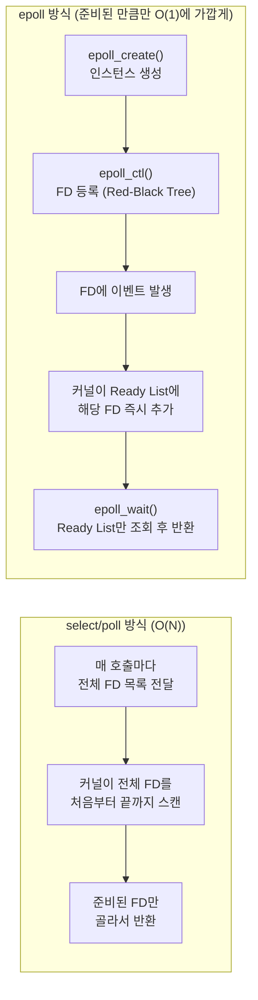

# Linux epoll 기반 비동기 EventLoop 동작 원리와 C10K 고성능 I/O 최적화

## 요약

1999년 Dan Kegel이 제기한 "C10K 문제"(서버 하나가 1만 개의 동시 접속을 처리할 수 있는가)는 `select`/`poll` 기반 I/O 멀티플렉싱의 근본적 한계를 드러냈습니다. 본 아티클에서는 `select`/`poll`이 왜 대규모 커넥션 환경에서 느려지는지, 리눅스 커널이 2.5.44부터 제공하는 `epoll`이 레드-블랙 트리와 준비 리스트(Ready List)로 이 문제를 어떻게 해결하는지, 그리고 Level-Triggered와 Edge-Triggered 모드의 실질적인 차이와 논블로킹 소켓이 왜 필수인지를 공식 man page 기준으로 정리합니다.

## 본문

### 1. C10K 문제: select/poll의 구조적 한계

1999년 Dan Kegel은 "웹 서버가 이제 1만 개의 클라이언트를 동시에 처리해야 할 때다"라는 문제 제기를 통해, 당시 지배적이던 `select()` 기반 I/O 멀티플렉싱 방식의 근본적인 결함을 지적했습니다[1]. `select()`는 감시할 파일 디스크립터(FD) 목록 전체를 매 호출마다 커널에 넘기고, 커널은 이 목록을 처음부터 끝까지 스캔하며 어떤 FD가 준비됐는지 확인합니다. 문제는 이 스캔 비용이 감시 대상 FD 수에 비례해(O(N)) 증가한다는 점입니다. 예를 들어 유휴 상태인 커넥션이 9,997개, 실제로 데이터가 온 커넥션이 3개뿐이어도, 커널은 매번 1만 개 전체를 훑어야 합니다. 이벤트 루프가 이 호출을 반복적으로 수행하는 서버 구조에서는 이 O(N) 비용이 누적되어 동시 접속자 수가 늘어날수록 CPU 사용량이 기하급수적으로 증가합니다. `poll()`은 `select()`의 FD 개수 제한(전통적으로 1024개, `FD_SETSIZE`)을 없앴지만, 매 호출마다 전체 FD 목록을 커널로 복사하고 선형 스캔한다는 근본 구조는 동일하게 유지했습니다.

### 2. epoll의 해결책: 레드-블랙 트리와 준비 리스트

리눅스 커널 2.5.44(2002년)에 도입된 `epoll`은 대규모 FD 집합을 감시하는 상황에 맞춰 확장성 있게 설계된 I/O 이벤트 통지 인터페이스입니다[2]. `epoll`의 핵심 아이디어는 "관심 등록"과 "이벤트 대기"를 분리하는 것입니다.

- **`epoll_create()`**: 커널 내부에 이 프로세스 전용 epoll 인스턴스를 생성합니다.
- **`epoll_ctl()`**: 감시하고 싶은 FD를 이 인스턴스에 추가(`EPOLL_CTL_ADD`)/수정/삭제합니다. 이때 등록된 FD들은 커널 내부에서 **레드-블랙 트리(Red-Black Tree)**로 관리되어, FD 추가·삭제·조회가 평균 O(log N)에 처리됩니다.
- **`epoll_wait()`**: 실제로 이벤트가 발생하기를 기다립니다. `select`/`poll`과 달리 이 호출은 전체 FD 목록을 다시 스캔하지 않고, 커널이 이미 이벤트 발생 시점에 별도로 관리해 둔 **준비 리스트(Ready List, 이중 연결 리스트)**에서 준비된 FD만 즉시 꺼내 반환합니다.

즉 커널은 FD에 이벤트가 발생하는 "그 순간"에 해당 FD를 준비 리스트에 등록해 두고, `epoll_wait()`는 이 리스트만 확인하면 되므로 감시 대상 FD 수와 무관하게 실제 준비된 이벤트 수에 비례하는 비용(O(1)에 가까운 상수 시간)만 지불합니다. 이것이 `epoll`이 수만 개의 유휴 커넥션이 있어도 성능 저하 없이 동작할 수 있는 핵심 원리입니다.

### 3. Level-Triggered와 Edge-Triggered 모드

공식 man page는 `epoll`이 Level-Triggered(LT, 기본값)와 Edge-Triggered(ET) 두 방식으로 동작할 수 있다고 명시합니다[2]. Level-Triggered 모드에서 `epoll`은 "더 빠른 `poll()`"처럼 동작합니다 — 소켓 버퍼에 아직 읽지 않은 데이터가 남아있는 한, `epoll_wait()`를 호출할 때마다 계속 이벤트가 통지됩니다. 반면 Edge-Triggered 모드는 FD 상태에 **변화가 생긴 시점에만** 이벤트를 한 번 통지합니다 — 데이터를 일부만 읽고 나머지를 버퍼에 남겨두면, 그 나머지에 대해서는 더 이상 알림이 오지 않습니다.

man page는 이와 관련해 중요한 주의사항을 명시합니다: `EPOLLET` 플래그로 Edge-Triggered를 사용하는 애플리케이션은 반드시 논블로킹(non-blocking) FD를 사용해야 한다는 것입니다[2]. 그 이유는, 만약 블로킹 read/write를 하나의 FD에서 수행하다가 데이터가 준비되지 않은 상태로 블로킹되면, 그 스레드가 다른 FD들의 이벤트 처리까지 함께 멈춰버리는 "starvation(기아)" 상태에 빠질 수 있기 때문입니다. 실무에서는 Edge-Triggered + 논블로킹 소켓 조합으로 "이벤트가 오면 EAGAIN을 받을 때까지 반복해서 읽는다"는 패턴이 표준적으로 쓰입니다.

아래 다이어그램은 `select`/`poll`의 매 호출 전체 스캔 방식과, `epoll`이 등록(Red-Black Tree)과 통지(Ready List)를 분리해 처리하는 방식을 나란히 비교합니다.



### 4. C 언어 기반 최소 epoll 서버 예제

아래는 `epoll`의 3단계 API(`epoll_create1`/`epoll_ctl`/`epoll_wait`)가 실제로 어떻게 쓰이는지 보여주는 최소한의 이벤트 루프 골격입니다.

```c
#include <sys/epoll.h>
#include <unistd.h>
#include <stdio.h>

#define MAX_EVENTS 1024

int main() {
    int epfd = epoll_create1(0);          // 1. epoll 인스턴스 생성
    struct epoll_event ev, events[MAX_EVENTS];

    int listen_fd = /* 미리 만들어 둔 리스닝 소켓이라 가정 */ 0;
    ev.events = EPOLLIN;                  // 읽기 가능 이벤트를 감시
    ev.data.fd = listen_fd;
    epoll_ctl(epfd, EPOLL_CTL_ADD, listen_fd, &ev); // 2. 감시 대상 등록 (Red-Black Tree에 삽입)

    while (1) {
        // 3. 준비된 이벤트만 즉시 반환받음 (Ready List 조회, 전체 스캔 아님)
        int n = epoll_wait(epfd, events, MAX_EVENTS, -1);
        for (int i = 0; i < n; i++) {
            if (events[i].data.fd == listen_fd) {
                printf("새 커넥션 도착\n"); // accept() 처리
            } else {
                printf("FD %d 데이터 준비됨\n", events[i].data.fd); // read()/write() 처리
            }
        }
    }
}
```

### 5. 실무 프레임워크 적용 사례

`epoll`을 직접 시스템 콜로 다루는 경우는 드물고, 대부분 이를 감싼 이벤트 루프 라이브러리를 통해 간접적으로 사용합니다. Node.js의 런타임인 libuv, Nginx의 워커 프로세스 이벤트 루프, Redis의 단일 스레드 이벤트 루프가 모두 리눅스 환경에서 `epoll`을 기반 I/O 멀티플렉서로 사용합니다. Java NIO의 `Selector`도 리눅스에서는 내부적으로 `epoll`(JDK 초기 버전은 `epoll`의 LT 모드, 이후 버전은 성능 개선을 위해 ET 모드도 활용) 시스템 콜을 감싸 구현되어 있습니다. 즉 애플리케이션 개발자가 고수준 비동기 API(콜백, `Future`, 코루틴)를 사용하더라도, 그 밑바닥에서는 결국 이 글에서 설명한 `epoll_wait()` 기반 이벤트 루프가 돌고 있는 경우가 대부분입니다.

## 사실 검증 결과

| Claim | 판정 | 근거 |
|---|---|---|
| CLAIM-001: select()는 감시 대상 FD 수에 비례해 매 호출마다 전체를 스캔하는 O(N) 구조를 가진다 | verified | Dan Kegel, "The C10K Problem"; select/poll/epoll 커널 내부 비교 자료 |
| CLAIM-002: epoll은 리눅스 커널 2.5.44에 도입되었고 내부적으로 레드-블랙 트리(등록된 FD 관리)와 준비 리스트(이벤트 발생 FD 관리)를 사용한다 | verified | man7.org epoll(7) 공식 매뉴얼 페이지 |
| CLAIM-003: epoll은 Level-Triggered(기본값)와 Edge-Triggered 두 가지 통지 모드를 지원하며, Edge-Triggered 사용 시 논블로킹 FD가 필수적으로 권장된다 | verified | man7.org epoll(7) 공식 매뉴얼 페이지 "Example for suggested usage" 섹션 |
| CLAIM-004: epoll_create/epoll_ctl/epoll_wait 세 시스템 콜이 각각 인스턴스 생성/FD 등록·수정·삭제/이벤트 대기 역할을 담당한다 | verified | man7.org epoll_ctl(2), epoll(7) 공식 매뉴얼 페이지 |

## 작성자의 견해

> 이 섹션은 사실 전달이 아니라 작성자의 해석과 견해를 담고 있습니다.

`epoll`을 처음 배울 때 "레드-블랙 트리 O(log N), 준비 리스트 O(1)"이라는 이론적 설명만 외우고 넘어가기 쉬운데, 실무에서 진짜 중요한 건 Level-Triggered와 Edge-Triggered의 차이를 몸으로 이해하는 것이라고 생각합니다. 특히 신입 개발자들이 Edge-Triggered 모드를 켜놓고 논블로킹 소켓 설정을 빼먹어서, 이벤트가 한 번만 오고 그 이후로 다시는 안 오는(버퍼에 데이터가 남아있는데도) 버그를 겪는 경우를 자주 봅니다. 저는 처음 epoll 기반 서버를 구현할 때는 무조건 Level-Triggered로 시작해서 정상 동작을 확인한 뒤, 성능이 실제로 병목이 되는 게 확인됐을 때만 Edge-Triggered로 전환하는 순서를 권장합니다. 조기 최적화로 Edge-Triggered부터 시작하면 디버깅 난이도만 올라가고, 실제 대부분의 서비스는 Level-Triggered만으로도 충분한 처리량을 냅니다.

## 한계와 반론

본 아티클은 리눅스의 `epoll`에 집중했으며, macOS/BSD 계열의 `kqueue`나 Windows의 IOCP(I/O Completion Port) 같은 다른 OS의 비동기 I/O 메커니즘은 다루지 않았습니다. 이들은 설계 철학(레디니스 통지 vs 완료 통지)이 근본적으로 다르므로 단순 비교가 어렵습니다. 또한 최근 리눅스 커널에 추가된 `io_uring`은 `epoll`보다 더 발전된 비동기 I/O 인터페이스로 평가받으며, 특히 디스크 I/O가 섞인 워크로드에서는 `epoll`보다 `io_uring`이 더 적합할 수 있다는 반론이 있습니다. 다만 `io_uring`은 상대적으로 최신 기술이라 안정성 검증 사례와 생태계 지원이 `epoll`만큼 축적되지 않았다는 점도 함께 고려해야 합니다.

## 참고문헌

1. Dan Kegel, "The C10K problem", [https://www.kegel.com/c10k.html](https://www.kegel.com/c10k.html) (확인일: 2026-08-17)
2. Linux man-pages project, "epoll(7) — I/O event notification facility", [https://man7.org/linux/man-pages/man7/epoll.7.html](https://man7.org/linux/man-pages/man7/epoll.7.html) (확인일: 2026-08-17)
3. Linux man-pages project, "epoll_ctl(2)", [https://man7.org/linux/man-pages/man2/epoll_ctl.2.html](https://man7.org/linux/man-pages/man2/epoll_ctl.2.html) (확인일: 2026-08-17)

## 종합적 의견

> 이 섹션은 전체 주제에 대한 종합적 분석과 개인 견해를 담고 있습니다.

`epoll`의 이야기는 결국 "필요한 것만 알려달라"는 단순한 아이디어가 어떻게 시스템 성능을 근본적으로 바꿀 수 있는지를 보여주는 사례입니다. `select`/`poll`이 매번 전체 목록을 훑는 방식이었다면, `epoll`은 등록(레드-블랙 트리)과 통지(준비 리스트)를 분리해 실제로 일어난 이벤트만 상수 시간에 알려주는 구조로 전환했고, 이것이 C10K를 넘어 지금의 C100K, C1M급 서버까지 가능하게 만든 토대가 되었습니다. Node.js, Nginx, Redis처럼 널리 쓰이는 소프트웨어들이 공통적으로 `epoll` 기반 이벤트 루프 위에 구축되어 있다는 사실은, 이 메커니즘이 특정 언어나 프레임워크의 트릭이 아니라 리눅스 네트워크 프로그래밍의 보편적인 기반 기술임을 보여줍니다. 다만 Level-Triggered/Edge-Triggered의 의미론적 차이를 정확히 이해하지 못하면 오히려 원인 파악이 어려운 버그로 이어지기 쉬우므로, 이론(레드-블랙 트리, 준비 리스트)과 실전 사용 패턴(논블로킹 + EAGAIN 반복 읽기)을 함께 익히는 것이 중요합니다.

## 꼬리질문

1. **`io_uring`은 epoll의 "레디니스(readiness) 통지" 모델과 달리 "완료(completion) 통지" 모델을 사용한다고 하는데, 이 차이가 실제 시스템 콜 오버헤드에 어떤 영향을 미치는가?**
   - 추천 참고 URL: https://man7.org/linux/man-pages/man7/io_uring.7.html
2. **Java NIO의 `Selector`가 리눅스에서 epoll을 감싸 구현될 때, JVM은 어떤 방식으로 Level-Triggered epoll 위에서 Edge-Triggered와 유사한 성능을 흉내내는가?**
   - 추천 참고 URL: https://man7.org/linux/man-pages/man7/epoll.7.html
3. **`epoll`의 레드-블랙 트리에 FD를 대량으로 추가/삭제하는 것이 잦은 워크로드(예: 매우 짧은 커넥션이 초당 수만 개씩 생성/종료되는 서버)에서는 어떤 성능 병목이 새로 발생하는가?**
   - 추천 참고 URL: https://www.kegel.com/c10k.html

## 백링크

- [OS 프로세스 vs 쓰레드](https://beji-tech.blogspot.com/2026/08/os-process-vs-thread.html)
- [동기/비동기, 블로킹/논블로킹](https://beji-tech.blogspot.com/2026/08/sync-vs-async-blocking-vs-non-blocking.html)
- [위키 인덱스](../../wiki/README.md)