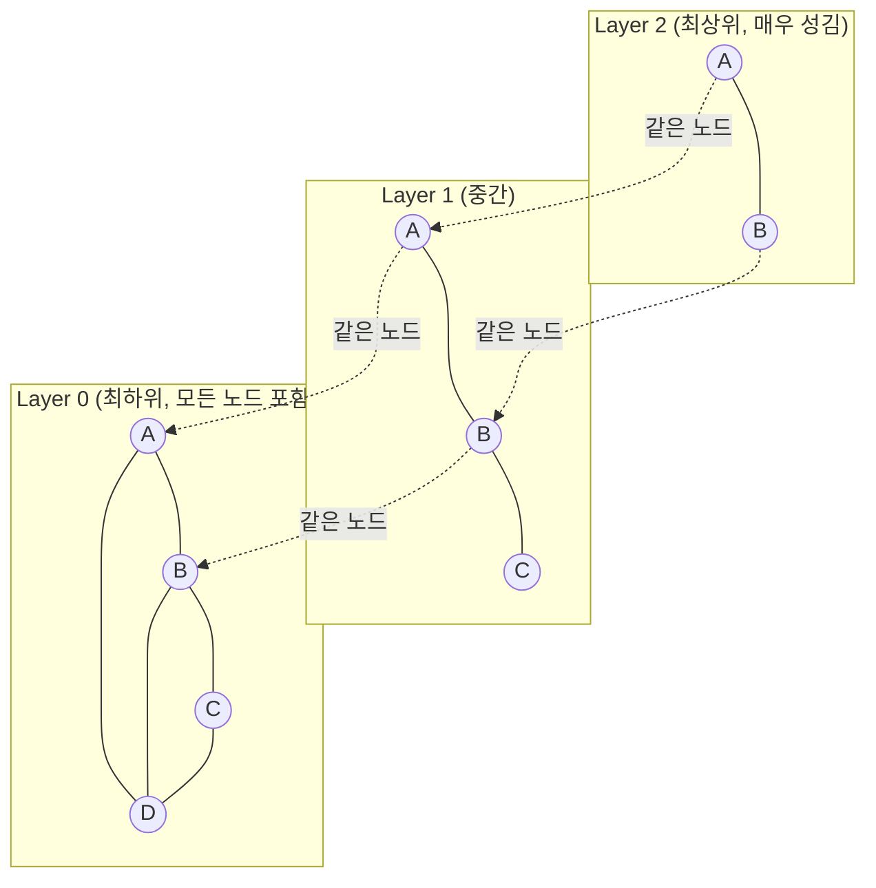

# Vector Database ANN 인덱싱: HNSW 알고리즘과 RAG 파이프라인에서의 역할

## 요약

RAG(Retrieval-Augmented Generation) 파이프라인의 검색 단계는 결국 "질의 임베딩과 가장 가까운 문서 임베딩 K개를 찾는" 최근접 이웃 탐색 문제입니다. 그런데 실무에서 쓰이는 벡터 데이터베이스(Pinecone, Milvus, pgvector 등)는 정확한 최근접 이웃(Exact Nearest Neighbor)이 아니라 근사 최근접 이웃(Approximate Nearest Neighbor, ANN)을 반환합니다. 이 글은 그 이유와, 현재 사실상 업계 표준으로 자리잡은 ANN 인덱싱 알고리즘인 HNSW(Hierarchical Navigable Small World)가 어떻게 계층적 그래프 구조로 로그 수준의 탐색 복잡도를 달성하는지, 그리고 이것이 RAG 파이프라인의 검색(Retrieval) 단계에서 정확히 어떤 역할을 하는지를 원 논문과 pgvector/Milvus 공식 문서 기준으로 설명합니다. GraphRAG처럼 지식 그래프 기반으로 RAG를 개선하는 접근과 달리, 이 글은 벡터 유사도 검색 자체의 인덱싱 알고리즘에 집중합니다.

## 차별화 포인트

<!-- 내부 전용 섹션, 라이브 배포 시 자동 제거됨 -->

"HNSW는 계층적 그래프다"라는 개념 설명에서 멈추는 글이 대부분인데, 이 글은 원 논문(Malkov & Yashunin, arXiv:1603.09320)의 스킵 리스트 비유부터 pgvector/Milvus 공식 문서가 실제로 노출하는 `M`/`efConstruction`/`ef` 세 파라미터의 정확한 기본값과 트레이드오프, 그리고 이를 실제 `CREATE INDEX ... USING hnsw` SQL과 검색 코드로 잇는다. 특히 "리트리버가 관련 없는 문서를 가져온다"는 흔한 RAG 디버깅 증상의 상당수가 임베딩 모델이 아니라 `ef` 미조정 문제라는, 실무에서 자주 오진되는 지점을 짚는다.

## 본문

### 1. 왜 정확한 최근접 이웃 대신 근사 탐색을 쓰는가

RAG 시스템은 문서를 임베딩 모델(예: OpenAI `text-embedding-3`, BGE 등)로 수백~수천 차원의 벡터로 변환해 저장해두고, 사용자 질의도 같은 방식으로 벡터화한 뒤 "가장 가까운" 문서 벡터들을 찾아 LLM에 컨텍스트로 넘깁니다. 문제는 이 "가장 가까운 것 찾기"가 저차원에서는 쉽지만, 고차원 벡터 공간에서는 급격히 어려워진다는 점입니다.

가장 단순한 방법은 질의 벡터와 저장된 모든 벡터 사이의 거리를 전부 계산하는 브루트포스(Brute-force) 탐색이지만, 이는 문서 수 N에 비례해 시간이 늘어나는 O(N) 알고리즘이라 문서가 수백만 건 이상이면 질의 하나에 초 단위 지연이 발생합니다. KD-Tree 같은 전통적인 공간 분할 트리 인덱스는 저차원에서는 O(log n)으로 빠르지만, 차원이 수십을 넘어가면 "차원의 저주(Curse of Dimensionality)"로 인해 트리의 가지치기(Pruning) 효과가 거의 사라져 사실상 브루트포스와 비슷한 성능으로 퇴화합니다. 임베딩 벡터는 보통 384~3072차원이므로, KD-Tree류의 정확한 탐색 알고리즘은 이 영역에서 실용적이지 않습니다.

그래서 실무 벡터 데이터베이스들은 "100% 정확한 최근접 이웃"을 포기하는 대신 "충분히 가까운 이웃을 매우 빠르게" 찾는 근사 탐색(ANN)으로 전환합니다. 정확도(Recall, 실제 최근접 이웃 중 몇 %를 찾아냈는가)와 속도(Latency)를 조절 가능한 트레이드오프로 만드는 것이 ANN 알고리즘 설계의 핵심 목표이며, HNSW는 이 트레이드오프를 그래프 구조로 푸는 대표적인 알고리즘입니다.

### 2. HNSW의 계층적 그래프 구조

HNSW는 Yu. A. Malkov와 D. A. Yashunin이 2016년 발표하고(arXiv:1603.09320) 2018년 IEEE TPAMI에 게재한 논문 "Efficient and robust approximate nearest neighbor search using Hierarchical Navigable Small World graphs"에서 제안한 알고리즘입니다. 기존 NSW(Navigable Small World) 그래프에 "계층(Hierarchy)"을 추가해 성능을 끌어올린 것이 핵심 아이디어입니다.

HNSW는 여러 층(Layer)으로 이루어진 그래프를 만듭니다. 각 데이터 포인트(벡터)를 그래프에 삽입할 때, 그 포인트가 몇 층까지 존재할지를 지수적으로 감소하는 확률 분포로 무작위 결정합니다 — 즉 대부분의 포인트는 최하위 층(Layer 0)에만 존재하고, 위로 올라갈수록 포인트 수가 기하급수적으로 줄어듭니다. 최상위 층에는 극소수의 포인트만 남습니다. 원 논문은 이 구조를 "스킵 리스트(Skip List)"에 비유합니다 — 상위 층은 "빠르게 멀리뛰기 위한" 성긴 지도이고, 하위 층으로 내려갈수록 촘촘하고 정밀한 지도가 되는 구조입니다.



### 3. 탐색 알고리즘: 위에서 아래로 좁혀가기

질의가 들어오면 HNSW는 최상위 층의 임의(또는 고정된) 진입점(Entry Point)에서 시작해, 그리디 탐색(Greedy Search)으로 질의 벡터에 더 가까운 이웃 쪽으로 계속 이동합니다. 해당 층에서 더 이상 가까워질 수 없는 지점(지역 최솟값)에 도달하면, 그 지점을 그대로 한 층 아래로 내려가는 진입점으로 삼아 같은 그리디 탐색을 반복합니다. 이 과정을 최하위 층(Layer 0)까지 반복한 뒤, 최하위 층에서 더 정밀한 후보 목록을 모아 최종 상위 K개를 반환합니다.

상위 층은 노드 수가 적어 "멀리뛰기"가 가능하므로 탐색 초반에 전체 공간에서 대략적인 방향을 빠르게 잡고, 하위 층으로 내려갈수록 촘촘한 그래프에서 정밀도를 높이는 방식입니다. 원 논문은 이 계층 분리(Layer separation by characteristic distance scale)가 NSW 단일 계층 구조 대비 성능을 끌어올리며 로그 복잡도에 가까운 탐색 시간 확장(Scaling)을 가능하게 한다고 설명합니다.

### 4. 핵심 파라미터: M, efConstruction, ef

HNSW 인덱스를 실무에서 튜닝할 때 마주치는 세 파라미터는 pgvector와 Milvus 공식 문서에서 다음과 같이 정의됩니다.

- **M**: 각 노드가 층마다 가질 수 있는 최대 연결(간선) 수입니다. pgvector 기본값은 16입니다. M이 클수록 그래프가 촘촘해져 검색 정확도(Recall)는 높아지지만, 인덱스 크기(메모리)와 빌드 시간이 늘어납니다.
- **efConstruction**: 인덱스를 구축할 때, 새 노드를 그래프에 연결하기 위해 고려하는 후보 이웃 목록의 크기입니다. pgvector 기본값은 64, Milvus 권장 범위는 [50, 500]입니다. 값이 클수록 더 나은 품질의 그래프가 만들어지지만 인덱스 빌드 시간이 늘어납니다.
- **ef (efSearch)**: 검색 시점에 평가할 후보 노드 수입니다. Milvus 공식 문서는 이 값이 검색 정확도와 속도를 직접 조절하는 런타임 파라미터이며, `ef`가 `top_k`보다 작으면 안 된다고 명시합니다. 값이 클수록 정확도는 높아지지만 질의당 지연 시간도 늘어납니다.

세 파라미터 모두 "정확도(Recall) vs 속도/메모리"라는 동일한 트레이드오프 축 위에 있으며, 실무에서는 인덱스 빌드 시점(M, efConstruction)과 매 질의 시점(ef)에 이 축을 각각 다르게 조절할 수 있다는 것이 HNSW의 실용적 강점입니다.

### 5. RAG 파이프라인에서 HNSW의 위치

RAG 파이프라인을 인덱싱(Indexing)과 질의(Query) 두 흐름으로 나누면, HNSW는 정확히 다음 지점에 위치합니다.

**인덱싱 흐름**: 문서 → 청킹(Chunking) → 임베딩 모델로 벡터화 → 벡터 DB에 저장하며 HNSW 그래프 구축(이때 `M`, `efConstruction` 적용).

**질의 흐름**: 사용자 질문 → 같은 임베딩 모델로 벡터화 → 벡터 DB에 ANN 검색 요청(이때 `ef`/`top_k` 적용) → HNSW가 상위 K개 후보 문서 청크를 반환 → 이 청크들을 프롬프트에 삽입해 LLM에 전달.

즉 HNSW는 RAG의 "검색(Retrieval)" 단계에서 임베딩 유사도 계산을 실제로 수행하는 엔진입니다. GraphRAG가 엔티티·관계를 추출해 지식 그래프로 전역적 맥락을 보강하는 접근이라면, HNSW 기반 벡터 검색은 여전히 "국소적으로 의미가 비슷한 텍스트를 빠르게 찾아오는" 로컬 검색의 기본 엔진 역할을 하며, 실무에서는 두 접근이 종종 함께 쓰입니다(예: 1차로 HNSW ANN 검색으로 후보를 좁힌 뒤, 필요시 그래프 관계로 확장).

### 6. 코드로 보는 HNSW 인덱스 생성과 검색 (pgvector)

```sql
-- 1. pgvector 확장 활성화 및 임베딩 컬럼을 가진 테이블 생성
CREATE EXTENSION IF NOT EXISTS vector;

CREATE TABLE documents (
    id BIGSERIAL PRIMARY KEY,
    content TEXT NOT NULL,
    embedding VECTOR(1536) -- 예: OpenAI text-embedding-3-small 차원
);

-- 2. HNSW 인덱스 생성 (M=16, efConstruction=64는 pgvector 기본값)
CREATE INDEX ON documents
USING hnsw (embedding vector_cosine_ops)
WITH (m = 16, ef_construction = 64);

-- 3. 검색 시점 파라미터(ef) 조정 후 질의 실행
SET hnsw.ef_search = 100;

SELECT id, content
FROM documents
ORDER BY embedding <=> '[0.012, -0.034, ...]'::vector -- 질의 벡터와의 코사인 거리
LIMIT 5;
```

```python
# Python에서 pgvector로 RAG 검색 단계 예시 (psycopg 사용)
def retrieve_top_k(query_embedding: list[float], k: int = 5):
    cursor.execute(
        """
        SELECT content FROM documents
        ORDER BY embedding <=> %s::vector
        LIMIT %s
        """,
        (query_embedding, k),
    )
    return [row[0] for row in cursor.fetchall()]

# retrieve_top_k()의 결과(top-k 청크)를 LLM 프롬프트 컨텍스트로 삽입
```

## 사실 검증 결과

| Claim | 판정 | 근거 |
|---|---|---|
| HNSW는 Yu. A. Malkov와 D. A. Yashunin이 저자이며, 2016년 arXiv 프리프린트(1603.09320)로 발표되고 2018년 IEEE TPAMI 42(4)에 게재되었다 | verified | arXiv:1603.09320 원문 확인(제목·저자 대조) |
| HNSW는 각 노드가 존재할 최대 층을 지수적으로 감소하는 확률 분포로 무작위 결정하는 다층 그래프 구조이며, 상위 층에서 탐색을 시작해 로그 복잡도에 가까운 확장을 달성한다 | verified | arXiv:1603.09320 초록 원문 직접 대조 |
| pgvector의 HNSW 인덱스는 `m`(기본 16), `ef_construction`(기본 64) 파라미터를 가지며, `CREATE INDEX ... USING hnsw` 문법으로 생성한다 | verified | pgvector 공식 GitHub 저장소 README 원문 대조 |
| Milvus의 HNSW 인덱스에서 `ef`는 검색 시 평가할 후보 노드 수를 결정하는 런타임 파라미터이고, `efConstruction`은 인덱스 구축 시 후보 이웃 수를 결정하며 권장 범위는 [50, 500]이다 | verified | Milvus 공식 문서 "HNSW" 페이지 원문 대조 |

## 작성자의 견해

> 이 섹션은 사실 전달이 아니라 작성자의 해석과 견해를 담고 있습니다.

실무에서 HNSW를 다룰 때 가장 자주 보는 실수는 `ef`(검색 파라미터)를 기본값에서 한 번도 조정하지 않고 그대로 쓰는 것입니다. RAG 파이프라인의 리트리버가 "이상하게 관련 없는 문서를 가져온다"는 문제의 상당수는 실제로는 임베딩 모델이나 프롬프트 문제가 아니라, `ef` 값이 너무 낮아 근사 탐색의 정확도(Recall)가 충분히 확보되지 않은 경우입니다. `ef`를 `top_k`보다 훨씬 크게(예: `top_k`가 5라면 `ef`는 40~100 수준으로) 설정해보고 응답 품질이 개선되는지 먼저 확인하는 것이, 임베딩 모델을 바꾸거나 청킹 전략을 손대는 것보다 훨씬 저렴하고 빠른 첫 번째 디버깅 단계라고 생각합니다. 또한 `M`과 `efConstruction`은 인덱스를 다시 만들어야만 바뀌는 값이라, 서비스 초기에는 기본값으로 시작하고 실제 질의 분포와 데이터 규모가 어느 정도 파악된 뒤에 재구축 비용을 감수하고 튜닝하는 순서를 권합니다. 성급하게 파라미터를 최적화하려 들면 오히려 어떤 변화가 실제로 검색 품질을 개선했는지 판단하기 어려워집니다.

## 한계와 반론

**한계점**: HNSW는 그래프 전체를 메모리에 상주시켜야 빠른 탐색이 가능하다는 근본적 제약이 있습니다. `M`을 높여 그래프를 촘촘하게 만들수록 정확도는 올라가지만 인덱스가 차지하는 메모리도 선형적으로 늘어나, 임베딩 차원이 크고 문서 수가 수억 건에 달하는 환경에서는 메모리 비용이 벡터 DB 운영비의 상당 부분을 차지할 수 있습니다. 또한 HNSW는 완전히 정적인 배치 인덱싱에 최적화된 구조가 아니라 증분(Incremental) 삽입을 지원하지만, 삭제나 대규모 갱신이 잦은 데이터셋에서는 그래프 품질이 점진적으로 저하되어 주기적인 재구축이 필요할 수 있습니다.

**반론**: "메모리 비용이 크다면 IVFFlat 같은 클러스터링 기반 인덱스를 쓰면 되지 않는가"라는 반론이 있을 수 있습니다. 실제로 pgvector는 HNSW와 IVFFlat을 모두 지원하며, 공식 문서도 이 둘을 속도-정확도-빌드시간의 트레이드오프로 비교합니다. IVFFlat은 빌드가 빠르고 메모리 사용량이 적지만, 사전에 클러스터 중심을 학습(Training)하는 단계가 필요하고 일반적으로 같은 정확도 대비 검색 속도는 HNSW보다 느린 경향이 있습니다. 즉 HNSW가 항상 정답은 아니며, 데이터 갱신 빈도와 가용 메모리, 목표 정확도에 따라 인덱스 종류 자체를 선택하는 것이 정확한 접근입니다.

## 참고문헌

1. Yu. A. Malkov, D. A. Yashunin, "Efficient and Robust Approximate Nearest Neighbor Search Using Hierarchical Navigable Small World Graphs", arXiv:1603.09320, [https://arxiv.org/abs/1603.09320](https://arxiv.org/abs/1603.09320) (확인일: 2026-08-19)
2. pgvector, "Open-source vector similarity search for Postgres" (공식 GitHub README, HNSW 인덱스 문법·파라미터), [https://github.com/pgvector/pgvector](https://github.com/pgvector/pgvector) (확인일: 2026-08-19)
3. Milvus, "HNSW" 공식 문서, [https://milvus.io/docs/hnsw.md](https://milvus.io/docs/hnsw.md) (확인일: 2026-08-19)

## 종합적 의견

> 이 섹션은 전체 주제에 대한 종합적 분석과 개인 견해를 담고 있습니다.

RAG 시스템을 다루는 개발자에게 임베딩 모델 선택이나 프롬프트 엔지니어링만큼 중요하지만 상대적으로 덜 조명되는 영역이 바로 벡터 인덱스의 내부 동작입니다. HNSW는 "정확한 답을 조금 포기하고 압도적으로 빠른 답을 얻는다"는 근사 알고리즘의 철학을 계층적 그래프라는 우아한 구조로 구현한 사례이며, 이 트레이드오프의 존재 자체를 이해하는 것이 RAG 파이프라인의 검색 품질 문제를 진단하는 첫걸음입니다. `M`, `efConstruction`, `ef` 세 파라미터가 만드는 정확도-속도-메모리 삼각형을 이해하고 나면, "왜 이 벡터 DB는 이렇게 설정을 요구하는가"라는 질문에 스스로 답할 수 있게 되고, GraphRAG처럼 벡터 검색을 보완하는 다른 접근들이 정확히 어떤 지점을 개선하려는 것인지도 더 명확하게 이해할 수 있습니다.

## 꼬리질문

1. **HNSW 그래프에서 노드 삭제(Delete)는 어떻게 처리되며, 삭제가 누적될 때 그래프 품질 저하를 방지하기 위한 실무적 재구축 전략은 무엇인가?**
   - 추천 참고 URL: https://github.com/pgvector/pgvector
2. **HNSW와 IVFFlat을 하이브리드로 결합한 인덱스(예: IVF-HNSW)는 각 알고리즘의 장점을 어떻게 절충하는가?**
   - 추천 참고 URL: https://milvus.io/docs/hnsw.md
3. **양자화(Quantization, 예: Product Quantization)를 HNSW와 결합하면 메모리 사용량을 얼마나 줄일 수 있으며, 정확도 손실은 어느 정도인가?**
   - 추천 참고 URL: https://arxiv.org/abs/1603.09320

## 백링크

- [RAG(검색 증강 생성) 시스템의 한계 극복을 위한 GraphRAG 아키텍처와 엔티티 추출 원리](https://beji-tech.blogspot.com/2026/08/rag-graphrag.html)
- [LLM Agent 오케스트레이션 프레임워크 비교 분석: AutoGen vs LangGraph](https://beji-tech.blogspot.com/2026/08/llm-agent-autogen-vs-langgraph.html)