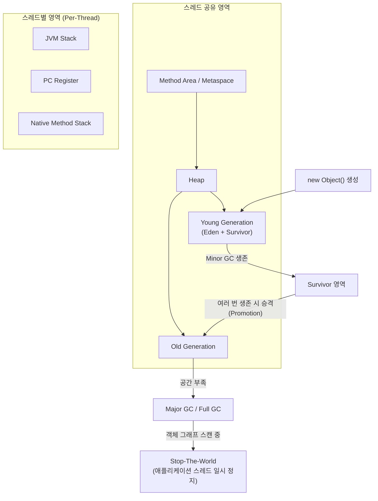

# JVM 메모리 영역(Heap, Stack, Metaspace) 구조와 Garbage Collection(GC) 기본 동작 원리

## 요약

자바 애플리케이션이 실행되는 동안 JVM은 객체, 메서드 코드, 스레드별 실행 상태를 서로 다른 메모리 영역에 나누어 관리합니다. 본 아티클에서는 JVM 명세(Java Virtual Machine Specification)가 정의하는 5가지 런타임 데이터 영역(Heap, Method Area/Metaspace, JVM Stack, PC Register, Native Method Stack)의 역할과 스레드 공유 여부를 정리하고, Young/Old Generation 기반 세대별 GC와 Minor/Major GC, Stop-The-World가 실제로 어떻게 맞물려 동작하는지, 그리고 2026년 현재 JDK의 기본 GC로 자리잡아 가는 G1 GC의 기본 동작 원리를 다룹니다.

## 본문

### 1. JVM 런타임 데이터 영역 개요

JVM 명세(Java SE 21 Edition) 2장은 JVM이 프로그램 실행 중 사용하는 런타임 데이터 영역을 크게 두 부류로 나눕니다. 첫째는 모든 스레드가 공유하는 영역(Heap, Method Area)이고, 둘째는 스레드마다 독립적으로 생성·소멸되는 영역(PC Register, JVM Stack, Native Method Stack)입니다[1]. 이 구분이 중요한 이유는 "어떤 메모리가 스레드 간에 공유되어 동시성 문제(레이스 컨디션)를 신경 써야 하는가"를 결정짓기 때문입니다. 공유 영역인 힙은 여러 스레드가 동시에 접근할 수 있어 동기화가 필요하지만, 스레드별 스택은 애초에 다른 스레드가 접근할 수 없으므로 스택에 저장된 지역 변수는 동기화 없이도 안전합니다.

### 2. Heap: 객체가 사는 곳

힙은 `new`로 생성한 모든 클래스 인스턴스와 배열이 저장되는 공간이며, JVM 시작 시 생성되어 종료 시까지 유지되는 스레드 공유 영역입니다[1]. JVM 명세는 힙이 물리적으로 연속된 메모리일 필요는 없다고 명시하며, 초기 크기·최대 크기 제어를 구현체(HotSpot 등)가 프로그래머에게 제공할 수 있다고 규정합니다[1]. 실무에서 `-Xms`(초기 힙 크기)와 `-Xmx`(최대 힙 크기) JVM 옵션으로 이 크기를 직접 제어하는 것이 바로 이 명세 조항의 실제 구현입니다. 힙에 객체를 더 이상 할당할 공간이 없으면 `OutOfMemoryError`가 발생합니다.

HotSpot VM은 이 힙을 다시 Young Generation(Eden + Survivor 영역)과 Old Generation으로 나누어 관리하는 세대별(Generational) 전략을 씁니다. 대부분의 객체는 생성된 직후 금방 참조를 잃고 버려진다는 경험적 관찰(Weak Generational Hypothesis)에 기반해, 새로 생성된 객체를 Young Generation에 배치하고 여러 번의 GC에서 살아남은 객체만 Old Generation으로 승격(Promotion)시킵니다.

### 3. Method Area(메서드 영역)와 Metaspace

Method Area 역시 힙과 마찬가지로 모든 스레드가 공유하는 영역으로, 클래스별 런타임 상수 풀(Run-Time Constant Pool), 필드·메서드 정보, 메서드 바이트코드 자체가 저장됩니다[1]. JVM 명세는 이 Method Area를 "논리적으로는 힙의 일부이지만 구현체가 가비지 컬렉션 여부를 선택할 수 있다"고 설명합니다[1]. HotSpot에서는 Java 8 이전까지 이 영역을 PermGen(Permanent Generation)이라는 이름으로 힙 안쪽에 고정 크기로 배치했으나, 클래스가 많은 애플리케이션(대형 웹 애플리케이션, 다수의 동적 프록시/리플렉션 사용)에서 `OutOfMemoryError: PermGen space`가 빈번히 발생하는 문제가 있었습니다. Java 8부터는 Method Area 구현을 Metaspace로 교체해 네이티브 메모리(OS가 관리하는 힙 바깥 영역)에 배치하고, 기본적으로 필요한 만큼 자동으로 확장되도록 바꾸었습니다. `-XX:MaxMetaspaceSize`로 상한을 지정하지 않으면 이론상 시스템 메모리가 허용하는 한 계속 늘어날 수 있습니다.

### 4. JVM Stack, PC Register, Native Method Stack: 스레드별 영역

나머지 세 영역은 모두 스레드가 생성될 때 함께 만들어지고 스레드가 종료되면 함께 사라지는 스레드 전용(Per-Thread) 영역입니다[1].

- **JVM Stack**: 메서드가 호출될 때마다 프레임(Frame)이 하나씩 쌓이는 스택으로, 각 프레임은 지역 변수 배열(Local Variables)과 연산에 쓰이는 오퍼랜드 스택(Operand Stack)을 갖습니다[1]. 재귀 호출이 너무 깊어지면 `StackOverflowError`가 발생하는데, 이는 정확히 이 JVM Stack의 최대 깊이를 초과했기 때문입니다.
- **PC Register(프로그램 카운터)**: 현재 실행 중인 JVM 바이트코드 명령의 주소를 담는 스레드별 레지스터입니다. 실행 중인 메서드가 네이티브 메서드라면 이 값은 정의되지 않습니다(undefined)[1].
- **Native Method Stack**: JNI(Java Native Interface)를 통해 C/C++로 작성된 네이티브 메서드를 실행할 때 사용하는 스택으로, JVM 명세는 이 영역을 선택적(optional) 구성 요소로 규정합니다[1].

아래 다이어그램은 지금까지 설명한 메모리 영역의 스레드 공유 여부와, 객체가 생성된 뒤 Young Generation에서 Old Generation으로 승격되는 흐름을 함께 보여줍니다.



### 5. Garbage Collection 기본 동작: Minor GC, Major GC, Stop-The-World

세대별 힙 구조 위에서 GC는 크게 두 종류로 나뉩니다. **Minor GC**는 Young Generation(주로 Eden 영역)이 가득 찼을 때 발생하며, 살아남은 객체를 Survivor 영역으로 옮기고 Eden을 비웁니다. Young Generation은 크기가 작고 대부분의 객체가 금방 죽기 때문에 Minor GC는 상대적으로 빠르게 끝납니다. 반면 **Major GC(Full GC)**는 Old Generation까지 포함해 힙 전체를 정리하는 작업으로, 검사해야 할 객체가 훨씬 많아 소요 시간이 길어집니다.

두 GC 방식 모두 전통적으로는 **Stop-The-World(STW)**라는 현상을 동반합니다. GC가 힙의 객체 그래프를 탐색해 살아있는 객체와 죽은 객체를 판별하는 동안, 애플리케이션의 모든 스레드가 실행을 멈춰야 합니다(그렇지 않으면 GC가 참조 관계를 스캔하는 도중 애플리케이션 스레드가 참조를 바꿔버려 일관성이 깨질 수 있기 때문입니다). STW 시간이 길어지면 API 응답 지연이나 타임아웃으로 직결되므로, 최신 GC 알고리즘의 핵심 목표는 이 STW 시간을 최대한 짧고 예측 가능하게 만드는 것입니다.

### 6. G1 GC 기본 동작과 2026년 현재 상황

Oracle의 HotSpot GC 튜닝 가이드는 G1(Garbage-First) GC를 "멀티 프로세서, 대용량 메모리 환경을 타깃으로 하며 짧은 정지 시간 목표를 높은 확률로 달성하면서 우수한 처리량을 함께 얻도록 설계된 서버 지향 컬렉터"로 설명합니다[2]. G1은 힙을 동일한 크기의 여러 리전(Region)으로 나누고, 전체 힙이 아니라 가비지가 가장 많이 찬 리전들을 우선적으로 골라 회수하는 방식으로 동작합니다[2]. 전역 마킹(Global Marking) 같은 힙 전체 단위 작업은 애플리케이션 스레드와 동시에(concurrently) 수행되어, 힙 크기나 살아있는 데이터 양에 비례해 애플리케이션이 멈추는 시간을 줄입니다[2].

G1은 JDK 9부터 서버급 환경(멀티 코어, 대용량 메모리)의 기본 GC였습니다(JEP 248)[3]. 여기서 한 걸음 더 나아가, JDK 27을 타깃으로 하는 JEP 523은 커맨드라인에서 GC를 명시하지 않았을 때 서버 환경 여부와 무관하게 HotSpot이 항상 G1을 선택하도록 만드는 것을 제안하고 있습니다[4]. 이 JEP는 최근 동기화 작업 개선으로 G1의 최대 처리량이 Serial GC에 근접했고, G1의 최대 지연 시간은 이미 항상 Serial보다 우수했으며, 네이티브 메모리 사용량도 Serial과 비슷한 수준으로 줄었다는 벤치마크 근거를 제시합니다[4]. Serial GC 자체가 JDK에서 제거되는 것은 아니며, 성능 특성상 Serial이 더 적합한 상황(예: 매우 작은 힙, 단일 코어 환경)에서는 여전히 명시적으로 선택해 사용할 수 있습니다[4].

```bash
# 현재 사용 중인 GC 옵션 확인
java -XX:+PrintFlagsFinal -version | grep -i "Use.*GC"

# G1 GC를 명시적으로 지정하고 힙 크기를 설정하는 예
java -XX:+UseG1GC -Xms512m -Xmx2g -jar app.jar

# 실행 중인 JVM의 GC 통계를 1초 간격으로 실시간 관찰 (jstat)
jstat -gcutil <pid> 1000
```

## 사실 검증 결과

| Claim | 판정 | 근거 |
|---|---|---|
| CLAIM-001: JVM 런타임 데이터 영역은 힙/메서드 영역처럼 스레드가 공유하는 영역과 PC 레지스터/JVM 스택/네이티브 메서드 스택처럼 스레드별로 독립적인 영역으로 나뉜다 | verified | Java Virtual Machine Specification, SE 21 Edition, Chapter 2 (Java SE 21) |
| CLAIM-002: Java 8부터 HotSpot은 클래스 메타데이터 저장 영역을 PermGen에서 네이티브 메모리 기반 Metaspace로 교체했다 | verified | Oracle HotSpot Virtual Machine Garbage Collection Tuning Guide |
| CLAIM-003: G1 GC는 힙을 균등한 크기의 리전으로 나누고 가비지가 많은 리전을 우선 회수하며, 전역 마킹을 애플리케이션 스레드와 동시에 수행한다 | verified | Oracle HotSpot VM GC Tuning Guide, "Garbage-First Garbage Collector" 챕터 |
| CLAIM-004: G1은 JDK 9부터 서버급 환경의 기본 GC였고, JDK 27을 타깃으로 하는 JEP 523은 이를 모든 환경의 기본값으로 확장하는 것을 제안한다 | verified | OpenJDK JEP 248, JEP 523(2026년 5월 JDK 27 타깃 지정, Inside.java 보도) |

## 작성자의 견해

> 이 섹션은 사실 전달이 아니라 작성자의 해석과 견해를 담고 있습니다.

JEP 523이 통과되면 "GC 옵션을 아무것도 안 주면 무슨 GC가 뜨는지" 헷갈릴 일이 훨씬 줄어들 것이라고 봅니다. 지금까지는 같은 애플리케이션 코드라도 실행 환경(코어 수, 메모리 크기)에 따라 기본 GC가 Serial이었다 G1이었다 달라질 수 있었는데, 이게 로컬 개발 환경(보통 리소스가 작아 Serial이 뜸)과 운영 서버(G1이 뜸) 사이의 GC 동작 차이로 이어져 "로컬에서는 멀쩡했는데 운영에서만 GC 관련 이슈가 난다"는 디버깅 혼란의 원인이 되곤 했습니다. 다만 실무자 입장에서는 여전히 GC 튜닝을 "기본값에 맡기고 끝"이라고 생각하면 안 됩니다. 힙 크기(`-Xmx`)를 애플리케이션의 실제 워킹셋보다 지나치게 작게 잡으면 아무리 좋은 GC 알고리즘을 쓰더라도 Full GC가 빈번해지는 것을 막을 수 없고, 반대로 Metaspace 상한을 안 잡아두면 클래스 로더 누수(예: 애플리케이션 서버에서 배포를 반복할 때)가 있는 경우 네이티브 메모리 고갈로 OS 레벨에서 프로세스가 죽는 사고로 이어질 수 있습니다. 저는 특히 컨테이너(쿠버네티스 Pod) 환경에서 메모리 리밋을 거는 조직일수록, 기본 GC 변경 여부와 무관하게 `-Xmx`와 `-XX:MaxMetaspaceSize`를 명시적으로 지정하는 습관이 반드시 필요하다고 봅니다.

## 한계와 반론

본 아티클은 G1 GC의 개괄적인 동작 원리에 집중했으며, ZGC나 Shenandoah 같은 더 최신의 저지연 컬렉터의 구체적인 내부 알고리즘(컬러 포인터, 로드 배리어 등)은 다루지 않았습니다. 극단적으로 짧은 지연 시간(수 밀리초 이하)이 요구되는 금융 거래 시스템 등에서는 G1보다 ZGC/Shenandoah가 더 적합할 수 있다는 반론이 있을 수 있습니다. 또한 JEP 523은 이 글 작성 시점 기준 JDK 27을 타깃으로 제안(target)된 상태이며, 실제로 해당 버전에 그대로 반영되어 출시될지, 세부 조건이 바뀔지는 최종 릴리스 전까지 유동적일 수 있다는 점도 감안해야 합니다.

## 참고문헌

1. Oracle, "The Java Virtual Machine Specification, Java SE 21 Edition — Chapter 2. The Structure of the Java Virtual Machine", [https://docs.oracle.com/javase/specs/jvms/se21/html/jvms-2.html](https://docs.oracle.com/javase/specs/jvms/se21/html/jvms-2.html) (확인일: 2026-08-17)
2. Oracle, "HotSpot Virtual Machine Garbage Collection Tuning Guide — Garbage-First (G1) Garbage Collector", [https://docs.oracle.com/en/java/javase/25/gctuning/garbage-first-g1-garbage-collector1.html](https://docs.oracle.com/en/java/javase/25/gctuning/garbage-first-g1-garbage-collector1.html) (확인일: 2026-08-17)
3. OpenJDK, "JEP 248: Make G1 the Default Garbage Collector", [https://openjdk.org/jeps/248](https://openjdk.org/jeps/248) (확인일: 2026-08-17)
4. OpenJDK, "JEP 523: Make G1 the Default Garbage Collector in All Environments", [https://openjdk.org/jeps/523](https://openjdk.org/jeps/523) (확인일: 2026-08-17)

## 종합적 의견

> 이 섹션은 전체 주제에 대한 종합적 분석과 개인 견해를 담고 있습니다.

JVM 메모리 구조를 이해하는 것은 단순히 시험용 지식이 아니라, 실무에서 `OutOfMemoryError`의 종류(Heap space인지 Metaspace인지 StackOverflow인지)만 보고도 원인을 좁혀나갈 수 있는 실전 디버깅 능력과 직결됩니다. Heap과 Method Area가 스레드 공유 영역이라는 사실은 왜 멀티스레드 애플리케이션에서 객체 상태 동기화가 필요한지를, 반대로 JVM Stack이 스레드 전용이라는 사실은 왜 지역 변수는 동기화가 필요 없는지를 설명해 줍니다. GC 쪽에서는 세대별 가설(대부분의 객체는 금방 죽는다)에 기반한 Young/Old Generation 분리와, "가장 가비지가 많은 영역부터 회수한다"는 G1의 이름 그 자체(Garbage-*First*)가 결국 같은 문제의식—전체 힙을 매번 다 훑지 않고 효율적으로 회수 대상을 고르자는—을 공유한다는 점이 흥미롭습니다. JEP 523으로 G1이 모든 환경의 기본값이 되어가는 흐름은, 이제 "어떤 GC를 쓸지"보다 "그 GC에 맞게 힙/메타스페이스 크기를 어떻게 설계할지"가 더 중요한 실무 과제가 되었다는 것을 시사합니다.

## 꼬리질문

1. **G1 GC의 리전(Region) 크기는 어떻게 자동으로 결정되며, `-XX:G1HeapRegionSize`로 수동 조정할 때 어떤 트레이드오프가 발생하는가?**
   - 추천 참고 URL: https://docs.oracle.com/en/java/javase/25/gctuning/garbage-first-g1-garbage-collector1.html
2. **ZGC와 Shenandoah는 G1과 달리 어떤 메커니즘(컬러 포인터, 로드 배리어)으로 Stop-The-World 시간을 수 밀리초 이하로 줄이는가?**
   - 추천 참고 URL: https://docs.oracle.com/en/java/javase/25/gctuning/z-garbage-collector.html
3. **컨테이너(cgroup) 메모리 리밋 환경에서 JVM이 힙 크기를 자동으로 계산하는 `-XX:+UseContainerSupport`는 실제로 어떻게 동작하는가?**
   - 추천 참고 URL: https://docs.oracle.com/en/java/javase/25/gctuning/introduction-garbage-collection-tuning.html

## 백링크

- [OS 프로세스 vs 쓰레드](https://beji-tech.blogspot.com/2026/08/os-process-vs-thread.html)
- [위키 인덱스](../../wiki/README.md)