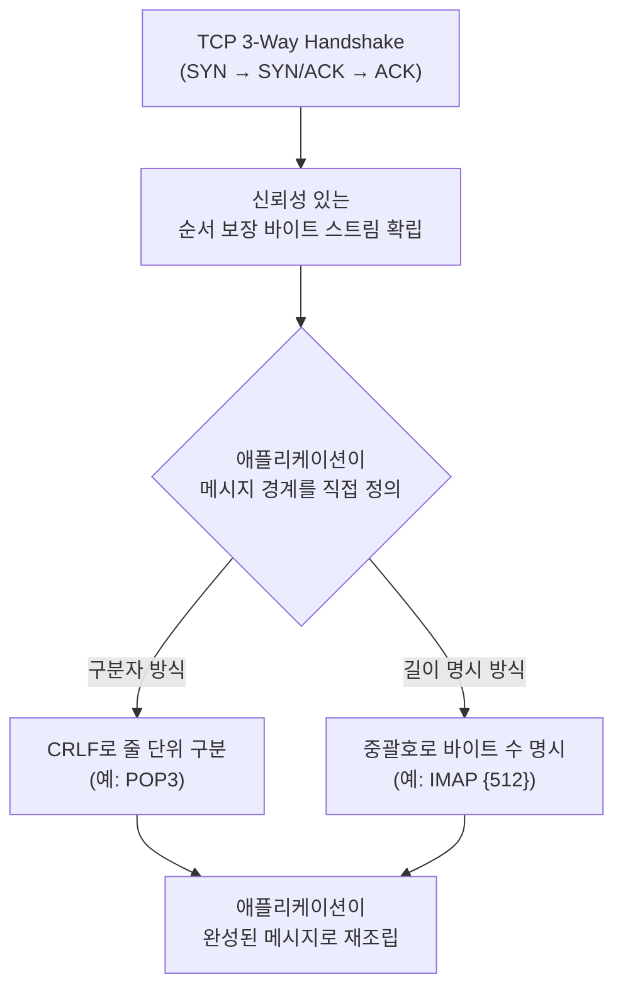

# TCP 기반 애플리케이션 계층 통신 원리 — 이메일(IMAP/POP3) 프로토콜이 TCP 위에서 동작하는 방식

## 요약

IMAP과 POP3 같은 이메일 프로토콜, 그리고 HTTP 같은 웹 프로토콜은 모두 TCP라는 동일한 전송 계층 위에서 동작합니다. 하지만 TCP 자체는 "메시지"라는 개념을 전혀 모르고, 그저 순서가 보장된 신뢰성 있는 바이트 스트림만 제공합니다. 본 아티클에서는 RFC 9293(현재 TCP 표준 명세)이 정의하는 TCP의 핵심 속성—연결지향형, 신뢰성 있는 순서 보장 전달, 전이중 통신—을 정리하고, 이 "그냥 바이트 스트림"이라는 낮은 수준의 서비스 위에서 IMAP/POP3 같은 텍스트 기반 요청-응답 프로토콜이 어떻게 자기만의 메시지 경계와 명령어 문법을 만들어 애플리케이션 계층 프로토콜로 성립하는지를 소켓 프로그래밍 관점에서 설명합니다.

## 본문

### 1. TCP는 무엇을 보장하고, 무엇을 보장하지 않는가

현재 TCP의 정본 표준인 RFC 9293(2022년 발행, 기존 RFC 793 및 그 이후 수정 RFC들을 통합)은 TCP를 "애플리케이션에 신뢰성 있고 순서가 보장된 바이트 스트림 서비스를 제공하는 프로토콜"로 정의합니다[1]. TCP의 신뢰성은 시퀀스 번호를 통한 패킷 손실 탐지와, 세그먼트 단위 체크섬을 통한 오류 탐지, 그리고 재전송을 통한 복구로 구성됩니다[1]. 또한 TCP는 연결지향형(connection-oriented)이며 양방향 데이터 흐름을 지원하는 전이중(full-duplex) 통신을 제공합니다[1].

여기서 실무적으로 가장 자주 오해되는 지점은 "TCP가 메시지 경계를 보장해 준다"는 착각입니다. RFC 9293은 이를 명시적으로 부정합니다: "애플리케이션은 상위 계층 프로토콜의 메시지 단위로 쓰기(write)를 수행할 수 있지만, TCP는 전송·수신된 TCP 세그먼트의 경계와 애플리케이션의 읽기/쓰기 버퍼 경계 사이에 아무런 상관관계를 보장하지 않는다"[1]. 다시 말해 애플리케이션이 "안녕"과 "하세요"를 두 번의 별도 `write()` 호출로 전송해도, 수신 측에서는 이게 한 번의 `read()`로 "안녕하세요"가 통째로 들어올 수도 있고, 반대로 "안"과 "녕하세요"로 쪼개져서 들어올 수도 있습니다. TCP는 바이트가 순서대로, 손실 없이 도착하는 것만 보장할 뿐, 어디까지가 하나의 "메시지"인지는 전혀 신경 쓰지 않습니다.

### 2. 그렇다면 메시지 경계는 누가 정의하는가: 애플리케이션 계층의 책임

바로 이 지점에서 애플리케이션 계층 프로토콜(HTTP, SMTP, IMAP, POP3 등)이 필요해집니다. 이 프로토콜들은 공통적으로 "바이트 스트림 안에서 메시지가 어디서 끝나는지"를 스스로 정의하는 규칙을 둡니다. 대표적인 두 가지 접근 방식은 다음과 같습니다.

- **구분자(Delimiter) 기반**: 줄바꿈(CRLF, `\r\n`)으로 명령/응답 단위를 구분하는 방식. POP3의 모든 명령(`USER alice`, `RETR 2`)과 대부분의 응답이 이 방식을 씁니다.
- **길이 명시(Length-Prefixed) 기반**: 본문 앞에 바이트 수를 명시해, 그 바이트 수만큼 읽으면 메시지가 끝난다고 알려주는 방식. IMAP의 `FETCH` 응답에서 메일 본문을 전송할 때 `{512}`처럼 중괄호 안에 바이트 수를 먼저 보내는 리터럴(literal) 문법이 이 방식입니다.

이 두 방식 모두 "TCP가 대신 해주지 않는 일을, 애플리케이션 프로토콜이 텍스트 규약으로 직접 해결한다"는 공통점을 가집니다.

아래 다이어그램은 TCP 3-way handshake로 연결이 수립된 뒤, 애플리케이션 계층 프로토콜이 두 가지 방식(구분자/길이 명시) 중 하나로 스스로 메시지 경계를 정의하는 흐름을 보여줍니다.



### 3. TCP 소켓 위에서 이메일 프로토콜이 동작하는 실제 흐름

이메일 클라이언트가 IMAP 서버에 접속하는 과정을 소켓 계층에서 보면 다음과 같습니다: 클라이언트는 서버의 IP 주소와 포트(IMAP은 보통 993)로 `connect()`를 호출해 TCP 3-way handshake를 완료하고, 이 시점부터 클라이언트와 서버는 양방향 바이트 스트림을 주고받을 수 있는 하나의 TCP 커넥션(소켓)을 공유합니다. 이후 IMAP/POP3의 모든 명령과 응답은 이 하나의 TCP 커넥션 위로 오가는 텍스트 바이트일 뿐입니다 — TCP 입장에서는 `LOGIN alice ******\r\n`이라는 바이트열이 IMAP 로그인 명령인지, 그냥 임의의 텍스트인지 전혀 구분하지 않습니다. 프로토콜의 "의미"는 전적으로 클라이언트와 서버 양쪽이 같은 애플리케이션 프로토콜 명세(RFC 3501, RFC 1939)를 따르기로 미리 약속했기 때문에 성립하는 것입니다.

```python
import socket
import ssl

# 1. TCP 소켓 생성 및 3-way handshake (connect)로 연결 수립
raw_sock = socket.create_connection(("imap.example.com", 993), timeout=5)

# 2. IMAP은 993 포트에서 처음부터 TLS로 암호화된 바이트 스트림을 주고받음
context = ssl.create_default_context()
tls_sock = context.wrap_socket(raw_sock, server_hostname="imap.example.com")

# 3. 여기서부터는 순서 보장된 바이트 스트림 위에 IMAP 텍스트 프로토콜을 그대로 실어 보냄
#    TCP는 이 바이트들이 "IMAP 명령"이라는 걸 전혀 모른다 — 그냥 바이트일 뿐이다.
tls_sock.sendall(b"a1 LOGIN alice password\r\n")

# 4. 응답도 마찬가지로 바이트 스트림에서 CRLF로 구분된 텍스트 응답을 애플리케이션이 직접 파싱해야 함
response = tls_sock.recv(4096)
print(response.decode())  # 예: b"a1 OK LOGIN completed\r\n"
```

### 4. TCP 3-Way Handshake와의 관계

이메일 프로토콜의 첫 번째 바이트가 오가기 전에, TCP 계층에서는 이미 SYN → SYN-ACK → ACK로 이어지는 3-way handshake가 먼저 완료되어 연결이 수립되어 있어야 합니다. 이 핸드셰이크 자체는 IMAP/POP3와 무관한 순수 TCP 계층의 일이며, 애플리케이션은 이 과정을 직접 다루지 않고 운영체제의 소켓 API(`connect()`)가 완료해 줍니다. 이 핸드셰이크의 시퀀스 번호 교환, TIME_WAIT 상태 같은 세부 메커니즘은 별도의 심화 주제로 다룰 만큼 내용이 방대하므로, 본 아티클에서는 "이메일 프로토콜의 모든 대화는 이미 수립된 하나의 TCP 연결 위에서 일어난다"는 관계만 짚고 넘어갑니다.

### 5. 실무 적용: 소켓 프로그래밍에서 흔히 발생하는 실수

TCP가 메시지 경계를 보장하지 않는다는 사실을 모르고 애플리케이션 프로토콜을 직접 구현하면, "한 번의 `recv()` 호출로 응답 전체가 항상 온다"고 가정하는 버그를 만들기 쉽습니다. 실제로는 큰 메일 본문을 `FETCH`로 받을 때 TCP 세그먼트가 여러 번에 걸쳐 나뉘어 도착할 수 있으므로, 견고한 IMAP/POP3 클라이언트 구현은 반드시 "길이 명시 리터럴({512})만큼 다 받을 때까지" 또는 "CRLF가 나올 때까지" 루프를 돌며 누적해서 읽는(buffering) 로직을 갖춰야 합니다. Python의 `imaplib`, `poplib`이나 Java의 JavaMail 같은 성숙한 라이브러리를 쓰면 이 버퍼링 로직이 라이브러리 내부에 이미 구현되어 있어 신경 쓸 필요가 없지만, 저수준 소켓으로 직접 프로토콜을 구현한다면 이 부분이 가장 흔한 버그의 원인이 됩니다.

## 사실 검증 결과

| Claim | 판정 | 근거 |
|---|---|---|
| CLAIM-001: RFC 9293은 현재 TCP의 정본 표준으로, TCP를 신뢰성 있고 순서가 보장된 바이트 스트림 서비스로 정의한다 | verified | RFC 9293, rfc-editor.org 공식 명세 |
| CLAIM-002: TCP는 전송된 세그먼트의 경계와 애플리케이션의 읽기/쓰기 버퍼 경계 사이에 아무런 상관관계를 보장하지 않는다 | verified | RFC 9293 공식 명세 원문 |
| CLAIM-003: IMAP은 리터럴 바이트 수 명시({n}) 방식으로, POP3는 CRLF 구분자 방식으로 메시지 경계를 애플리케이션 계층에서 직접 정의한다 | verified | RFC 3501(IMAP4rev1), RFC 1939(POP3) 공식 명세 |
| CLAIM-004: TCP는 연결지향형이며 양방향 데이터 흐름을 지원하는 전이중 통신을 제공한다 | verified | RFC 9293 공식 명세 |

## 작성자의 견해

> 이 섹션은 사실 전달이 아니라 작성자의 해석과 견해를 담고 있습니다.

"TCP는 순서 보장 바이트 스트림만 제공하고 메시지 경계는 안 지켜준다"는 사실은 이론으로 한 번 듣고 넘어가면 금방 잊히지만, 실제로 소켓 프로그래밍을 직접 해보지 않은 개발자일수록 이걸 체감하기 어렵다고 생각합니다. 대부분의 실무에서는 HTTP 클라이언트 라이브러리나 IMAP 라이브러리가 이 버퍼링 문제를 이미 해결해 주기 때문에, "한 번 요청 보내면 한 번에 응답이 온다"는 착각 속에서 개발을 계속하게 됩니다. 하지만 대용량 페이로드를 다루는 시스템(대용량 첨부파일이 있는 메일, 큰 이미지 업로드)을 직접 저수준으로 구현하거나 디버깅해야 하는 상황이 오면 이 지식의 부재가 바로 원인 불명의 데이터 손실·파싱 오류로 나타납니다. 저는 신입 백엔드 개발자에게 소켓 프로그래밍을 가르칠 때, 라이브러리에 기대지 않고 직접 `recv()` 루프를 짜보게 하는 것이 이 개념을 체득시키는 가장 확실한 방법이라고 봅니다.

## 한계와 반론

본 아티클은 TCP 위에서 동작하는 애플리케이션 프로토콜의 "메시지 경계 정의"라는 좁은 주제에 집중했으며, TCP의 혼잡 제어(Congestion Control), 흐름 제어(Flow Control), 재전송 타이머 같은 성능 관련 메커니즘은 다루지 않았습니다. 또한 UDP 기반 프로토콜(DNS, QUIC/HTTP3)은 애초에 TCP와 다른 전제(비연결형, 자체 신뢰성 계층을 애플리케이션이나 QUIC 자체가 구현)를 가지므로 본문의 논의가 그대로 적용되지 않는다는 점도 반론으로 제기될 수 있습니다. TCP 기반 프로토콜이라고 해서 모든 애플리케이션 프로토콜이 텍스트 기반인 것도 아닙니다 — gRPC나 여러 바이너리 RPC 프로토콜은 텍스트 구분자 대신 프로토콜 버퍼 등으로 직렬화된 길이 명시 프레임을 사용하며, 이는 IMAP의 리터럴 방식과 원리는 같지만 구현 방식은 상당히 다릅니다.

## 참고문헌

1. IETF, "RFC 9293: Transmission Control Protocol (TCP)", [https://www.rfc-editor.org/rfc/rfc9293.html](https://www.rfc-editor.org/rfc/rfc9293.html) (확인일: 2026-08-17)
2. IETF, "RFC 3501: Internet Message Access Protocol - Version 4rev1", [https://www.rfc-editor.org/rfc/rfc3501](https://www.rfc-editor.org/rfc/rfc3501) (확인일: 2026-08-17)

## 종합적 의견

> 이 섹션은 전체 주제에 대한 종합적 분석과 개인 견해를 담고 있습니다.

TCP와 애플리케이션 계층 프로토콜의 관계는 "낮은 계층은 최소한의 보장만 제공하고, 그 위의 계층이 필요한 의미를 스스로 쌓아 올린다"는 네트워크 계층화(Layering) 설계 철학을 가장 명확하게 보여주는 사례입니다. TCP는 신뢰성 있는 순서 보장 바이트 전달이라는 딱 그만큼의 책임만 지고, "이 바이트들이 로그인 명령인지 메일 본문인지"는 전혀 알지 못한 채 그저 정확하게 순서대로 전달합니다. IMAP과 POP3는 이 위에 CRLF 구분자나 길이 명시 리터럴이라는 자기만의 문법을 얹어 "메일함과 대화하는 언어"를 완성합니다. TCP의 이런 무관심(agnostic) 덕분에 HTTP, SMTP, IMAP, POP3, 그리고 수많은 커스텀 프로토콜이 같은 전송 계층 위에서 각자의 애플리케이션 의미를 자유롭게 정의하며 공존할 수 있는 것입니다.

## 꼬리질문

1. **TCP의 Nagle 알고리즘이나 지연 ACK(Delayed ACK)는 짧은 텍스트 명령이 자주 오가는 IMAP/POP3 같은 프로토콜의 응답 지연에 실제로 얼마나 영향을 미치는가?**
   - 추천 참고 URL: https://www.rfc-editor.org/rfc/rfc9293.html
2. **gRPC 같은 바이너리 RPC 프로토콜의 길이 명시 프레임 방식은 IMAP의 리터럴({n}) 방식과 원리는 같은데, 실제 파싱 성능과 구현 복잡도 측면에서는 어떤 차이가 있는가?**
   - 추천 참고 URL: https://www.rfc-editor.org/rfc/rfc3501
3. **HTTP/3(QUIC)는 TCP가 아닌 UDP 위에서 자체 신뢰성 계층을 구현하는데, 이것이 이 글에서 설명한 "TCP의 메시지 경계 미보장" 문제를 근본적으로 어떻게 다르게 해결하는가?**
   - 추천 참고 URL: https://beji-tech.blogspot.com/2026/08/http11-vs-http2-vs-http3.html

## 백링크

- [HTTP/1.1 vs HTTP/2 vs HTTP/3](https://beji-tech.blogspot.com/2026/08/http11-vs-http2-vs-http3.html)
- [위키 인덱스](../../wiki/README.md)