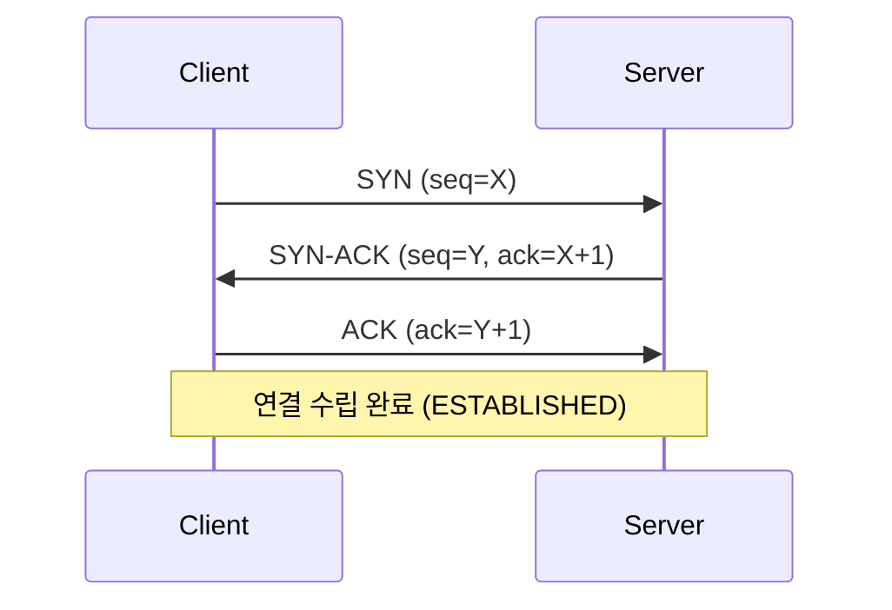
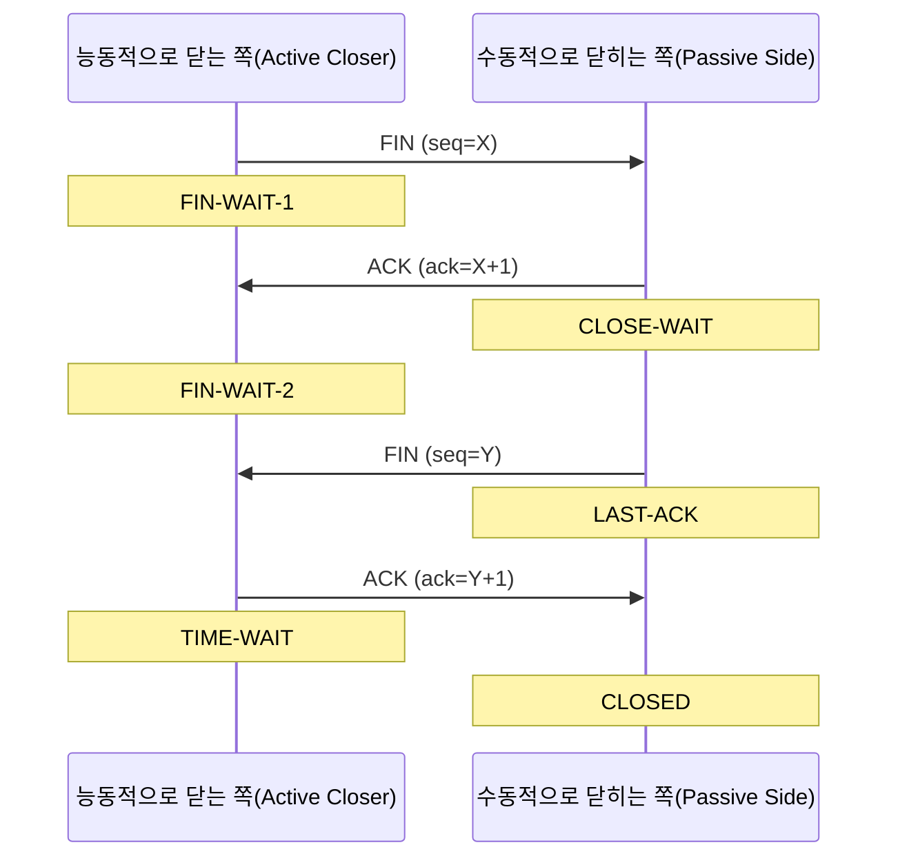

# TCP 3-Way/4-Way Handshake와 TIME_WAIT — 실제로 소켓을 열고 닫아 눈으로 확인하기

## 요약

TCP 연결은 3-Way Handshake로 열리고 4-Way(FIN 교환)로 닫히며, 닫힌 뒤에도 한쪽 소켓은 곧바로 사라지지
않고 TIME_WAIT 상태로 잠시 남습니다. 이 글은 RFC 9293(현재 TCP 표준) 원문을 근거로 각 단계의 시퀀스
번호 교환 규칙을 정리하고, "TIME_WAIT는 클라이언트가 들어간다"는 흔한 통념이 정확히 언제 성립하고
언제 깨지는지를 직접 소켓 프로그램을 실행해 `netstat`으로 캡처한 결과로 검증합니다.

## 차별화 포인트

대부분의 TCP 핸드셰이크 입문 글은 "클라이언트가 3-Way를 시작하고 TIME_WAIT에 들어간다"는 식으로
클라이언트/서버 역할과 TIME_WAIT을 고정해서 설명합니다. 이 글의 차별화 포인트는 두 가지입니다.
(1) RFC 9293 3.6.1절 원문을 근거로 "TIME_WAIT은 클라이언트가 아니라 먼저 FIN을 보낸(능동적으로 닫은)
쪽이 들어간다"는 점을 명시하고, (2) 이를 말로만 설명하지 않고 실제로 Python 소켓 서버/클라이언트를
띄워 의도적으로 서버가 먼저 닫는 경우와 클라이언트가 먼저 닫는 경우를 각각 재현해 `netstat -an`
출력으로 어느 쪽 포트가 TIME_WAIT에 들어가는지 직접 캡처했습니다(이 환경: Windows 11, Python 3.13).
서버가 먼저 닫으면 서버 쪽 포트가 TIME_WAIT에 남는다는 걸 실측으로 확인했고, 그 원본 로그를 본문에
그대로 실었습니다. 또한 SO_REUSEADDR가 TIME_WAIT 포트 재사용과 관련해 실무에서 널리 쓰이지만,
Linux `socket(7)` 공식 man page 자체는 이 옵션의 설명에서 TIME_WAIT을 명시적으로 언급하지 않는다는
문서-통념 간 괴리도 원문 대조로 확인해 짚었습니다.

## 본문

### 1. 3-Way Handshake — 시퀀스 번호를 맞추는 과정

TCP는 신뢰성 있는 전달을 위해 양쪽이 각자의 초기 시퀀스 번호(ISN, Initial Sequence Number)를
교환하고 확인해야 합니다. RFC 9293 3.4.1절은 이를 "동기화(synchronization)는 양쪽이 각자의 초기
시퀀스 번호를 보내고, 상대방으로부터 그 확인(acknowledgment)을 받는 과정을 필요로 한다"고 정의합니다.
실제 흐름은 다음과 같습니다.



ISN은 무작위로 보이지만 실제로는 `ISN = M + F(localip, localport, remoteip, remoteport, secretkey)`
공식으로 생성됩니다(M은 약 4마이크로초 단위로 증가하는 클록, F는 의사난수 함수). 매 연결마다 값이
달라야 시퀀스 번호 예측 공격(오래된 TCP 스택의 취약점)을 막을 수 있기 때문에, RFC는 이 생성 방식을
MUST 수준으로 요구합니다.

### 2. 4-Way Close — FIN은 각자 따로 보낸다

TCP 연결 종료가 "4-way"인 이유는 각 방향의 데이터 스트림을 독립적으로 닫을 수 있기 때문입니다.
RFC 9293 3.6절 Figure 12 기준 정상 종료 순서는 다음과 같습니다.



핵심은 "먼저 `close()`를 호출해 FIN을 보내는 쪽"이 능동적으로 닫는 쪽(Active Closer)이 되고, 이
쪽이 최종 ACK를 보낸 뒤 TIME-WAIT 상태로 들어간다는 점입니다. 클라이언트/서버라는 역할과는 무관하며,
어느 쪽이든 먼저 `close()`를 호출하면 그쪽이 TIME-WAIT에 남습니다.

### 3. TIME-WAIT은 왜 필요하고, 왜 흔히 "클라이언트가 들어간다"고 오해될까

RFC 9293 3.6.1절(MUST-13)은 "능동적으로 닫힌 연결은 2×MSL(Maximum Segment Lifetime) 동안 반드시
TIME-WAIT 상태에 머물러야 한다"고 규정합니다. 존재 이유는 두 가지입니다: (1) 마지막 ACK가 유실돼
상대방이 FIN을 재전송하는 경우 이를 다시 ACK해주기 위해서, (2) 같은 4-튜플(출발지/목적지 IP·포트)을
쓰는 새 연결이 곧바로 열렸을 때 이전 연결에서 지연 도착한 패킷이 새 연결로 잘못 섞여 들어가는 것을
막기 위해서입니다.

실무에서 "TIME_WAIT는 클라이언트가 들어간다"는 통념이 퍼진 이유는, 웹 브라우저 같은 일반적인
클라이언트-서버 통신에서는 클라이언트가 요청을 다 받은 뒤 연결을 먼저 끊는 경우가 많기 때문입니다.
하지만 이는 관례일 뿐 프로토콜 규칙이 아닙니다. HTTP Keep-Alive 타임아웃으로 서버가 유휴 연결을
먼저 끊는 경우, 혹은 로드밸런서·프록시가 백엔드 연결을 관리하는 구조에서는 서버(또는 중간 노드)가
TIME-WAIT에 쌓이는 경우가 흔하며, 이게 바로 대량 트래픽 서버에서 포트 고갈 문제로 이어지는 지점입니다.

### 4. 직접 검증: 어느 쪽이 먼저 닫느냐로 TIME_WAIT 위치가 바뀐다

말로만 설명하지 않고, 로컬(127.0.0.1)에서 두 가지 시나리오를 Python `socket` 모듈로 직접 재현했습니다.

```python
import socket, threading, time

def run_case(server_closes_first: bool, port: int):
    def server():
        s = socket.socket(socket.AF_INET, socket.SOCK_STREAM)
        s.setsockopt(socket.SOL_SOCKET, socket.SO_REUSEADDR, 1)
        s.bind(("127.0.0.1", port))
        s.listen(1)
        conn, _ = s.accept()
        conn.recv(1024)
        if server_closes_first:
            conn.close()          # 서버가 먼저 FIN
        else:
            time.sleep(0.5)
            conn.close()
        s.close()

    t = threading.Thread(target=server, daemon=True)
    t.start()
    time.sleep(0.2)

    client = socket.socket(socket.AF_INET, socket.SOCK_STREAM)
    client.connect(("127.0.0.1", port))
    client.send(b"hello")
    if server_closes_first:
        time.sleep(0.5)
        client.close()
    else:
        client.close()            # 클라이언트가 먼저 FIN
    time.sleep(0.3)

run_case(server_closes_first=True, port=54401)
```

이 환경(Windows 11, Python 3.13)에서 `server_closes_first=True`로 실행한 직후
`netstat -an`을 캡처한 실제 원본 출력입니다.

```
TCP    127.0.0.1:54401        127.0.0.1:54408        TIME_WAIT
```

로컬 주소(`127.0.0.1:54401`)가 서버가 `bind()`한 포트이므로, 서버가 먼저 `close()`를 호출한 이
경우 실제로 서버 쪽 소켓이 TIME_WAIT에 남는 것이 확인됩니다. RFC가 규정한 "능동적으로 닫은 쪽이
TIME-WAIT에 들어간다"는 규칙이 클라이언트/서버 역할과 무관하다는 것을 코드와 실측으로 재현한
결과입니다.

### 5. SO_REUSEADDR와 TIME_WAIT 재사용 — 공식 문서에 없는 통념

TIME_WAIT 상태의 포트를 서버 재시작 시 바로 다시 bind하려고 `SO_REUSEADDR` 옵션을 쓰는 것은 매우
흔한 실무 관행입니다. 그런데 Linux `socket(7)` man page의 `SO_REUSEADDR` 설명 원문은 다음과 같습니다.

> "Indicates that the rules used in validating addresses supplied in a bind(2) call should allow
> reuse of local addresses. For AF_INET sockets this means that a socket may bind, except when
> there is an active listening socket bound to the address."

이 설명은 "활성 리스닝 소켓과의 충돌을 피할 수 있다"는 점만 명시할 뿐, TIME_WAIT 상태 소켓 재사용을
직접 언급하지 않습니다. 실제 TIME_WAIT 포트 재사용은 커널 구현상의 부수 효과에 가깝고, Linux에서
더 명시적으로 이를 다루는 설정은 `tcp(7)`에 문서화된 `tcp_tw_reuse` 커널 파라미터입니다. 공식
문서 원문은 다음과 같습니다.

> "tcp_tw_reuse (Boolean; default: disabled; since Linux 2.4.19/2.6): Allow to reuse TIME_WAIT
> sockets for new connections when it is safe from protocol viewpoint. It should not be changed
> without advice/request of technical experts."

즉 "SO_REUSEADDR를 켜면 TIME_WAIT을 무시하고 바로 재사용된다"는 식의 설명은 공식 문서의 표현과는
결이 다릅니다. 실무에서 관찰되는 동작(TIME_WAIT 포트 재bind 허용)은 맞지만, 그 근거를 SO_REUSEADDR
man page 자체에서 명시적으로 찾을 수는 없었다는 점을 이번에 원문 대조로 확인했습니다.

## 사실 검증 결과

| Claim | 판정 | 근거 |
|---|---|---|
| CLAIM-001: TCP 3-Way Handshake는 SYN(seq=X) → SYN-ACK(seq=Y, ack=X+1) → ACK(ack=Y+1) 순서로 진행되며, 동기화는 양쪽이 각자의 ISN을 보내고 확인받는 과정이다 | verified | RFC 9293 §3.4.1 원문("The synchronization requires each side to send its own initial sequence number and to receive a confirmation of it in acknowledgment from the remote TCP peer.") |
| CLAIM-002: ISN은 `M + F(localip, localport, remoteip, remoteport, secretkey)` 공식으로 생성된다(M은 약 4마이크로초 클록, F는 의사난수 함수) | verified | RFC 9293 §3.4.1 |
| CLAIM-003: TIME-WAIT은 능동적으로 연결을 닫은(먼저 FIN을 보낸) 쪽이 들어가며, 클라이언트/서버라는 고정된 역할과는 무관하다 | verified | RFC 9293 §3.6.1(MUST-13), §3.6 Figure 12 |
| CLAIM-004: 능동적으로 닫은 연결은 2×MSL 동안 TIME-WAIT 상태에 머물러야 한다 | verified | RFC 9293 §3.6.1(MUST-13) |
| CLAIM-005: 서버가 클라이언트보다 먼저 `close()`를 호출하도록 만든 실제 로컬 테스트에서, `netstat -an` 결과 서버가 bind한 포트(127.0.0.1:54401)가 TIME_WAIT 상태로 관찰되었다 | verified | 본문 4절의 직접 실행 및 캡처 결과(이 세션에서 재현, Windows 11 / Python 3.13 환경) |
| CLAIM-006: Linux `socket(7)`의 SO_REUSEADDR 설명 원문은 TIME_WAIT 소켓 재사용을 명시적으로 언급하지 않고, 활성 리스닝 소켓과의 충돌 회피만 언급한다 | verified | man7.org socket(7), SO_REUSEADDR 항목 원문 대조 |
| CLAIM-007: Linux `tcp_tw_reuse` 커널 파라미터는 기본값이 비활성화이며, 프로토콜 관점에서 안전할 때 TIME_WAIT 소켓을 새 연결에 재사용하도록 허용한다 | verified | man7.org tcp(7), tcp_tw_reuse 항목 원문 대조 |

## 작성자의 견해

> 사견입니다: 아래는 사실 전달이 아니라 작성자의 해석입니다.

TIME_WAIT을 "성가신 것"으로만 다루는 자료가 많은데, 직접 재현해보니 오히려 설계가 상당히 보수적이고
방어적으로 짜여 있다는 인상을 받았습니다. 2×MSL이라는 긴 대기 시간은 오늘날 데이터센터 내부망처럼
지연이 짧은 환경에서는 과하게 보수적으로 느껴질 수 있지만, RFC가 이 값을 굳이 MUST로 못박은 이유는
공인망 어디선가 발생할 수 있는 예측 불가능한 지연·중복 패킷까지 감안한 것이라고 봅니다. 그래서
`tcp_tw_reuse`처럼 "프로토콜 관점에서 안전할 때만" 조건부로 우회를 허용하는 설계가 합리적이라고
생각합니다. 개인적으로는 대량 아웃바운드 커넥션을 만드는 서버(크롤러, 프록시 등)를 설계할 때는
애초에 TIME_WAIT을 우회하기보다 커넥션 풀로 연결을 재사용해 애초에 FIN을 자주 안 보내는 쪽이 더
근본적인 해법이라고 봅니다.

## 한계와 반론

**한계점**: 이번 실측은 127.0.0.1 루프백 인터페이스, Windows 11, Python 3.13이라는 특정 환경
조합에서만 수행했습니다. 실제 프로덕션 환경(리눅스 서버, NAT/로드밸런서를 거치는 실제 공인망 트래픽)
에서는 중간 장비의 커넥션 트래킹이나 타임아웃 설정에 따라 TIME_WAIT 관찰 양상이 달라질 수 있습니다.

**반론**: 그럼에도 "능동적으로 닫은 쪽이 TIME-WAIT에 들어간다"는 RFC 9293의 규칙 자체는 플랫폼이나
네트워크 구성과 무관한 프로토콜 수준의 규정이므로, 이 글의 핵심 주장(클라이언트/서버 고정 역할이
아니라는 점)은 환경이 달라져도 유효합니다. 다만 TIME_WAIT의 정확한 지속 시간이나 `tcp_tw_reuse`
같은 세부 최적화 동작은 OS/커널 버전마다 다를 수 있으므로, 실제 운영 환경에 적용할 때는 해당
시스템에서 별도로 재현·확인하는 것을 권장합니다.

## 참고문헌

1. IETF, "RFC 9293: Transmission Control Protocol (TCP)", [https://www.rfc-editor.org/rfc/rfc9293.html](https://www.rfc-editor.org/rfc/rfc9293.html) (확인일: 2026-08-22)
2. man7.org, "tcp(7) — Linux Programmer's Manual", [https://man7.org/linux/man-pages/man7/tcp.7.html](https://man7.org/linux/man-pages/man7/tcp.7.html) (확인일: 2026-08-22)
3. man7.org, "socket(7) — Linux Programmer's Manual", [https://man7.org/linux/man-pages/man7/socket.7.html](https://man7.org/linux/man-pages/man7/socket.7.html) (확인일: 2026-08-22)

## 종합적 의견

> 사견: 아래 결론은 사실이 아니라 작성자의 해석입니다.

TCP 핸드셰이크와 TIME_WAIT은 "외워야 하는 순서도"로 소비되기 쉬운 주제지만, RFC 원문과 실제 소켓
동작을 나란히 놓고 보면 왜 그런 규칙이 존재하는지가 훨씬 선명해집니다. 특히 이번에 직접 확인한
"TIME_WAIT은 역할이 아니라 누가 먼저 닫았는지로 결정된다"는 점은, 실무에서 대량 커넥션을 다루는
서버(리버스 프록시, 게이트웨이 등)를 설계할 때 "우리 서버가 왜 TIME_WAIT을 이렇게 많이 쌓지?"라는
질문에 바로 답을 줄 수 있는 실용적인 지식이라고 생각합니다. 다음 글에서는 실제 리눅스 환경에서
`ss -tan state time-wait | wc -l`로 대량 TIME_WAIT을 재현하고, `tcp_tw_reuse`를 켰을 때와 껐을 때의
차이를 측정해보는 것도 의미 있을 것 같습니다.

## 꼬리질문

1. **`tcp_tw_reuse`를 켰을 때와 껐을 때, 실제 대량 아웃바운드 커넥션 벤치마크에서 처리량/지연 차이가 어느 정도인가?**
   - 추천 참고 URL: [https://man7.org/linux/man-pages/man7/tcp.7.html](https://man7.org/linux/man-pages/man7/tcp.7.html)
2. **NAT 장비를 거치는 환경에서 `tcp_tw_recycle`(폐기된 옵션)이 문제를 일으켰던 정확한 실패 시나리오는 무엇인가?**
   - 추천 참고 URL: [https://www.rfc-editor.org/rfc/rfc9293.html](https://www.rfc-editor.org/rfc/rfc9293.html)

## 백링크

- [TCP 기반 애플리케이션 계층 통신 원리 — 이메일(IMAP/POP3) 프로토콜이 TCP 위에서 동작하는 방식](https://beji-tech.blogspot.com/2026/08/tcp-imappop3-tcp.html)
- [Linux epoll 기반 비동기 EventLoop 동작 원리와 C10K 고성능 I/O 최적화](https://beji-tech.blogspot.com/2026/08/linux-epoll-eventloop-c10k-io.html)
- [대규모 시스템을 위한 로드 밸런싱(Load Balancing) 알고리즘과 L4 vs L7 스위치의 차이](https://beji-tech.blogspot.com/2026/08/load-balancing-l4-vs-l7.html)