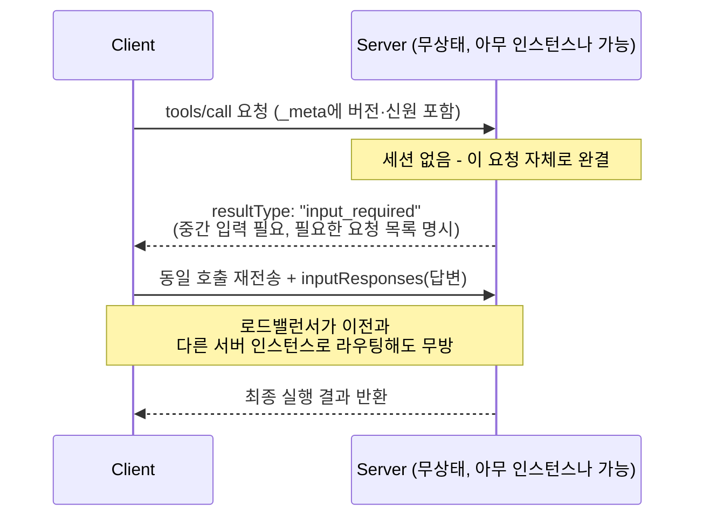

# MCP(Model Context Protocol) 2026-07-28 스펙 갱신: Stateless 아키텍처 전환과 멀티 에이전트 시대의 표준화

## 요약

Anthropic이 2024년 11월 오픈소스로 공개한 MCP(Model Context Protocol)는 불과 1년여 만에 LLM과 외부 도구·데이터를 연결하는 사실상의 표준으로 자리잡았습니다. 2026-07-28에 공개된 최신 스펙은 프로토콜 코어를 완전히 무상태(Stateless)로 재설계하고, 서버가 클라이언트에 중간 입력을 요구할 수 있는 Multi Round-Trip Requests, 헤더 기반 라우팅, 캐시 가능한 목록 응답, 강화된 인가(Authorization) 절차를 도입했습니다. 본 아티클에서는 이 변경 사항을 공식 스펙 문서 기준으로 정리하고, MCP와 구분되는 별개의 프로토콜인 A2A(Agent2Agent)가 왜 함께 언급되는지, 두 프로토콜이 실제로 어떤 역할을 나눠 맡는지를 살펴봅니다.

## 본문

### 1. MCP란 무엇인가: Host, Client, Server 3자 구조

공식 스펙 문서는 MCP를 "LLM 애플리케이션과 외부 데이터 소스·도구 간의 통합을 표준화하는 개방형 프로토콜"로 정의합니다[1]. 통신은 JSON-RPC 2.0 메시지 포맷을 기반으로 하며, 세 가지 역할로 구성됩니다[1].

- **Host**: 연결을 시작하는 LLM 애플리케이션(예: Claude Code, IDE 플러그인)
- **Client**: Host 애플리케이션 내부에 존재하는 커넥터
- **Server**: 실제 컨텍스트와 기능을 제공하는 서비스

서버가 클라이언트에 제공할 수 있는 3대 기능은 **Resources**(모델이 참고할 데이터), **Prompts**(정형화된 메시지 템플릿), **Tools**(모델이 실행할 수 있는 함수)이며, 반대로 클라이언트가 서버에 제공하는 기능으로 **Elicitation**(서버가 사용자에게 추가 정보를 요청)이 있습니다[1]. 스펙은 이 구조가 프로그래밍 언어 지원을 표준화한 LSP(Language Server Protocol)에서 영감을 받았다고 명시합니다[1].

### 2. Stateless 프로토콜 코어로의 전환

2026-07-28 스펙의 가장 근본적인 변화는 기존의 `initialize`/`initialized` 핸드셰이크와 세션 식별자를 완전히 제거하고, 모든 요청이 독립적으로 프로토콜 버전·클라이언트 신원·역량(capability) 정보를 `_meta` 필드에 담아 전송하도록 바꾼 것입니다. 이 변화의 실무적 의미는 명확합니다: 이제 어떤 요청이든 단순 라운드로빈 로드밸런서 뒤에 있는 아무 서버 인스턴스로나 전달될 수 있으며, 서버 간에 세션 상태를 공유 저장소에 동기화할 필요가 없어집니다. 기존의 양방향(bidirectional) 세션 유지형 모델에서, 매 요청이 자기 완결적인(self-contained) 무상태 모델로 전환된 것입니다.

### 3. Multi Round-Trip Requests(MRTR): 무상태 프로토콜에서의 대화형 흐름

세션이 없어지면서 발생하는 문제는 "도구 실행 중간에 사용자 확인이나 추가 파라미터가 필요한 경우"를 어떻게 처리하느냐입니다. 기존에는 스트림을 계속 열어둔 채 서버가 먼저 요청을 보내는 방식으로 처리했지만, 이는 세션 유지가 전제되어야 합니다. MRTR은 이를 대체하는 메커니즘으로, 도구 실행 중 추가 입력이 필요하면 서버가 `resultType: "input_required"`와 함께 필요한 요청 목록을 응답으로 돌려주고, 클라이언트는 `inputResponses`에 답변을 담아 원래 호출을 다시 요청하는 방식으로 대화형 흐름을 이어갑니다. 세션을 유지하지 않으면서도 다단계 상호작용을 가능하게 만드는 설계입니다.

### 4. 헤더 기반 라우팅과 캐시 가능한 목록 응답

Streamable HTTP 요청에는 이제 `Mcp-Method`와 `Mcp-Name` 헤더가 필수로 포함되어야 합니다. 이를 통해 게이트웨이, 레이트 리미터, WAF(웹 방화벽) 같은 인프라 레이어가 JSON 바디를 파싱하지 않고도 헤더만으로 라우팅·과금·속도 제한 판단을 내릴 수 있습니다. 또한 도구(Tools)·프롬프트(Prompts)·리소스(Resources) 목록 조회 응답에는 `ttlMs`(캐시 유효 시간)와 `cacheScope`(캐시 범위) 파라미터가 추가되어, 클라이언트가 불필요한 재조회를 줄이고 캐싱 전략을 스스로 판단할 수 있게 됐습니다.

### 5. 인가(Authorization) 절차 강화

보안 측면에서는 RFC 9207 기반 issuer 검증이 추가되었고, 로컬호스트 리디렉션을 지원하기 위해 클라이언트 등록 시 `application_type`을 명시하도록 했으며, 자격 증명을 특정 issuer에 바인딩하도록 강화했습니다. 특히 기존의 동적 클라이언트 등록(Dynamic Client Registration)은 공식적으로 지원 중단(deprecated)되고, Client ID Metadata Documents(CIMD) 방식으로 대체되었습니다. 공식 스펙 문서는 MCP가 "임의의 데이터 접근과 코드 실행 경로"를 가능하게 하는 만큼, 사용자 동의(User Consent)와 명시적 승인 없이는 도구를 실행하지 말아야 한다는 원칙을 핵심 보안 원칙으로 재확인하고 있습니다[1].

### 6. Extensions Framework: 코어와 확장 기능의 분리

이번 스펙은 Tasks(장시간 실행되는 작업의 비동기 처리, 폴링, 중간 입력, durable handle 지원), MCP Apps(대화 안에 인라인으로 렌더링되는 차트·폼 등 인터랙티브 UI), EMA(Enterprise Managed Authorization) 같은 기능을 코어 프로토콜이 아니라 공식 확장(Extension)으로 명확히 분리했습니다. 확장은 항상 opt-in이며 초기화(initialization) 시점에 클라이언트와 서버 양쪽이 명시적으로 지원을 선언해야 활성화됩니다. 이 구조 덕분에 코어 프로토콜은 가볍게 유지하면서도, 특정 사용 사례에 필요한 고급 기능은 계속 실험적으로 추가할 수 있는 유연성을 확보했습니다.

### 7. MCP와 A2A(Agent2Agent)는 어떻게 다른가

MCP와 함께 자주 언급되는 A2A(Agent2Agent)는 사실 MCP의 일부가 아니라 **Google이 개발해 2026년 Linux Foundation에 기증한 별도의 프로토콜**입니다. 역할 구분은 비교적 명확합니다: MCP는 "에이전트가 도구·데이터에 연결하는 방법"(수직적 통합)을 표준화하고, A2A는 "서로 다른 자율 에이전트끼리 작업을 위임하고 통신하는 방법"(수평적 협업)을 표준화합니다. A2A는 에이전트가 자신의 능력을 설명하는 JSON-LD 형식의 Agent Card를 통해 서로를 발견하고, 이를 근거로 작업을 위임합니다. 대규모 멀티 에이전트 시스템은 결국 두 프로토콜을 함께 사용하는 경우가 많습니다 — MCP로 각 에이전트가 도구·데이터에 신뢰성 있게 접근하고, A2A로 에이전트 간 작업 분배와 오케스트레이션을 처리하는 조합입니다.

아래 다이어그램은 세션이 사라진 2026-07-28 스펙에서, 도구 실행 중간에 추가 입력이 필요할 때 Multi Round-Trip Requests(MRTR)가 어떻게 무상태 방식으로 대화를 이어가는지를 보여줍니다.



```json
// MCP 클라이언트가 서버의 도구 목록을 요청하는 JSON-RPC 메시지 예시
// (2026-07-28 스펙: 세션 핸드셰이크 없이 매 요청이 독립적으로 완결됨)
{
  "jsonrpc": "2.0",
  "id": 1,
  "method": "tools/list",
  "_meta": {
    "protocolVersion": "2026-07-28",
    "clientInfo": { "name": "example-host", "version": "1.0.0" }
  }
}
```

## 사실 검증 결과

| Claim | 판정 | 근거 |
|---|---|---|
| CLAIM-001: MCP는 Host/Client/Server 3자 구조의 JSON-RPC 2.0 기반 프로토콜이며, LSP에서 영감을 받았다 | verified | modelcontextprotocol.io 공식 스펙 문서(2026-07-28) |
| CLAIM-002: 2026-07-28 스펙은 initialize/initialized 핸드셰이크와 세션 식별자를 제거하고 완전한 무상태(stateless) 코어로 전환했다 | verified | Model Context Protocol 공식 블로그 "The 2026-07-28 Specification" |
| CLAIM-003: Multi Round-Trip Requests는 resultType: "input_required"와 inputResponses를 통해 무상태 환경에서 다단계 상호작용을 지원한다 | verified | Model Context Protocol 공식 블로그 "The 2026-07-28 Specification" |
| CLAIM-004: 이번 스펙은 Dynamic Client Registration을 지원 중단하고 Client ID Metadata Documents(CIMD)로 대체했다 | verified | Model Context Protocol 공식 블로그 "The 2026-07-28 Specification" |
| CLAIM-005: A2A는 Google이 개발해 Linux Foundation에 기증한, MCP와는 별개의 에이전트 간 통신 프로토콜이다 | verified | 업계 리포트(Zylos Research, onereach.ai) 교차 확인 — Google 개발, 2026년 Linux Foundation 기증 |

## 작성자의 견해

> 이 섹션은 사실 전달이 아니라 작성자의 해석과 견해를 담고 있습니다.

MCP를 무상태로 전환한 결정은 "AI 에이전트 인프라도 결국 일반적인 웹 인프라 운영 상식을 따라간다"는 걸 보여주는 사례라고 생각합니다. 세션 상태를 서버가 들고 있으면 로드밸런싱, 오토스케일링, 장애 복구가 전부 복잡해지는 건 웹 서버 시대에 이미 충분히 겪은 문제인데, MCP 초기 설계가 양방향 스트림과 세션에 의존했던 건 어쩌면 프로토콜이 급하게 만들어지고 급하게 채택된 결과였을 수 있습니다. 다만 무상태로 바꾸면서 MRTR 같은 우회 메커니즘이 추가로 필요해진 것은 트레이드오프입니다 — 대화형 흐름(중간 확인, 추가 파라미터 요청)을 상태 없이 구현하려니 클라이언트가 "재요청" 로직을 직접 구현해야 하는 복잡성이 프로토콜 레벨에서 클라이언트 구현체 레벨로 옮겨간 셈입니다. 개인적으로는 MCP와 A2A를 혼동하는 콘텐츠가 많이 보이는데, 실무에서 두 프로토콜을 함께 도입할 계획이라면 "이 요청이 도구 호출인가, 다른 에이전트로의 위임인가"를 설계 초기에 명확히 구분하는 것이 아키텍처 복잡도를 낮추는 데 중요하다고 봅니다.

## 한계와 반론

본 아티클은 2026-07-28 스펙에서 발표된 변경 사항을 공식 문서 기준으로 정리한 것으로, 이 스펙이 실제 커뮤니티와 각 SDK 구현체에 어느 속도로 반영·전파될지는 별도로 지켜봐야 합니다. 프로토콜 스펙이 갱신되어도 기존 서버·클라이언트 구현체들이 하위 호환성 문제로 즉시 신버전을 채택하지 못하는 경우가 흔하므로, 실무 도입 시점에는 사용 중인 SDK가 2026-07-28 스펙을 지원하는지 별도로 확인해야 합니다. 또한 A2A와 MCP의 역할 구분을 "수직 통합 vs 수평 협업"으로 단순화했지만, 실제로는 두 프로토콜의 기능이 일부 중첩되는 영역(예: 에이전트가 노출하는 기능의 발견/디스커버리)이 있어, 이 경계가 앞으로도 계속 명확히 유지될지는 두 프로토콜 진영의 표준화 방향에 달려 있습니다.

## 참고문헌

1. Model Context Protocol, "Specification (2026-07-28)", [https://modelcontextprotocol.io/specification/2026-07-28](https://modelcontextprotocol.io/specification/2026-07-28) (확인일: 2026-08-17)
2. Model Context Protocol Blog, "The 2026-07-28 Specification", [https://blog.modelcontextprotocol.io/posts/2026-07-28/](https://blog.modelcontextprotocol.io/posts/2026-07-28/) (확인일: 2026-08-17)
3. Model Context Protocol Blog, "The 2026 MCP Roadmap", [https://blog.modelcontextprotocol.io/posts/2026-mcp-roadmap/](https://blog.modelcontextprotocol.io/posts/2026-mcp-roadmap/) (확인일: 2026-08-17)

## 종합적 의견

> 이 섹션은 전체 주제에 대한 종합적 분석과 개인 견해를 담고 있습니다.

2026-07-28 MCP 스펙은 프로토콜이 "실험적 표준"에서 "인프라 레벨에서 진지하게 운영되는 표준"으로 넘어가는 전환점을 보여줍니다. 세션 제거, 헤더 기반 라우팅, 캐시 힌트, 강화된 인가 절차는 모두 일반 트래픽이 아니라 로드밸런서·게이트웨이·WAF 같은 프로덕션 인프라 계층을 의식한 변화들입니다. 동시에 Tasks/MCP Apps 같은 기능을 코어가 아닌 확장(Extension)으로 분리한 것은, 코어 프로토콜의 안정성과 실험적 기능 확장 속도를 분리하려는 성숙한 설계 판단으로 보입니다. MCP(도구·컨텍스트 통합)와 A2A(에이전트 간 협업)가 서로 다른 문제를 풀도록 역할이 나뉘어 있다는 점을 이해하면, 앞으로 멀티 에이전트 시스템을 설계할 때 "이 프로토콜에 어떤 책임을 맡길 것인가"를 훨씬 명확하게 판단할 수 있습니다.

## 꼬리질문

1. **Multi Round-Trip Requests(MRTR)가 세션 기반 스트림 방식 대비 실제 네트워크 왕복 횟수와 지연 시간에 어떤 영향을 미치는가?**
   - 추천 참고 URL: https://blog.modelcontextprotocol.io/posts/2026-07-28/
2. **Client ID Metadata Documents(CIMD)는 기존 Dynamic Client Registration 대비 구체적으로 어떤 보안 취약점을 해결하는가?**
   - 추천 참고 URL: https://modelcontextprotocol.io/specification/2026-07-28
3. **A2A의 Agent Card 기반 발견(discovery) 메커니즘이 악의적인 에이전트의 카드 조작(prompt injection성 설명문)에 취약하다는 지적을 어떻게 완화할 수 있는가?**
   - 추천 참고 URL: https://modelcontextprotocol.io/specification/2026-07-28

## 백링크

- [LLM 에이전트: AutoGen vs LangGraph](https://beji-tech.blogspot.com/2026/08/llm-agent-autogen-vs-langgraph.html)
- [RAG와 GraphRAG](https://beji-tech.blogspot.com/2026/08/rag-graphrag.html)
- [위키 인덱스](../../wiki/README.md)