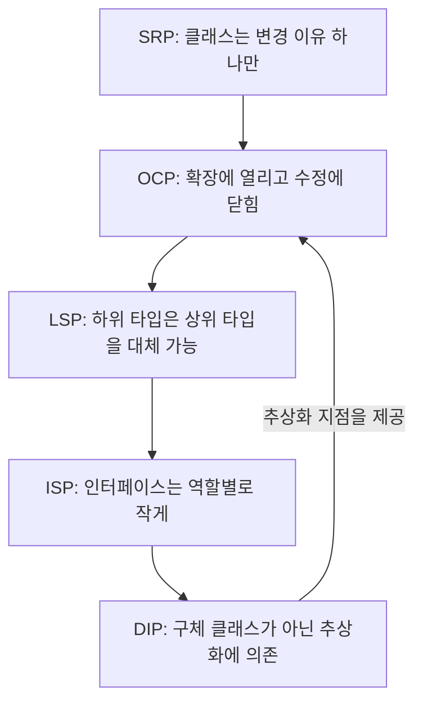

# SOLID 원칙이란 무엇인가 — Java 기준 객체지향 설계 5대 원칙과 실전 예시

## 요약

SOLID는 객체지향 프로그래밍(OOP)으로 소프트웨어를 설계할 때 코드를 이해하기 쉽고, 유연하고, 유지보수하기 좋게 만들기 위한 5가지 설계 원칙의 앞글자를 딴 이름입니다. Robert C. Martin("Uncle Bob")이 2000년 논문 "Design Principles and Design Patterns"에서 제시한 원칙들을 Michael Feathers가 2004년경 SOLID라는 약자로 정리했습니다. 이 글에서는 처음 SOLID를 접하는 개발자를 위해 SRP(단일 책임), OCP(개방-폐쇄), LSP(리스코프 치환), ISP(인터페이스 분리), DIP(의존관계 역전) 다섯 원칙을 각각 "원칙을 어긴 코드"와 "원칙을 지킨 코드"를 Java로 나란히 비교하며 설명합니다.

## 본문

### SOLID가 필요한 이유

신입 개발자가 처음 클래스를 설계할 때 흔히 겪는 문제는, 기능을 추가할 때마다 기존 클래스를 자꾸 수정하게 되고, 그 수정이 예상치 못한 다른 곳에서 버그를 일으키는 상황입니다. SOLID 5원칙은 "왜 이런 일이 반복되는가"에 대한 구조적인 답을 주고, 각 원칙은 서로 독립적이면서도 함께 적용될 때 시너지가 납니다. 하나씩 Java 코드로 살펴보겠습니다.

### 1. SRP (Single Responsibility Principle, 단일 책임 원칙)

Martin의 원문 정의는 "A class should have only one reason to change"(클래스가 변경되어야 할 이유는 오직 하나여야 한다)입니다. 여기서 "책임"은 "기능 하나"가 아니라 "변경의 이유"를 뜻합니다.

**위반 예시**: 아래 `Employee` 클래스는 급여 계산과 보고서 저장이라는 서로 다른 두 가지 이유로 변경될 수 있습니다. 회계 정책이 바뀌면 `calculatePay()`를, 저장 방식(파일→DB)이 바뀌면 `saveToFile()`을 고쳐야 하므로 하나의 클래스가 두 팀(회계팀 요구사항, 인프라팀 요구사항)의 변경 압력을 동시에 받습니다.

```java
// 위반: 급여 계산 책임 + 파일 저장 책임이 한 클래스에 섞여 있음
class Employee {
    private String name;
    private double baseSalary;

    public double calculatePay() {
        return baseSalary * 1.1; // 급여 계산 로직
    }

    public void saveToFile(String path) {
        // 파일 입출력 로직 — calculatePay()와 무관한 책임
        try (var writer = new java.io.FileWriter(path)) {
            writer.write(name + "," + calculatePay());
        } catch (java.io.IOException e) {
            throw new RuntimeException(e);
        }
    }
}
```

**개선 예시**: 책임을 두 클래스로 분리하면, 급여 계산 정책이 바뀌어도 저장 로직은 손대지 않아도 됩니다.

```java
// 개선: 책임을 분리
class Employee {
    private String name;
    private double baseSalary;

    public double calculatePay() {
        return baseSalary * 1.1;
    }
}

class EmployeeRepository {
    public void saveToFile(Employee employee, String path) {
        try (var writer = new java.io.FileWriter(path)) {
            writer.write(employee.calculatePay() + "");
        } catch (java.io.IOException e) {
            throw new RuntimeException(e);
        }
    }
}
```

### 2. OCP (Open-Closed Principle, 개방-폐쇄 원칙)

원문 정의는 "Software entities should be open for extension, but closed for modification"(소프트웨어 요소는 확장에는 열려 있고 수정에는 닫혀 있어야 한다)입니다. 새 기능을 추가할 때 기존 코드를 고치지 않고, 새 코드를 "추가"하는 것만으로 확장할 수 있어야 한다는 뜻입니다.

**위반 예시**: 할인 정책을 `if-else`로 분기하면, 새 할인 유형이 생길 때마다 `calculateDiscount()` 메서드 자체를 계속 수정해야 합니다.

```java
// 위반: 새 할인 정책이 추가될 때마다 이 메서드를 계속 고쳐야 함
class DiscountCalculator {
    double calculateDiscount(String type, double price) {
        if (type.equals("VIP")) {
            return price * 0.8;
        } else if (type.equals("REGULAR")) {
            return price * 0.95;
        }
        return price;
    }
}
```

**개선 예시**: 인터페이스로 추상화하면, 새 할인 정책은 새 클래스를 "추가"하는 것으로 끝나고 기존 코드는 건드리지 않습니다.

```java
// 개선: 인터페이스로 확장 지점을 열어둠
interface DiscountPolicy {
    double apply(double price);
}

class VipDiscount implements DiscountPolicy {
    public double apply(double price) { return price * 0.8; }
}

class RegularDiscount implements DiscountPolicy {
    public double apply(double price) { return price * 0.95; }
}

// 새 정책(예: BlackFridayDiscount)을 추가해도 DiscountCalculator는 수정 불필요
class DiscountCalculator {
    double calculateDiscount(DiscountPolicy policy, double price) {
        return policy.apply(price);
    }
}
```

### 3. LSP (Liskov Substitution Principle, 리스코프 치환 원칙)

이 원칙은 Barbara Liskov가 1987년 OOPSLA 학회 기조연설 "Data abstraction and hierarchy"에서 처음 제시했고, 1994년 Liskov와 Jeannette Wing이 발표한 논문 "A Behavioral Notion of Subtyping"에서 더 정교하게 정리되었습니다. 핵심은 "하위 타입 객체는 상위 타입 객체를 대체해도 프로그램의 정확성이 깨지지 않아야 한다"는 것입니다.

**위반 예시**: 수학적으로는 정사각형이 직사각형의 특수한 경우이지만, `Square`가 `Rectangle`을 상속하면서 `setHeight`가 폭까지 바꿔버리면, `Rectangle`을 기대하고 작성된 코드가 `Square`를 넣었을 때 예상과 다르게 동작합니다.

```java
// 위반: Square가 Rectangle의 계약(높이만 바뀐다)을 깨뜨림
class Rectangle {
    protected int width, height;
    void setWidth(int w) { this.width = w; }
    void setHeight(int h) { this.height = h; }
    int area() { return width * height; }
}

class Square extends Rectangle {
    @Override
    void setWidth(int w) { this.width = w; this.height = w; } // 부작용 발생
    @Override
    void setHeight(int h) { this.width = h; this.height = h; }
}
// Rectangle r = new Square(); r.setWidth(5); r.setHeight(10);
// Rectangle을 기대한 코드는 area()가 50일 거라 예상하지만 실제로는 100
```

**개선 예시**: 상속 관계 대신 공통 인터페이스로 분리하면, 각 도형은 자기 계약만 지키면 되고 서로를 대체할 필요가 없어집니다.

```java
// 개선: 상속 대신 공통 인터페이스로 분리
interface Shape {
    int area();
}

class Rectangle implements Shape {
    private final int width, height;
    Rectangle(int w, int h) { this.width = w; this.height = h; }
    public int area() { return width * height; }
}

class Square implements Shape {
    private final int side;
    Square(int side) { this.side = side; }
    public int area() { return side * side; }
}
```

### 4. ISP (Interface Segregation Principle, 인터페이스 분리 원칙)

원문 정의는 "Clients should not be forced to depend upon interfaces that they do not use"(클라이언트는 자신이 사용하지 않는 메서드에 의존하도록 강요받아서는 안 된다)입니다.

**위반 예시**: 모든 근무자가 `Worker` 인터페이스를 구현해야 한다면, 로봇 작업자는 먹지 않는데도 `eat()`을 구현해야 하는 억지 상황이 생깁니다.

```java
// 위반: 거대한 단일 인터페이스
interface Worker {
    void work();
    void eat();
}

class RobotWorker implements Worker {
    public void work() { /* 작업 수행 */ }
    public void eat() { throw new UnsupportedOperationException(); } // 억지 구현
}
```

**개선 예시**: 인터페이스를 역할별로 쪼개면, 각 클래스는 필요한 인터페이스만 구현하면 됩니다.

```java
// 개선: 역할별로 인터페이스 분리
interface Workable { void work(); }
interface Eatable { void eat(); }

class HumanWorker implements Workable, Eatable {
    public void work() { /* 작업 수행 */ }
    public void eat() { /* 식사 */ }
}

class RobotWorker implements Workable {
    public void work() { /* 작업 수행 */ } // eat()이 없어도 됨
}
```

### 5. DIP (Dependency Inversion Principle, 의존관계 역전 원칙)

원문 정의는 "High-level modules should not depend on low-level modules. Both should depend on abstractions"(상위 모듈은 하위 모듈에 의존해서는 안 되며, 둘 다 추상화에 의존해야 한다)입니다. Spring 프레임워크의 의존성 주입(DI)이 이 원칙을 실무에서 구현하는 대표적인 방식입니다.

**위반 예시**: `OrderService`가 구체 클래스 `MySqlOrderRepository`를 직접 `new`로 생성하면, 나중에 저장소를 PostgreSQL이나 인메모리 구현으로 바꾸려면 `OrderService` 코드 자체를 고쳐야 합니다.

```java
// 위반: 상위 모듈(OrderService)이 하위 모듈(MySqlOrderRepository)에 직접 의존
class MySqlOrderRepository {
    void save(String order) { /* MySQL 저장 로직 */ }
}

class OrderService {
    private final MySqlOrderRepository repository = new MySqlOrderRepository();
    void placeOrder(String order) { repository.save(order); }
}
```

**개선 예시**: 인터페이스에 의존하고 구체 구현은 외부(생성자)에서 주입받으면, 저장소 구현체를 바꿔도 `OrderService`는 수정할 필요가 없습니다.

```java
// 개선: 추상화(interface)에 의존, 구현체는 생성자로 주입
interface OrderRepository {
    void save(String order);
}

class MySqlOrderRepository implements OrderRepository {
    public void save(String order) { /* MySQL 저장 로직 */ }
}

class OrderService {
    private final OrderRepository repository;
    OrderService(OrderRepository repository) { this.repository = repository; }
    void placeOrder(String order) { repository.save(order); }
}
```

### SOLID 원칙 사이의 관계



SRP로 책임을 잘게 나누면 OCP를 지키기 위한 확장 지점(인터페이스)을 만들기 쉬워지고, LSP는 그 확장 지점에 들어갈 구현체들이 서로 안전하게 대체 가능하도록 보장하며, ISP는 그 인터페이스가 너무 비대해지지 않게 관리하고, DIP는 이 모든 것을 "구체 클래스가 아니라 추상화에 의존한다"는 하나의 규율로 묶습니다. 다섯 원칙은 따로 배우기보다 이렇게 연쇄적으로 이해하는 편이 실무에서 적용하기 쉽습니다.

## 사실 검증 결과

| Claim | 판정 | 근거 |
|---|---|---|
| SOLID는 Robert C. Martin이 2000년 논문 "Design Principles and Design Patterns"에서 제시한 원칙들이며, Michael Feathers가 2004년경 SOLID라는 약어로 정리했다 | verified | Wikipedia "SOLID" 항목(en.wikipedia.org/wiki/SOLID), 원본 소재지 표기(objectmentor.com 발행, DePaul University 미러 condor.depaul.edu에서 원문 논문 링크 확인) |
| SRP의 원문 정의는 "there should never be more than one reason for a class to change"이다 | verified | Wikipedia "SOLID" 항목, Robert C. Martin 원문 인용 |
| OCP의 원문 정의는 "software entities should be open for extension, but closed for modification"이다 | verified | Wikipedia "SOLID" 항목, Robert C. Martin 원문 인용 |
| LSP는 Barbara Liskov가 1987년 OOPSLA 기조연설 "Data abstraction and hierarchy"에서 처음 제시했고, 1994년 Liskov·Wing의 논문 "A Behavioral Notion of Subtyping"에서 재정식화되었다 | verified | Wikipedia "Liskov substitution principle" 항목(en.wikipedia.org/wiki/Liskov_substitution_principle) |
| ISP의 원문 정의는 "clients should not be forced to depend upon interfaces that they do not use"이다 | verified | Wikipedia "SOLID" 항목, Robert C. Martin 원문 인용 |
| DIP의 원문 정의는 "one should depend upon abstractions, not concretes"(고수준 모듈과 저수준 모듈 모두 추상화에 의존해야 한다)이다 | verified | Wikipedia "SOLID" 항목, Robert C. Martin 원문 인용 |

## 작성자의 견해

> 이 섹션은 사실 전달이 아니라 작성자의 해석과 견해를 담고 있습니다.

신입 개발자에게 SOLID를 가르칠 때 가장 흔한 오해는 "다섯 원칙을 모든 클래스에 항상 완벽하게 적용해야 한다"는 강박입니다. 실제로는 정반대입니다. SRP를 과도하게 적용해서 클래스를 지나치게 잘게 쪼개면 오히려 클래스 사이의 관계를 추적하기 어려워지고, DIP를 모든 필드에 기계적으로 적용해서 별 이유 없이 단일 구현체만 있는 인터페이스를 남발하면 코드베이스만 비대해집니다. 필자는 SOLID를 "정답"이 아니라 "코드가 변경에 취약해 보일 때 점검할 체크리스트"로 쓰는 것을 권장합니다. 예를 들어 "이 클래스를 수정하는 이유가 두 개 이상 떠오르는가?"(SRP 신호), "새 요구사항이 생길 때마다 이 if-else 블록에 분기를 추가하고 있는가?"(OCP 신호) 같은 질문을 실제 코드 리뷰에서 던져보는 방식입니다. 특히 Java·Spring 생태계에서는 DIP가 프레임워크의 의존성 주입(`@Autowired`, 생성자 주입)과 직결되어 있어서, 다섯 원칙 중 실무에서 가장 먼저 체감하게 되는 원칙이기도 합니다. 처음 배울 때는 이 글의 위반/개선 예시처럼 작은 클래스 단위로 반복 연습하면서 "왜 이 구조가 변경에 더 강한가"를 직접 손으로 리팩터링해보는 것이 이론만 읽는 것보다 훨씬 체감이 빠릅니다.

## 한계와 반론

SOLID는 만능 해법이 아니라는 반론도 널리 공유됩니다. 대표적으로, 작은 스크립트나 단기 프로토타입에 다섯 원칙을 전부 적용하면 오히려 클래스와 인터페이스 수가 불필요하게 늘어나 "과도한 설계(Over-engineering)"가 될 수 있습니다. 또한 OCP를 지키기 위해 미리 확장 지점을 인터페이스로 만들어두는 관행은, 실제로는 그 확장이 영원히 일어나지 않는 "YAGNI(You Aren't Gonna Need It)" 위반으로 이어지기도 합니다. LSP는 이론적으로는 명확하지만, 실무에서 "행위 계약(behavioral contract)"이 정확히 무엇인지 판단하기 애매한 경우가 많아 정사각형-직사각형 문제처럼 교과서적 사례를 벗어나면 적용 기준이 모호해질 수 있습니다. 이런 이유로 최근에는 SOLID를 규칙집이 아니라 "코드 스멜을 감지하는 휴리스틱"으로 접근하고, 실제 적용 여부는 팀의 변경 빈도·프로젝트 수명·팀 규모 같은 맥락에 따라 판단해야 한다는 실용주의적 관점이 힘을 얻고 있습니다.

## 참고문헌

1. Wikipedia, "SOLID", [https://en.wikipedia.org/wiki/SOLID](https://en.wikipedia.org/wiki/SOLID) (확인일: 2026-08-19)
2. Wikipedia, "Liskov substitution principle", [https://en.wikipedia.org/wiki/Liskov_substitution_principle](https://en.wikipedia.org/wiki/Liskov_substitution_principle) (확인일: 2026-08-19)
3. DePaul University (dmumaugh), "Bob Martin's Design Principles Page" — Robert C. Martin의 SOLID 원전 논문(Dependency Inversion / Interface Segregation / Liskov Substitution / Open-Closed Principle) 링크 모음, [https://condor.depaul.edu/dmumaugh/OOT/Design-Principles/](https://condor.depaul.edu/dmumaugh/OOT/Design-Principles/) (확인일: 2026-08-19)
4. Oracle, "The Java Tutorials — Creating and Using Interfaces", [https://docs.oracle.com/javase/tutorial/java/IandI/createinterface.html](https://docs.oracle.com/javase/tutorial/java/IandI/createinterface.html) (확인일: 2026-08-19)
5. Spring Framework Reference, "Dependency Injection — Constructor-based Dependency Injection", [https://docs.spring.io/spring-framework/reference/core/beans/dependencies/factory-collaborators.html](https://docs.spring.io/spring-framework/reference/core/beans/dependencies/factory-collaborators.html) (확인일: 2026-08-19)

## 종합적 의견

> 이 섹션은 전체 주제에 대한 종합적 분석과 개인 견해를 담고 있습니다.

SOLID 5원칙을 관통하는 하나의 질문은 "이 코드는 요구사항이 바뀔 때 얼마나 적은 범위를 건드리고 대응할 수 있는가"입니다. SRP와 ISP는 "무엇을 하나로 묶고 무엇을 분리할 것인가"에 대한 답이고, OCP와 LSP는 "그렇게 나눈 조각들을 어떻게 안전하게 확장·교체할 것인가"에 대한 답이며, DIP는 이 모든 설계를 코드 레벨에서 실제로 가능하게 만드는 배선 규칙입니다. 신입 개발자 입장에서는 다섯 원칙을 암기하기보다, 이 글의 각 예시처럼 "위반 코드를 보고 어떤 변경이 생기면 문제가 되는지" 먼저 상상해보는 연습이 훨씬 유효합니다. 실무에서는 Spring 같은 프레임워크가 DIP를 사실상 강제하는 구조(생성자 주입, 인터페이스 기반 빈 등록)로 되어 있어서, SOLID를 몰라도 프레임워크를 따라가다 보면 자연히 절반은 지키게 되는 경우도 많습니다. 다만 그 결과가 "왜 이렇게 설계됐는가"를 이해하지 못한 채 관행만 따르는 것과, 원칙을 이해하고 의도적으로 적용하는 것은 코드 리뷰나 새로운 설계 상황에서 분명한 차이를 만듭니다.

## 꼬리질문

1. **SRP를 지키려고 클래스를 계속 쪼개다 보면 클래스 수가 폭발적으로 늘어나는데, "책임을 얼마나 잘게 나눠야 적당한가"를 판단하는 실무적 기준은 무엇인가?**
   - 추천 참고 URL: https://en.wikipedia.org/wiki/SOLID
2. **Spring의 `@Autowired` 필드 주입과 생성자 주입은 둘 다 DIP를 구현하는 방식처럼 보이는데, 왜 Spring 공식 문서와 실무에서는 생성자 주입을 권장하는가?**
   - 추천 참고 URL: https://docs.spring.io/spring-framework/reference/core/beans/dependencies/factory-collaborators.html
3. **LSP 위반 여부를 코드 리뷰에서 기계적으로 판단할 방법(정적 분석 도구, 계약 기반 테스트 등)이 있는가?**
   - 추천 참고 URL: https://en.wikipedia.org/wiki/Liskov_substitution_principle

## 백링크

- [Spring IoC와 DI: 왜 생성자 주입을 선택해야 하는가](spring-ioc-di-constructor-injection.md)
- [GoF 핵심 14가지 디자인 패턴 분석 및 개별 포스트 인덱스 가이드](gof-14.md)

<!-- AUTO:related-sessions:start -->

## 관련 세션
이 문서와 관련된 세션 아카이브(자동 생성 — 태그 매칭 기반):

- [2026-08-16](../sessions/raw/2026-08-16.md)

<!-- AUTO:related-sessions:end -->