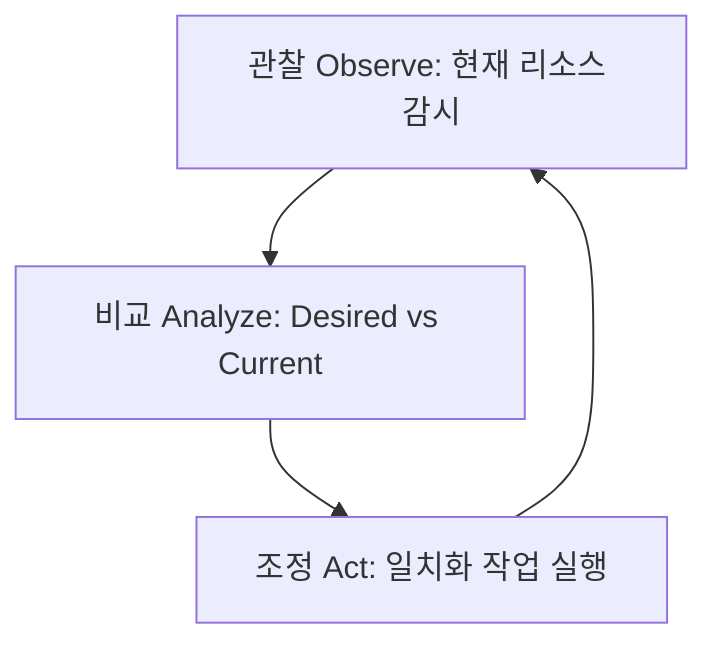

# Kubernetes Operator 패턴

Kubernetes의 기능을 확장하여 상태가 있는(Stateful) 애플리케이션이나 도메인별 리소스를 자동화하여 관리하는 핵심 패턴인 Kubernetes Operator에 대한 기술 지식입니다.

## 1. Operator 패턴의 핵심 개념

- **Custom Resource Definition (CRD)**: Kubernetes API를 확장하여 사용자가 직접 정의한 새로운 오브젝트 스펙(자원)을 정의합니다.
- **Reconciliation Loop (조정 루프)**: 컨트롤러는 끊임없이 리소스의 **현재 상태(Current State)**를 관찰하고, 사용자가 CRD를 통해 선언한 **원하는 상태(Desired State)**와 비교하여, 두 상태가 일치하도록 조치를 취하는 무한 루프를 돕니다.

## 2. 개발 도구 및 프레임워크 비교

Operator 개발을 시작할 때 주로 사용하는 두 도구입니다.

| 항목 | Kubebuilder | Operator SDK |
| :--- | :--- | :--- |
| **기반 구조** | controller-runtime 단독 기반 | Kubebuilder 기반 확장 |
| **지원 언어** | Go | Go, Ansible, Helm |
| **추가 기능** | 가볍고 표준적인 골격 제공 | OLM(Operator Lifecycle Manager) 연동, 테스트 툴링 내장 |
| **추천 시나리오** | Kubernetes 표준 컨트롤러에 가깝고 가벼운 개발을 선호할 때 | 성숙한 업그레이드 관리 및 다국어(Ansible 등) 지원이 필요할 때 |

## 3. 구현 모범 사례 (Best Practices)

- **멱등성 (Idempotency)**: 조정 루프는 언제, 몇 번을 호출받아 동작하더라도 매번 동일한 결과 상태를 보장해야 합니다. 리소스를 생성하기 전에 기존 존재 여부를 확인하고 수정(Patch)하는 패턴을 적용해야 합니다.
- **API 서버 부하 최소화**: `controller-runtime` 내부의 Cache 및 Informer의 Indexer를 활용하여 API 서버에 가해지는 실시간 트래픽을 최소화해야 합니다.

## 4. 후속 연구 및 꼬리질문

- 어드미션 웹훅(Admission Webhook)을 활용하여 Custom Resource 생성 전 스키마 및 보안 정합성을 검증하는 구조는 어떻게 설계되는가?
- Informer와 Cache의 지연(Lag)으로 발생하는 동기화 어긋남 현상을 제어하는 스위치(Rate Limiting/Queueing) 설정 방식은 무엇인가?

## 관련 문서
- [위키 인덱스](README.md)
