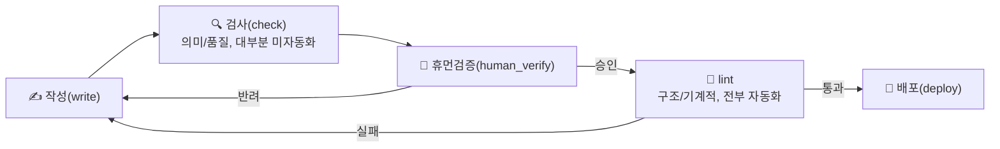
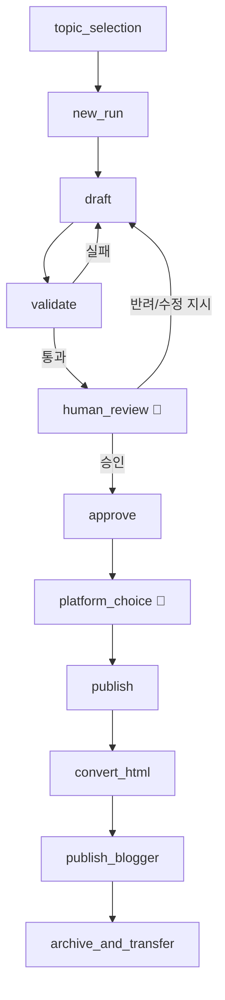

# 글 작성 파이프라인 — Admin 보고

- 전문(각 스텝 상세, 코드 근거): `wiki/rules/blog_article_pipeline_schema.md` (wiki 관리 지식 저장소)
- 이 파일: 결단용 압축 뷰(keyword + diagram). 최종 갱신: 2026-08-23

## Diagram — Phase Model (사용자 정의: 작성-검사-휴먼검증-lint-배포)


`check`와 `lint`는 현재 코드상 같은 `validate_run()` 하나로 처리됨(물리적 미분리, 아래 결단 대기 참고).

## Diagram — CLI Step Sequence



## Element Matrix (write → check → lint, 1:1:1)

| 요소 | check(의미/품질) | lint(구조/기계적) |
|---|---|---|
| 토픽 | ✅ *(2026-08-23)* `check_topic_duplication.py` — 유사도 채점 + 임계값 이상이면 대안 주제 자동 생성·재검증 | ✅ required_sections, section_min_words |
| 이미지 | ⚠️ 자동화 보류(의도적 결정, 2026-08-23) — 비전 API 없음, 에이전트 Read 툴 직접 확인으로 대체(규칙 16) | ✅ code_or_image_presence (존재만) |
| 코드 | ✅ *(2026-08-23)* `check_code_blocks.py` — python/bash/json 구문 검사 + 설명-코드 식별자 교차 확인 | ✅ code_or_image_presence (존재만) |
| 공식문서 참고 | ✅ reference_credibility_tier | ✅ reference_link_liveness |
| 백링크 | ✅ *(2026-08-23)* `check_backlink_relevance.py` — 태그 기준 관련성 점수화 | ✅ internal_link_count |
| 의견/차별화 | ✅ *(2026-08-23, 근사치)* `check_opinion_insight.py` — 구체성/상투구/타글유사도/주장-근거정합/어휘다양성 5개 하위 지표 | ✅ opinion_disclaimer, section_min_words |
| 사실검증 | 🟡 부분 자동화 *(2026-08-23)* — 모호한 근거 표현(vague_evidence)은 실시간 차단, "실제 원문 대조 여부"는 여전히 판단 불가 | ✅ fact_check_verdicts, unsupported_claims, vague_evidence |
| 구조(frontmatter) | — (형식 요소, check 대상 아님) | ✅ frontmatter, min_references, encoding |
| SEO 메타 description *(2026-08-23 신설)* | ✅ `seo_check.py` (독립 모듈, validate_run() 미포함) — 요약 스니펫이 자연스러운지만 점검 | ❌ 불가능 — Blogger API·테마 둘 다 프로그래밍적 설정 경로 없음(아래 결단 대기 참고) |

⚠️ **주의**: 위 6개 신규 check 도구(토픽/코드/백링크/의견/사실검증 일부)는 전부 `validate_run()`
8개 게이트와 물리적으로 분리된 **독립 aid 스크립트**다(vague_evidence 하나만 예외로 validate.py에
직접 편입돼 발행을 막는 실제 게이트) — 나머지는 draft 단계에서 참고용으로 실행하는 것이지 통과
못 해도 발행 자체를 막지 않는다. "완전 자동화"가 아니라 "근사 신호 제공"이며, 특히 의견/차별화·
사실검증은 여전히 human_verify가 최종 방어선이다. 이미지만 자동화를 의도적으로 안 함(위 표 참고).

## Diagram — content/posts/ 카테고리 구조 *(2026-08-23 신설, Obsidian 볼트 겸용)*

```mermaid
graph TD
    P[content/posts/] --> IDX[00-Index.md — 전체 위키링크 인덱스]
    P --> B[Basics/ — 30개 + _MOC.md]
    P --> A[Advanced/ — 21개 + _MOC.md]
    P --> E[ETC/ — 5개 + _MOC.md]
    B -.build_moc.py 재생성.-> B
    A -.build_moc.py 재생성.-> A
    E -.build_moc.py 재생성.-> E
```
분류 기준은 `tags`(`Basics`/`Advanced`/`ETC` 셋 중 하나, 기존 규칙과 동일) — `src/core/paths.py::category_for_tags()`.
`_MOC.md`는 각 글의 실제 `## 백링크`를 파싱해 tags 그룹으로 정리한 자동 생성 파일(수동 편집 금지).

## Keyword Index

```
steps:
  topic_selection → new_run → draft → validate → human_review → approve
  → platform_choice → publish → convert_html → publish_blogger → archive_and_transfer

validate.checks:  # 2026-08-22: warn 4개 전부 error로 승격, 통과시키지 않음
  frontmatter
  required_sections
  min_references
  reference_link_liveness
  reference_credibility_tier
  section_min_words
  code_or_image_presence
  opinion_disclaimer
  encoding_corruption
  fact_check_verdicts
  unsupported_claims
  internal_link_count
  human_approval

guardrails:
  no_one_off_scripts
  confirmed_body_immutable
  batch_approval_not_transitive
  differentiation_required
  internal_links_must_be_real
  utf8_only
  quality_over_word_count

post_publish_maintenance:
  update_post_content
  apply_nav_labels
  patch_published_posts
  report_fact_check_stats
  archive_session_log
  build_session_backlink_index / apply_session_backlinks / lint_session_backlinks
  build_moc  # 2026-08-23 신설 — content/posts/<Category>/_MOC.md 재생성

related_but_separate:
  sync
  todo
  backlinks
  theme
```

## 결단 대기 항목 (Open Decisions)
- **check/lint 코드 물리적 분리 여부**: 지금은 스키마/문서에서만 두 개념으로 나눴고 실제 코드
  (`validate.py`)는 여전히 하나. `check_run()`/`lint_run()`으로 실제 분리할지 결단 필요.
- **~~위 표의 ⚠️ 5개 요소 자동화 여부~~ → 2026-08-23 해결**: 토픽 중복/코드 품질/백링크 관련성/의견
  통찰력 4개는 근사 신호 도구로 자동화(아래 변경 이력), 이미지 적절성은 자동화 안 하기로 의도적 결정
  (에이전트 Read 툴 직접 확인으로 대체). 아래 결단 대기 항목으로 남는 건 "이 근사 신호들을 검증 게이트
  로 격상시킬지(현재는 vague_evidence 하나만 실제 게이트, 나머지는 통과 안 해도 발행 막지 않음)" — 오탐률
  검증 없이 바로 error 게이트로 승격하면 과거 warn→error 승격 때처럼 정상 케이스를 막을 위험이 있어
  당분간 aid 상태 유지 권장.
- **SEO 메타 description 자동화 여부** *(신규, 2026-08-23)*: Blogger API v3 Posts 리소스에 글별
  검색 설명 필드가 없다는 것을 공식 문서 + Blogger 공식 커뮤니티 답변(2025-05, "customMetadata는
  Blogger가 쓰지 않아 문서에서 제거했다")으로 확정 확인. 테마에서 `data:post.body`를 `<head>`에서
  자르는 우회도 실패 확인(`data:post.*`가 위젯 루프 밖에서 항상 빈 값). 남은 방법은 **브라우저
  자동화로 Blogger 편집기의 "검색 설명" 입력창에 대신 타이핑**하는 것뿐 — 진행 여부 결단 필요.
- **테마 변경 라이브 반영 여부** *(신규, 2026-08-23)*: `content/theme/blogger_site_theme.xml`에
  GA4(`G-GWQ3ER3GTL`) 스크립트 추가 완료(로컬). 테마 배포는 여전히 수동(Blogger HTML 편집기에
  전체 파일 붙여넣기) — 사용자가 직접 반영해야 함.
- **기존 발행 글 소급 차별화 포인트 추가**: 백링크 소급 보완(깨진 링크 5개 교정 + 백링크 없던 24개
  신규 추가)은 2026-08-23 완료. 차별화 포인트(14번 수칙)만 아직 소급 미적용 — 각 글을 다시 읽고
  실제 차별화 각도를 새로 찾아야 하는 콘텐츠 작업이라 범위가 큼.

## 변경 이력
- 2026-08-23: **element_matrix의 6개 미자동화 check 요소 중 5개 해결**: 사용자가 1→6번 순서로 지정한
  작업. (1) `check_topic_duplication.py` — 경고만이 아니라 임계값 이상이면 차별화 각도를 결합한 대안
  주제를 자동 생성해 재검증(사용자 요청). (2) `check_backlink_relevance.py` — 태그 기준 관련성 점수화.
  (3) `check_code_blocks.py` — python/bash/json 구문 검사 + 코드펜스 직전 문단의 백틱 식별자가 실제
  코드에 있는지 "설명-코드 일치" 교차 확인(사용자 요청으로 추가). (4) `validate.py`에 `vague_evidence`
  게이트 신설 — 근거 열이 "업계 리포트"/"교차 확인" 등 구체적 출처 표지 없는 모호한 표현이면 발행
  차단(wiki/Incident_Log.md의 실제 사고 패턴 재발 방지, 유일하게 진짜 게이트로 편입됨). (5)
  `check_opinion_insight.py` — 단일 점수 대신 구체성/상투구 비율/타 글과의 bigram 유사도/주장-근거
  정합성/어휘 다양성 5개 하위 지표로 세분화(사용자 요청). (6) 이미지 적절성은 의도적으로 자동화 안
  하기로 결정, `wiki/Blog_Writing_Rules.md` 16번 수칙으로 에이전트 Read 툴 직접 확인을 명문화. 전부
  기존 발행 글로 회귀 테스트(오탐 조정 포함) + 합성 테스트로 실제 과거 사고 패턴 재현 확인 완료.
- 2026-08-23: **content/posts/ 카테고리화 + Obsidian 볼트화**: 55개 글을 `Basics/Advanced/ETC`
  하위폴더로 이동(`tags` 기준, 미분류 17개는 키워드 휴리스틱으로 백필). 경로 로직을 쓰는 전체 코드
  (`paths.py`, `publishers/__init__.py`, `update_post_content.py`, `suggest_internal_links.py`,
  `patch_published_posts.py`, `build_knowledge_graph.py`) 수정·회귀 테스트 완료. `00-Index.md` +
  `build_moc.py`(태그 그룹 기반 실제 백링크 그래프 MOC) 신규.
- 2026-08-23: **SEO 메타 description 조사 및 결론**: Blogger API/테마 양쪽 다 프로그래밍적으로
  설정 불가능함을 공식 확인(위 결단 대기 참고). `seo_check.py` 독립 모듈로 목적 재정의(메타 태그
  채우기 → 구글 자동 스니펫 대비 요약 품질 점검). GA4 스크립트를 테마에 추가(로컬, 미배포).
- 2026-08-23: **신규 글 4편 발행**: CAP/PACELC, Goroutine GMP, Vector DB HNSW, gRPC/Protobuf —
  2026-08-19에 작성됐다가 신규 게이트(차별화 포인트/백링크 실 URL) 미달로 미승인 상태였던 것을
  전부 수정 후 검토·승인·발행. TLS/SSL Handshake 신규 글 1편도 별도로 작성·발행.
  이미지 2개는 `generate_image` 툴 대신 직접 작성한 경량 SVG(각 1.4~4.8KB)로 대체.
- 2026-08-23: **기존 발행 글 백링크 소급 보완**: 라이브 5개 글의 깨진 백링크/관련세션 링크를 실제
  URL로 교정, 백링크 섹션 자체가 없던 24개 글에 태그 기반 추천으로 신규 추가 — 전부 라이브 반영·검증.
- 2026-08-22: `validate.checks`의 warn 4개(reference_credibility_tier, code_or_image_presence,
  unsupported_claims, internal_link_count) 전부 error로 승격 — 경고만으로는 무시되고 넘어가는
  사례가 반복돼 사용자 지시로 게이트가 강제 차단하도록 변경. 부수 조치로 `TRUSTED_REFERENCE_DOMAINS`
  누락 도메인 9개(grpc.io 등) 보강 — 안 그러면 목록에 없는 정상 공식 문서만 인용해도 새로 막힘.
  draft 단계 보조 도구 2종(`suggest_internal_links.py`, `check_reference_domains.py`) 신규 추가.
- 2026-08-22: 사용자가 정의한 "작성-검사-휴먼검증-lint-배포" 5단계 모델 + 요소별 write→check→lint
  1:1:1 매핑을 스키마/보고서에 반영(코드는 미변경, 사용자 확인 하에 문서 재구성으로 범위 한정).
