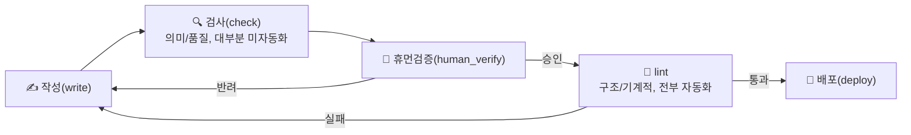
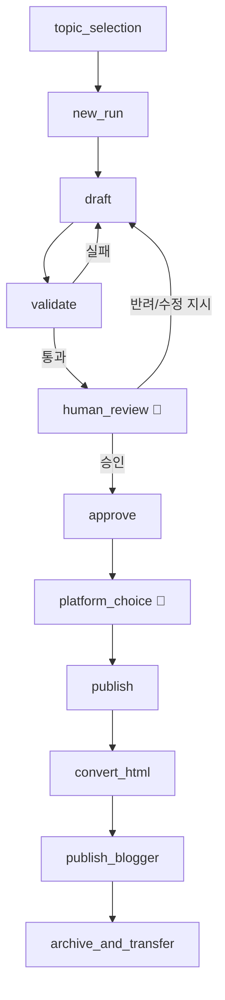

# 글 작성 파이프라인 — Admin 보고

- 전문(각 스텝 상세, 코드 근거): `wiki/rules/blog_article_pipeline_schema.md` (wiki 관리 지식 저장소)
- 이 파일: 결단용 압축 뷰(keyword + diagram). 최종 갱신: 2026-08-22

## Diagram — Phase Model (사용자 정의: 작성-검사-휴먼검증-lint-배포)


`check`와 `lint`는 현재 코드상 같은 `validate_run()` 하나로 처리됨(물리적 미분리, 아래 결단 대기 참고).

## Diagram — CLI Step Sequence



## Element Matrix (write → check → lint, 1:1:1)

| 요소 | check(의미/품질) | lint(구조/기계적) |
|---|---|---|
| 토픽 | ⚠️ 미자동화 — 중복 토픽 육안 대조만 | ✅ required_sections, section_min_words |
| 이미지 | ⚠️ 미자동화 — 적절성 판단 없음 | ✅ code_or_image_presence (존재만) |
| 코드 | ⚠️ 미자동화 — 품질/동작 검증 없음 | ✅ code_or_image_presence (존재만) |
| 공식문서 참고 | ✅ reference_credibility_tier | ✅ reference_link_liveness |
| 백링크 | ⚠️ 미자동화 — 관련성 판단 없음, 개수만 | ✅ internal_link_count |
| 의견/차별화 | ⚠️ 미자동화 — 통찰 여부 판단 없음 | ✅ opinion_disclaimer, section_min_words |
| 사실검증 | ⚠️ 미자동화 — rubber-stamp 여부 판단 없음 | ✅ fact_check_verdicts, unsupported_claims |
| 구조(frontmatter) | — (형식 요소, check 대상 아님) | ✅ frontmatter, min_references, encoding |

⚠️ 5개 요소가 여전히 사람/에이전트 판단에 의존 — `human_verify` 단계가 실질적 방어선.

## Keyword Index

```
steps:
  topic_selection → new_run → draft → validate → human_review → approve
  → platform_choice → publish → convert_html → publish_blogger → archive_and_transfer

validate.checks:  # 2026-08-22: warn 4개 전부 error로 승격, 통과시키지 않음
  frontmatter
  required_sections
  min_references
  reference_link_liveness
  reference_credibility_tier
  section_min_words
  code_or_image_presence
  opinion_disclaimer
  encoding_corruption
  fact_check_verdicts
  unsupported_claims
  internal_link_count
  human_approval

guardrails:
  no_one_off_scripts
  confirmed_body_immutable
  batch_approval_not_transitive
  differentiation_required
  internal_links_must_be_real
  utf8_only
  quality_over_word_count

post_publish_maintenance:
  update_post_content
  apply_nav_labels
  patch_published_posts
  report_fact_check_stats
  archive_session_log
  build_session_backlink_index / apply_session_backlinks / lint_session_backlinks

related_but_separate:
  sync
  todo
  backlinks
  theme
```

## 결단 대기 항목 (Open Decisions)
- **check/lint 코드 물리적 분리 여부**: 지금은 스키마/문서에서만 두 개념으로 나눴고 실제 코드
  (`validate.py`)는 여전히 하나. `check_run()`/`lint_run()`으로 실제 분리할지 결단 필요.
- **위 표의 ⚠️ 5개 요소 자동화 여부**: 토픽 중복 검사, 이미지 적절성, 코드 품질, 백링크 관련성,
  의견 통찰력 — 자동화하려면 각각 별도 도구/모델 호출이 필요(비용·정확도 트레이드오프 있음).

## 변경 이력
- 2026-08-22: `validate.checks`의 warn 4개(reference_credibility_tier, code_or_image_presence,
  unsupported_claims, internal_link_count) 전부 error로 승격 — 경고만으로는 무시되고 넘어가는
  사례가 반복돼 사용자 지시로 게이트가 강제 차단하도록 변경. 부수 조치로 `TRUSTED_REFERENCE_DOMAINS`
  누락 도메인 9개(grpc.io 등) 보강 — 안 그러면 목록에 없는 정상 공식 문서만 인용해도 새로 막힘.
  draft 단계 보조 도구 2종(`suggest_internal_links.py`, `check_reference_domains.py`) 신규 추가.
- 2026-08-22: 사용자가 정의한 "작성-검사-휴먼검증-lint-배포" 5단계 모델 + 요소별 write→check→lint
  1:1:1 매핑을 스키마/보고서에 반영(코드는 미변경, 사용자 확인 하에 문서 재구성으로 범위 한정).
