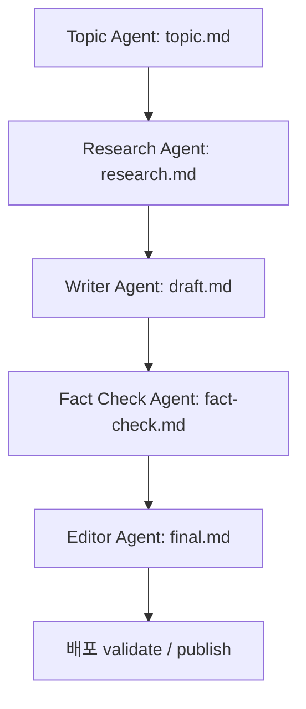

# 에이전트별 지침 및 아키텍처 가이드

이 문서는 `ai-blogging` 프로젝트의 자동화 글쓰기를 이행하는 다중 에이전트들의 역할, 협업 모델, 생성 파일 흐름 및 관리 규칙에 대한 가이드라인입니다.

## 1. 다중 에이전트 협업 워크플로우

블로그 글 작성은 다음과 같이 5가지 에이전트가 각 파일을 순차적으로 완성 및 조율하는 형태로 처리됩니다.

## 2. 에이전트별 역할 및 산출 규격

1. **주제 편집자 (Topic Agent)**:
   - **산출 파일**: `topic.md`
   - **규격**: 최종 선정 주제 확정, 5개 이상의 목차(TOC) 설계, 핵심 탐구 질문 3개 이상 도출, 명확한 조사 범위 및 제외 범위 정의.
   
2. **리서처 (Research Agent)**:
   - **산출 파일**: `research.md`
   - **규격**: 공식 레퍼런스, 백서 등 신뢰할 수 있는 1차 자료 중심 출처 수집(최소 5개 이상). 설계된 각 목차별로 최소 2개 이상의 출처 매핑.

3. **작성자 (Writer Agent)**:
   - **산출 파일**: `draft.md`
   - **규격**: 템플릿의 필수 섹션(요약, 본문, 사실 검증 결과, 작성자의 견해, 한계와 반론, 참고문헌, 종합적 의견, 꼬리질문, 백링크) 구조 구현. 본문 내 검증 대상에 `CLAIM-NNN` 부여 및 인라인 인용.

4. **독립 사실 검증인 (Fact Check Agent)**:
   - **산출 파일**: `fact-check.md`
   - **규격**: 초안의 `CLAIM-NNN`에 대해 리서치 증거를 바탕으로 verified / unverified / contradicted 최종 판정.

5. **최종 편집자 (Editor Agent)**:
   - **산출 파일**: `final.md`
   - **규격**: 반박되거나 미검증된 주장들을 제거/보완. 최종 검토를 마치고 Pydantic 규격에 맞춰 `factCheckScore` (0.0 ~ 1.0) 반영 및 `status: "verified"` 설정.

## 3. 관리자 모범 사례 (Best Practices)
- 각 에이전트 프롬프트 템플릿 문서(`agents/*.md`)의 고유 지침과 수정 금지 액션(Forbidden Actions)을 철저히 모니터링해야 합니다.
- 게이트 검증(`validate`) 실패 시 frontmatter 구조와 Pydantic 형식이 맞는지 디버깅을 우선 수행합니다.
