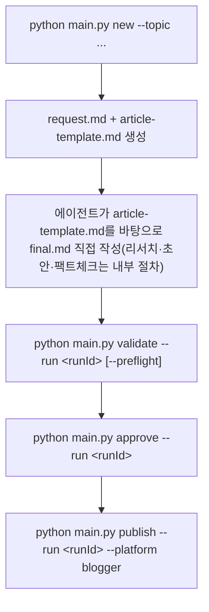

# 에이전트별 지침 및 아키텍처 가이드

이 문서는 `ai-blogging` 프로젝트의 자동화 글쓰기를 이행하는 CLI 파이프라인의 실제 파일 흐름, 게시 게이트 규칙, 관리자 모범 사례에 대한 가이드라인입니다.

## 1. 실제 파일 흐름

블로그 글 작성은 문서 이론상의 5단계(주제→리서치→초안→팩트체크→편집) 파일 핸드오프가 **아니라**, `python main.py` CLI가 관리하는 단일 실행 디렉토리(`temp/runs/<runId>/`) 안에서 진행됩니다. 리서치·초안 작성·사실 검증은 어디까지나 글을 쓰는 에이전트(Claude 등)가 **내부적으로 수행하는 작업 절차**일 뿐, 시스템이 별도 파일로 강제하지는 않습니다.

실행 디렉토리(`temp/runs/<runId>/`)에 실제로 존재하는 파일은 다음 5개뿐입니다.

| 파일 | 생성 시점 | 생성 주체 |
| --- | --- | --- |
| `state.json` | `new` 실행 시 | `src/pipeline/new_run.py` (`RunState`) |
| `request.md` | `new` 실행 시 | `src/pipeline/new_run.py` (주제/생성 시각 기록용 메모) |
| `article-template.md` | `new` 실행 시 | `wiki/templates/article.md`를 렌더링(`{{articleId}}`/`{{title}}`/`{{slug}}`/`{{createdAt}}` 치환) |
| `final.md` | 에이전트가 직접 작성 | 글쓰기 에이전트 (시스템이 생성하지 않음) |
| `publish-result.json` | `publish` 성공 시 | `src/publishers/__init__.py::publish_to_multi` |

## 2. CLI 명령어

`main.py`가 지원하는 서브커맨드는 다음과 같습니다 (`python main.py <command> [options]`).

| 명령 | 옵션 | 동작 |
| --- | --- | --- |
| `new` | `--topic "<주제>"` | `create_run()` — 새 `runId` 생성, `request.md` + `article-template.md` 작성 |
| `validate` | `--run <runId>` `[--preflight]` `[--skip-link-check]` | `validate_run()` — 게시 게이트 검사(아래 3절). `--preflight`면 `humanApproved` 체크를 건너뜀, `--skip-link-check`면 참고문헌 URL 생존 확인(네트워크 호출)을 건너뜀 |
| `approve` | `--run <runId>` | `approve_run()` — `state.json`의 `humanApproved`를 `true`로 기록 |
| `publish` | `--run <runId>` `[--platform blogger,notion]` `[--dry-run]` | `publish_to_multi()` — 게이트 재검증 후 실제 게시. `--platform` 미지정 시 기본값 `blogger` |
| `sync` | – | Notion 페이지를 MDX로 동기화 |
| `todo` | `[--status ...]` | `final.md`의 `## 꼬리질문` 섹션에서 파싱된 후속 질문 TODO 목록 조회 |
| `backlinks` | – | 지식 그래프 기반 백링크 조회 |
| `theme` | – | Blogger 테마 관리 (`src/theme/theme.py`) |

에이전트가 새 글을 쓸 때의 실제 순서: `new` → (`final.md` 직접 작성) → `validate --preflight`로 사전 점검 → `approve` → `publish`.

## 3. 게시 게이트 규칙 (`src/core/publish_gate.json`)

`validate_run()`(`src/pipeline/validate.py`)이 `final.md`에 대해 검사하는 항목:

- **Frontmatter**: `ArticleFrontmatter` Pydantic 모델 검증 (id/title/slug/status/tags/factCheckScore 등)
- **필수 섹션** (`requiredSections`): `요약`, `본문`, `사실 검증 결과`, `작성자의 견해`, `한계와 반론`, `참고문헌`, `종합적 의견`, `꼬리질문` — 8개 `##` 헤딩이 모두 존재해야 함
- **최소 참고문헌 수** (`minimumReferences`): `## 참고문헌` 섹션에 리스트 항목 2개 이상
- **참고문헌 링크 유효성**: 각 항목에 `http(s)://` URL이 있는지, 있다면 실제로 접속되는지(`requests.head`/`get`)를 확인합니다. `allowBrokenLinks`가 `false`(기본값)면 URL 누락/접속 불가 시 오류, `true`면 경고로만 표시됩니다. `--skip-link-check`로 이 네트워크 호출 자체를 생략할 수 있습니다.
- **참고문헌 신뢰도 등급(경고)**: 모든 참고문헌 URL이 `TRUSTED_REFERENCE_DOMAINS`(arxiv.org, docs.oracle.com, docs.spring.io, kubernetes.io 등 Tier1/2 도메인) 목록과 하나도 안 겹치면 경고. 등급 정의는 `wiki/Blog_Writing_Rules.md` 10번 수칙 참고.
- **섹션별 최소 분량** (`sectionMinWords`): `본문`(800단어) / `작성자의 견해`(100) / `한계와 반론`(80) / `종합적 의견`(100) 미달 시 오류. 2026-08-14에 발행된 GoF 생성 패턴 4개 글이 200단어 안팎으로 통과된 사례가 재발하지 않도록 2026-08-17에 추가됨.
- **코드/이미지 부재(경고)**: 펜스드 코드블록과 이미지가 모두 0개면 경고(차단 아님 — 주제에 따라 코드가 불필요할 수 있음).
- **작성자 견해 안내문** (`requireOpinionDisclaimer`): `> 사실 전달이 아니라 작성자의 해석과 견해...`처럼 인용구(`>`)로 시작하는 줄에 해당 문구가 있어야 함(빈 `>` 뒤에 평문으로 쓰면 게이트 실패)
- **인코딩 손상 차단**: 본문에 유니코드 손상 문자(U+FFFD, `�`)가 하나라도 있으면 오류
- **미검증/반박 주장 차단**: `## 사실 검증 결과` 표(`| Claim | 판정 | 근거 |`)의 판정 셀에 `unverified` 또는 `contradicted`가 하나라도 있으면 오류. (예전엔 `Risk: high`/`Verdict: unverified` 접두 표기를 찾는 정규식이었는데, 실제 저작 포맷은 이 접두사를 쓴 적이 없어 항상 무매칭이었음 — 2026-08-17에 실제 표 셀 형식을 매칭하도록 수정)
- **근거 없는 claim 경고**: 같은 표에서 `근거` 열이 비어 있는 채로 `verified` 등 판정된 행이 있으면 경고(할루시네이션 방지용 최소 신호. `Blog_Writing_Rules.md` 13번 수칙 — 할루시네이션/난해함/과도한 단순화는 자동 게이트로 완전히 못 잡아 최종적으로 관리자 검토가 실질적 방어선임).
- **사람 승인** (`requireHumanApproval`): `--preflight` 없이 실행 시 `state.json.humanApproved`가 `true`여야 함

이 8개 필수 섹션 구조는 `wiki/templates/article.md`에 기본 스켈레톤으로 이미 포함되어 있으므로, `article-template.md`를 뼈대 삼아 각 섹션을 채워나가면 게이트 통과 요건을 자연히 만족합니다. 다만 섹션별 최소 분량은 별도로 채워야 통과합니다.

## 4. 관리자 모범 사례 (Best Practices)

- 게이트 검증(`validate`) 실패 시 오류 메시지가 어느 섹션/필드 문제인지 정확히 알려주므로, `final.md`의 frontmatter와 해당 `##` 섹션 존재 여부부터 확인합니다.
- `publish`는 내부적으로 `validate_run()`을 다시 호출하므로 게이트를 우회할 수 없습니다. `--dry-run`으로 먼저 검증 없이(단, `humanApproved` 체크는 생략됨) API 호출 없이 확인 가능합니다.
- 게시 성공 시 `final.md`는 `content/posts/<slug>.md`로 자동 복사되어 정식 자산 저장소에 편입됩니다(`publish_to_multi()` 마지막 단계). 이 파일이 곧 라이브 글의 소스 오브 트루스입니다.
  - 단, 2026-08-17 이전에 존재하던 기존 글들은 이 경로가 아니라 `src/tools/sync_published_posts.py`(Blogger 공개 피드를 그대로 긁어와 덮어쓰는 별도 백필 도구)로 채워진 것이었고, 그 과정에서 유니코드 손상(U+FFFD)이 섞여 들어간 적이 있습니다(`src/tools/patch_published_posts.py`로 로컬/라이브 양쪽 교정 완료). 앞으로 `content/posts/`를 다시 대량 재동기화할 때는 이 도구가 원본 데이터를 있는 그대로 신뢰하기보다, 손상 여부를 먼저 점검하는 습관을 들일 것.
- 각 실행의 원본 주제 확인이 필요하면 `temp/runs/<runId>/request.md`, 게시 후 결과 확인은 `publish-result.json`을 참고합니다.
- **콘텐츠 유지보수 도구**: `src/tools/apply_nav_labels.py`, `dedupe_basics_label.py`, `rename_trends_to_etc.py`, `patch_published_posts.py` — 전부 `--dry-run`을 지원하는 재사용 가능한 Blogger API 콘텐츠 수정 도구. 이미 발행된 글을 일괄 수정해야 하면 새 스크립트를 만들지 말고 이 패턴을 따를 것.
- **이미지 GitHub CDN 자동 push**: `publish`(dry-run 아닐 때)는 게이트 통과 직후 `src/publishers/__init__.py::ensure_images_pushed()`를 호출해 `content/images/`의 미반영 변경을 자동 commit·push합니다. 실패하면(네트워크/인증 등) 예외로 발행이 차단됩니다 — 이미지를 미리 수동으로 push해둘 필요는 없지만, 실패 원인을 먼저 해결해야 재발행 가능합니다.
- **사실 검증 통계 확인**: `python src/tools/report_fact_check_stats.py`(읽기 전용)로 `temp/runs/*/final.md`의 factCheckScore/verdict 분포를 주기적으로 점검합니다. 2026-08-17 기준 남아있는 17개 run 중 14개가 예외 없이 100% verified였습니다 — 형식적 검증 방지를 위해 `Blog_Writing_Rules.md` 12번 수칙(실제 원문 대조) 준수가 중요합니다.

## 관련 문서
- [위키 인덱스](README.md)
- [Google Blogger API 사용법](Google_Blogger_API_사용법.md)
