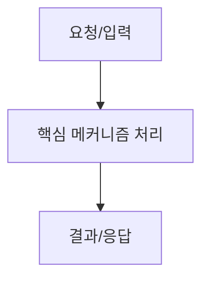

# [AI Agent 필독] 표준 블로그 포스팅 템플릿 (Blog Post Template)

본 문서는 AI Agent가 본 프로젝트에서 기술 포스팅 초안(`drafted`)을 작성하거나 글을 리팩토링할 때 **반드시 참고해야 하는 표준 포스팅 마크다운 템플릿 위키 문서**입니다.

---

## 📋 표준 마크다운 템플릿 양식 (Standard Template)

```markdown
---
id: "{{articleId}}"
title: "{{title}}"
slug: "{{slug}}"
createdAt: "{{createdAt}}"
tags: ["기술라벨1", "기술라벨2"]
---

# [글 제목]

> **TL;DR**: [포스팅 전체를 관통하는 핵심 시사점 및 결론 1~2문장 요약]

---

## 1. 개요 및 왜 필요한가? (Background & Motivation)
- 문제 상황과 이 글이 다루는 핵심 기술 주제를 두괄식으로 서술합니다.

---

## 2. 핵심 아키텍처 및 동작 원리 (Core Concept & Architecture)
- 개념의 흐름을 한눈에 파악할 수 있는 `mermaid` 다이어그램 또는 비교 표(Table)를 필수 작성합니다.



---

## 3. 실무 구현 예제 (Implementation & Code)
- 줄임표(`...`) 없는 `public static void main` 또는 Complete Runnable 소스코드 및 실행 콘솔 결과(`Expected Output`)를 작성합니다.

```java
public class Demo {
    public static void main(String[] args) {
        System.out.println("Complete Runnable Code Example");
    }
}
```

#### 💻 실행 결과 (Expected Output)
```text
Complete Runnable Code Example
```

---

## 4. 실무 주의점 및 결론 (Troubleshooting & Conclusion)
- 실무 적용 시 트레이드오프, 운영 주의사항 및 3줄 핵심 요약을 명시합니다.

---

## 5. 참고 문헌 및 레퍼런스 (References)
- 모든 URL은 클릭 가능한 하이퍼링크 `[명칭](URL)` 형태로 제공합니다.
- [공식 규격 문서명](https://example.com)
```

---

## 💡 AI Agent 작성 시 준수 사항

1. **최상단 TL;DR 필수**: H1 직후 포스팅 요약 알림 상자 작성
2. **Complete Runnable Code**: 의존성이 생략된 단편 코드 금지 (`main()` 포함 및 실행 결과 출력 필수)
3. **Mermaid 다이어그램 필수**: 흐름 시각화 작성
4. **URL 하이퍼링크 필수**: raw URL 대신 `[문서명](URL)` 변환
