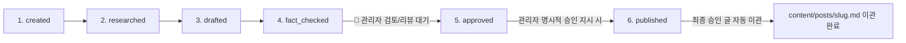

# [AI Agent 필독] 블로그 작성 및 파이프라인 룰 (Blog Writing Rules)

본 문서는 AI Agent가 본 프로젝트에서 기술 블로그 글을 수집, 작성, 검증 및 파이프라인 처리할 때 **필히 RAG 지식으로 참조해야 하는 전역 글 작성 룰 위키 문서**입니다.

---

## 🛑 1. AI Agent 필수 이행 6대 수칙

1. **일회성 API 푸시 및 스크립트 작성 전면 금지**
   - `scratch/`나 임의 경로에 일회성 API 푸시 스크립트(`enrich_*.js` 등)를 만드는 행위를 전면 금지하며, 오직 **`python main.py` 정식 오케스트레이터 파이프라인**을 구동합니다.

2. **6단계 라이프사이클 100% 이행**:
   - `created → researched → drafted → fact_checked → 🛑[관리자 검토/리뷰 명시적 승인] → approved → published`

3. **`temp/runs/${run_id}/final.md` 100% 필수 생성 및 로컬 검증 원본 보관**:
   - 파이프라인 구동 시 관리자 검토 전용 임시 로컬 파일 `final.md`를 타임스탬프 실행 폴더에 의무적으로 보관합니다.

4. **★ 다이어그램의 간소화된 이미지 자산 변환 및 배포 (Image Asset Rule)**:
   - 복잡한 텍스트/raw Mermaid 다이어그램 구역은 **`generate_image` 툴을 사용해 고품질의 간소화된 이미지 자산으로 생성 및 변환**합니다.
   - 생성된 이미지는 **`content/images/${image_name}.png`** 정식 자산 저장소에 보관하고, 본문에는 `` 링크로 삽입하여 외부 배포 시 URL 이미지 링크로 100% 연동시킵니다.

5. **관리자 명시적 승인 필수 (Human Approval Gate)**:
   - `fact_checked` 단계 완출 후 절대로 실서버에 자동 배포하지 않으며, 관리자(사용자)가 `final.md` 검토 후 **"승인/배포 지시"**를 내렸을 때만 `approved` 및 `published`를 진행합니다.

6. **`content/posts/` 자동 이관 필수**:
   - 배포 성공 시 파이프라인이 `final.md`에서 내부 검증 메모(`## 사실 검증 결과` 표 등)를 자동 Sanitization 제거 후 배포함과 동시에, **`temp/runs/${run_id}/final.md` 원본을 최종 승인 포스팅으로서 `content/posts/${slug}.md`로 자동 이관 보관**합니다.

7. **상단 탭 분류 라벨 필수 부여 (Nav Classification Label Rule)**:
   - 블로그 테마 상단 탭(Home/Basics/Advanced/Trends)은 글의 `tags`에 실제로 붙은 라벨만 보고 분류합니다(키워드 추론 없음). 모든 신규 글의 `tags`에는 아래 세 라벨 중 **정확히 하나**를 반드시 포함해야 합니다:
     - **기초(Basics)**: 개념/정의 위주의 입문 글 → `기초` 또는 `Basics` 라벨
     - **심화(Advanced)**: 아키텍처 심층 분석, 튜닝, 실무 트레이드오프 글 → `Advanced` 라벨
     - **트렌드(Trends)**: 최신 기술/emerging 주제 글 → `Trends` 라벨
   - 분류가 애매한 글은 심화(Advanced)를 기본값으로 사용합니다. 이미 배포된 기존 38개 글은 `src/tools/apply_nav_labels.py`로 일괄 백필했습니다.

---

## 2. 자산 디렉터리 역할 구별

- **`wiki/`**: 본 블로그 시스템의 프로젝트 개발/운용 가이드 및 **AI Agent가 필히 읽고 참고하는 작성 규칙/템플릿/테마 RAG 지식 노드**
- **`content/posts/`**: 관리자 승인 및 배포가 완출된 **최종 검토 마크다운 글 저장소**
- **`content/images/`**: 배포 시 외부 URL 링크 (``)로 연결되는 **완성형 이미지 저장소 (유지)**
- **`temp/runs/${run_id}/`**: 파이프라인 구동 중 관리자 검토용 로컬 `final.md`가 생성되는 **임시 작업 디렉토리**
