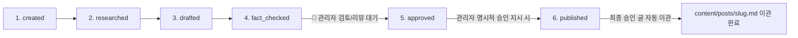

# [AI Agent 필독] 블로그 작성 및 파이프라인 룰 (Blog Writing Rules)

본 문서는 AI Agent가 본 프로젝트에서 기술 블로그 글을 수집, 작성, 검증 및 파이프라인 처리할 때 **필히 RAG 지식으로 참조해야 하는 전역 글 작성 룰 위키 문서**입니다.

---

## 🛑 1. AI Agent 필수 이행 수칙

1. **일회성 API 푸시 및 스크립트 작성 전면 금지**
   - `scratch/`나 임의 경로에 일회성 API 푸시 스크립트(`enrich_*.js` 등)를 만드는 행위를 전면 금지하며, 오직 **`python main.py` 정식 오케스트레이터 파이프라인**을 구동합니다.

2. **6단계 라이프사이클 100% 이행**:
   - `created → researched → drafted → fact_checked → 🛑[관리자 검토/리뷰 명시적 승인] → approved → published`



3. **`temp/runs/${run_id}/final.md` 100% 필수 생성 및 로컬 검증 원본 보관**:
   - 파이프라인 구동 시 관리자 검토 전용 임시 로컬 파일 `final.md`를 타임스탬프 실행 폴더에 의무적으로 보관합니다.

4. **★ 다이어그램의 간소화된 이미지 자산 변환 및 배포 (Image Asset Rule)**:
   - 복잡한 텍스트/raw Mermaid 다이어그램 구역은 **`generate_image` 툴을 사용해 고품질의 간소화된 이미지 자산으로 생성 및 변환**합니다.
   - 생성된 이미지는 **`content/images/${image_name}.png`** 정식 자산 저장소에 보관하고, 본문에는 `` 링크로 삽입하여 외부 배포 시 URL 이미지 링크로 100% 연동시킵니다.
   - 배포 시 `converter.py`가 이 로컬 이미지를 GitHub Raw CDN URL(`raw.githubusercontent.com/.../content/images/${filename}`)로 자동 치환하는데, 이 URL은 **해당 파일이 실제로 GitHub 원격 저장소에 push되어 있어야만** 살아있습니다. `publish` 명령이 게이트 통과 직후 `content/images/`의 미반영 변경을 자동으로 commit·push하므로(`src/publishers/__init__.py::ensure_images_pushed()`), push 실패 시 발행 자체가 차단됩니다 — 수동으로 이미지를 미리 push해둘 필요는 없지만, 이 자동 push가 실패하면(네트워크/인증 문제 등) 원인을 먼저 해결해야 발행이 재개됩니다.

5. **관리자 명시적 승인 필수 (Human Approval Gate)**:
   - `fact_checked` 단계 완출 후 절대로 실서버에 자동 배포하지 않으며, 관리자(사용자)가 `final.md` 검토 후 **"승인/배포 지시"**를 내렸을 때만 `approved` 및 `published`를 진행합니다.

6. **`content/posts/` 자동 이관 필수**:
   - 배포 성공 시 파이프라인이 `final.md`에서 내부 검증 메모(`## 사실 검증 결과` 표 등)를 자동 Sanitization 제거 후 배포함과 동시에, **`temp/runs/${run_id}/final.md` 원본을 최종 승인 포스팅으로서 `content/posts/${slug}.md`로 자동 이관 보관**합니다.

7. **상단 탭 분류 라벨 필수 부여 (Nav Classification Label Rule)**:
   - 블로그 테마 상단 탭(Home/Basics/Advanced/ETC)은 글의 `tags`에 실제로 붙은 라벨만 보고 분류합니다(키워드 추론 없음). 모든 신규 글의 `tags`에는 아래 세 라벨 중 **정확히 하나만** 영어 단일 표기로 포함해야 합니다 (한/영 중복 라벨 금지 — 예전에 `기초`+`Basics`를 함께 붙였다가 정리한 적 있음):
     - **Basics**: 개념/정의 위주의 입문 글
     - **Advanced**: Basics도 ETC도 아닌 나머지 전부 (아키텍처 심층 분석, 튜닝, 실무 트레이드오프 등). 분류가 애매하면 기본값으로 사용
     - **ETC**: AI 에이전트/Kubernetes/DevOps/HTTP3 등 소수 특정 주제만 모으는 카테고리
   - 이미 배포된 기존 38개 글은 `src/tools/apply_nav_labels.py`(초기 분류 백필), `src/tools/dedupe_basics_label.py`(기초/Basics 중복 정리), `src/tools/rename_trends_to_etc.py`(Trends→ETC 개명)로 일괄 정리했습니다.

8. **`final.md`는 항상 UTF-8로 쓰고, 멀티바이트 문자를 자르는 부분 편집 금지**
   - 2026-08-17에 `content/posts/*.md` 33개 파일·라이브 Blogger 게시물 2개에서 유니코드 손상 문자(U+FFFD, `�`)가 발견되어 `src/tools/patch_published_posts.py`로 전량 교정한 사례가 있습니다. 정확한 발생 지점은 특정하지 못했으나, 한글 같은 멀티바이트 문자를 다루는 도구(에디터, 셸, 부분 문자열 편집)를 파일 인코딩 확인 없이 오갈 때 발생할 수 있는 것으로 추정됩니다.
   - `final.md`를 쓰거나 수정할 때는 항상 UTF-8 인코딩을 명시하고, 멀티바이트 문자 중간을 잘라내는 바이트 단위/부분 범위 편집을 피합니다.
   - `python main.py validate`가 이제 본문에 `�`가 하나라도 있으면 게이트에서 자동으로 막으므로(`src/pipeline/validate.py`), 손상이 있으면 발행 전에 반드시 걸러집니다.

9. **최신 공식 문서 우선 확인 (Official-Source-First Rule)**:
   - 본문 작성 전, 다루는 기술/개념의 **최신 공식 문서(버전 명시)**를 1차 자료로 먼저 확인하고 이를 바탕으로 핵심 내용을 확정합니다. 블로그·커뮤니티 글은 공식 문서로 확인이 안 될 때 보조 자료로만 사용합니다.
   - `## 참고문헌`의 모든 항목에 확인일을 표기합니다 (예: `(확인일: 2026-08-17)`). 일부 글에 산발적으로 있던 관행을 전역 규칙으로 승격한 것입니다.

10. **참고문헌 신뢰도 등급 (Reference Credibility Tier)**:
    - 참고문헌은 아래 등급 순으로 우선 채택합니다. 등급이 낮은 출처(Tier 3)만으로 참고문헌을 채우는 것은 지양합니다.
      - **Tier 1**: Impact Factor 10 이상 학술지 논문, IEEE/ACM/Springer/Nature급 저널, IETF RFC, W3C 표준 문서.
      - **Tier 2**: 공식 벤더/재단 문서 — Oracle, Spring(spring.io), Kubernetes(kubernetes.io), CNCF, Linux Foundation, MDN, 클라우드 공식 문서(AWS/GCP/Azure) 등.
      - **Tier 3 (최후 수단)**: 방문수 높은 기술 블로그(Baeldung, InfoQ, 각 벤더 official blog 등). Tier 1/2로 충분히 뒷받침이 안 될 때만 보조적으로 사용합니다.
    - `src/pipeline/validate.py`가 참고문헌 URL이 알려진 Tier1/2 도메인(`TRUSTED_REFERENCE_DOMAINS`)과 하나도 안 겹치면 경고를 띄웁니다(발행 차단은 아님).
    - 존재하지 않거나 오타가 섞인 도메인(예: 과거 `docs.spring.org` 사례 — 실제는 `docs.spring.io`)을 인용하지 않도록, 링크를 넣기 전 실제로 열어서 확인합니다.

11. **섹션별 최소 분량 (Section Length Gate)**:
    - `src/core/publish_gate.json`의 `sectionMinWords`에 정의된 섹션(`본문` 800단어, `작성자의 견해` 100단어, `한계와 반론` 80단어, `종합적 의견` 100단어)은 미달 시 **발행이 차단**됩니다. 2026-08-14에 발행된 GoF 생성 패턴 4개 글(싱글톤/팩토리 메서드/추상 팩토리/빌더)이 200단어 안팎으로 지나치게 얇게 통과된 사례가 재발하지 않도록 만든 게이트입니다.
    - 코드/구현 메커니즘을 다루는 글은 최소 1개 이상의 언어 태그 코드펜스(```java 등)를, 가능하면 다이어그램/스크린샷 이미지도 포함할 것을 권장합니다(둘 다 0개면 경고).

12. **사실 검증은 실제 원문 대조로 수행 (No Rubber-Stamp Verification)**:
    - `## 사실 검증 결과`의 각 `CLAIM`을 `verified`로 판정할 때는 반드시 9·10번 수칙에서 실제로 확인한 공식 문서/논문 원문과 대조한 결과여야 합니다. 자기 사전지식만으로 판정하지 않습니다.
    - 모든 claim이 예외 없이 `verified`이고 `factCheckScore: 1.0`인 패턴이 반복되면 형식적 검증(rubber-stamp)일 위험이 있습니다 — `python src/tools/report_fact_check_stats.py`로 주기적으로 분포를 점검합니다.

13. **분량은 하한선일 뿐, 내용의 질이 우선입니다 (Quality Over Word Count)**:
    - 11번 수칙의 섹션별 최소 분량은 **하한선**입니다. 이를 넘기는 건 전혀 문제가 없지만, 분량을 채우기 위한 아래 3가지 실패 패턴은 절대 금지합니다 — 게이트가 자동으로 못 잡는 부분이라 작성 시점에 스스로 점검해야 합니다.
      - **할루시네이션 금지**: 본문의 모든 사실적 주장은 9·10·12번 수칙에서 실제로 확인한 출처에 근거해야 합니다. 확인되지 않았거나 확신이 서지 않는 내용은 사실처럼 서술하지 말고, 명확히 추정/의견으로 표시하거나(`작성자의 견해`, `한계와 반론` 섹션 활용) 아예 빼는 것을 우선합니다.
      - **불필요하게 난해한 서술 금지**: 목표 독자(글의 `tags`가 `Basics`면 입문자, `Advanced`/`ETC`면 실무자)가 이해할 수 있는 수준으로 씁니다. 전문 용어를 처음 쓸 때는 짧게라도 풀어 설명하고, 문장을 불필요하게 길게 늘여 어렵게 만들지 않습니다.
      - **과도한 단순화 금지**: 반대로 분량은 채웠지만 같은 내용을 다른 말로 반복하거나 피상적으로만 훑고 지나가는 "패딩"도 금지합니다. 각 문단은 새로운 정보(구체적 수치, 실제 코드/설정, 트레이드오프, 실무 사례 등)를 추가해야 하며, 단어 수를 채우기 위한 동어반복은 지양합니다.
    - 이 3가지는 자동 게이트로 완전히 검출하기 어려워 최종적으로는 `requireHumanApproval`(관리자 검토) 단계가 실질적 방어선입니다. 관리자 승인 전 스스로 다시 읽으며 이 기준으로 점검할 것.

---

## 2. 자산 디렉터리 역할 구별

- **`wiki/`**: 본 블로그 시스템의 프로젝트 개발/운용 가이드 및 **AI Agent가 필히 읽고 참고하는 작성 규칙/템플릿/테마 RAG 지식 노드**
- **`content/posts/`**: 관리자 승인 및 배포가 완출된 **최종 검토 마크다운 글 저장소**
- **`content/images/`**: 배포 시 외부 URL 링크 (``)로 연결되는 **완성형 이미지 저장소 (유지)**
- **`temp/runs/${run_id}/`**: 파이프라인 구동 중 관리자 검토용 로컬 `final.md`가 생성되는 **임시 작업 디렉토리**
