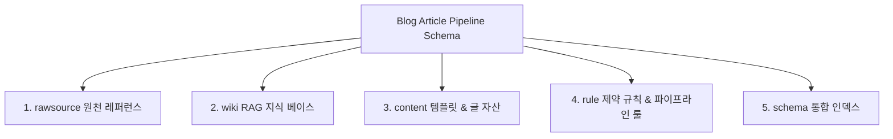

# [Blog 글 작성 & 파이프라인 스키마] (Blog Article Pipeline Schema)

본 스키마 문서는 당사 블로그 시스템에서 **기술 포스팅을 수집, 작성, 검증, 관리 및 파이프라인 구동**하기 위해 지켜야 할 5대 자산과 규칙을 정리하고 인덱싱한 **글 작성 파이프라인 표준 스키마 문서**입니다.

> 이 문서는 [`AGENTS.md`](../../AGENTS.md) §1·§3이 참조하는 Blog 글 작성 영역 SSOT입니다.

---

## 1. 글 작성 5대 구성 요소 인덱싱 (Core 5 Elements)

---

### 1.1 RawSource (원천 기술 레퍼런스)
- **공식 기술 규격**: POSIX 표준, RFC 문서 (RFC 9114 HTTP/3, RFC 9000 QUIC 등), Linux Kernel Documentation
- **공식 개발자 가이드**: Kubernetes Docs, Spring Framework Official Specs, Node.js API Reference
- **학술 및 전문 문서**: W. Richard Stevens의 *UNIX Network Programming*, Cloudflare/Toss/Line Tech Blog Reference

---

### 1.2 Wiki (AI Agent 참고 RAG 지식 베이스)
- **위키 디렉터리 경로**: [`wiki/`](file:///d:/coding-project/2026-project/ai-blogging/wiki/)
- **주요 지식 노드**:
  - [`wiki/README.md`](file:///d:/coding-project/2026-project/ai-blogging/wiki/README.md): RAG 연동 지식 베이스 인덱스
  - [`wiki/Agent_Guidelines.md`](file:///d:/coding-project/2026-project/ai-blogging/wiki/Agent_Guidelines.md): 에이전트 지식 활용 지침
  - [`wiki/Google_Blogger_API_사용법.md`](file:///d:/coding-project/2026-project/ai-blogging/wiki/Google_Blogger_API_%EC%82%AC%EC%9A%A9%EB%B2%95.md): API 서비스 계정 및 퍼블리싱 지식

---

### 1.3 Content (글 작성 구분 템플릿 & 배포 자산)
- **글 작성 구분 템플릿**: [`wiki/templates/article.md`](file:///d:/coding-project/2026-project/ai-blogging/wiki/templates/article.md) (Frontmatter 및 표준 헤더 골격)
- **정식 글 저장소**: `content/posts/` (최종 승인 및 배포 완료된 마크다운 아티클 노드)
- **지식 그래프 DB**: `wiki/knowledge-graph.json` (포스팅 간 관련성, 백링크, 연관 관계 지식 네트워크)
- **이미지 자산**: `content/images/` (포스팅 본문 시각 자산)

---

### 1.4 Rule (사용자 지시 및 파이프라인 제약 수칙)
- **통합 규칙 문서**: [`wiki/rules/blogger_rules.md`](file:///d:/coding-project/2026-project/ai-blogging/wiki/rules/blogger_rules.md)
- **사용자 필수 지시 4대 핵심 수칙**:
  1. **일회성 스크립트 작성 전면 금지**: `scratch/*.js` 등 임의의 일회성 API 전송 스크립트를 절대 금지하며, 오직 `python main.py` 정식 오케스트레이터를 통한다.
  2. **6단계 정식 라이프사이클 100% 이행**:
     `created → researched → drafted → fact_checked → 🛑[관리자 리뷰 대기] → approved → published`
  3. **`temp/runs/${run_id}/final.md` 100% 필수 보관**: 배포 전 로컬 검증 원본 `final.md`를 타임스탬프 실행 폴더에 의무적으로 보관한다.
  4. **관리자 명시적 승인 필수 (Human Approval Gate)**: `fact_checked` 완료 후 절대 자동 배포하지 않으며, 관리자(사용자)가 `final.md` 검토 후 **"승인/배포 지시"**를 내렸을 때만 실서버로 배포한다. (배포 시 `## 사실 검증 결과` 표 자동 Sanitization)

---

### 1.5 Schema (위 사항의 통합 링크 & 인덱싱)
- **전체 글 작성 파이프라인 인덱스**: 본 문서 ([`wiki/rules/blog_article_pipeline_schema.md`](file:///d:/coding-project/2026-project/ai-blogging/wiki/rules/blog_article_pipeline_schema.md))
- **에이전트 행동 수칙 인덱스**: 프로젝트 최상위 [`AGENTS.md`](file:///d:/coding-project/2026-project/ai-blogging/AGENTS.md)

## 관련 세션
- `../sessions/raw/2026-08-16.md:31178-31214` (pipeline, 2026-08-16)
- `../sessions/raw/2026-08-16.md:34838-34954` (pipeline, 2026-08-16)
- 전체 인덱스: [Session_Index.md](../Session_Index.md)
