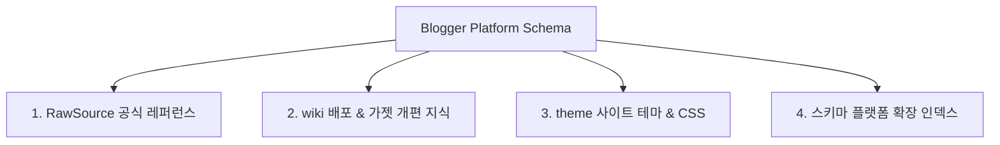

# [Blogger 배포 & 테마 플랫폼 스키마] (Blogger Platform Schema)

본 스키마 문서는 구글 Blogger(Blogspot)의 테마 수정, 가젯 연동, 퍼블리싱 규격, 그리고 향후 Naver/Tistory 등 외부 퍼블리싱 플랫폼으로의 확장을 대비하여 관련 자산을 링크 및 인덱싱한 **플랫폼 배포 표준 스키마 문서**입니다.

> 이 문서는 [`AGENTS.md`](../../AGENTS.md) §1·§3이 참조하는 Blogger 배포 영역 SSOT입니다.

---

## 1. 플랫폼 구성 요소 인덱싱 (Indexing Schema)

---

### 1.1 RawSource (공식 규격 & 참고 URL)
- **Blogger Layouts V3 공식 개발 가이드**: [Blogger Layouts V3 Guide](https://developers.google.com/blogger/docs/3.0/reference)
- **Blogger Widget/Gadget XML Spec**: [Blogger Widget Tags & Data Expressions](https://support.google.com/blogger/answer/42247)
- **Google Blogger REST API v3**: [Google Blogger API v3 Docs](https://developers.google.com/blogger/docs/3.0/getting_started)

---

### 1.2 wiki (테스트 및 개편 지식)
- **Blogger Layouts V3 종합 기술 레퍼런스**: [`wiki/theme/blogger_layout_thema_widget.md`](file:///d:/coding-project/2026-project/ai-blogging/wiki/theme/blogger_layout_thema_widget.md)
  * Blogger XML 최상위 계층, `<b:section>`, `<b:widget>`, `<b:defaultmarkups>` 가젯 동적 연동 수칙
  * `SAXParseException` (`&` ➔ `&amp;&amp;` / CDATA) 이스케이프 및 XML 검증 수칙
  * `Dynamic Card Pager Engine` (비동기 Feed API 기반 숫자 페이징 동적 카트 교체 및 외부 CDN 의존성 제거 인라인 100% 임베딩) 명세
  * `Category Modal Portal Engine` (DOM Body Portal 전이 & `initCategoryTagsLimit()` 상위 8개 칩 + `...` 더보기 모달 변환) 명세
  * `rockpool Schema & Nav Overlap Resolution` (`b:defaultmessages='false'` 제거, `all-head-content`, `b:defaultmarkups`, `b:template-skin`, `<Variable>` 스키마 정의 및 `padding-top: 80px`, `margin-top: 90px` 이격 레이아웃) 명세

---

### 1.3 theme (사이트 테마 템플릿 실배포 자산)
- **Blogger 종합 테마 XML**: [`content/theme/blogger_site_theme.xml`](file:///d:/coding-project/2026-project/ai-blogging/content/theme/blogger_site_theme.xml)
- **세분화 CSS 모듈**: [`content/theme/css/core-layout.css`](file:///d:/coding-project/2026-project/ai-blogging/content/theme/css/core-layout.css), [`content/theme/css/components.css`](file:///d:/coding-project/2026-project/ai-blogging/content/theme/css/components.css)
- **세분화 JS 모듈**: [`content/theme/js/category-modal.js`](file:///d:/coding-project/2026-project/ai-blogging/content/theme/js/category-modal.js), [`content/theme/js/card-pager.js`](file:///d:/coding-project/2026-project/ai-blogging/content/theme/js/card-pager.js)
- **글 본문 CSS 스타일시트**: [`content/theme/blogger_post_style.css`](file:///d:/coding-project/2026-project/ai-blogging/content/theme/blogger_post_style.css)
- **테마 백업 저장소 규격**: [`temp/backups/theme/`](file:///d:/coding-project/2026-project/ai-blogging/temp/backups/theme/)

---

### 1.4 스키마 (Schema - 외부 플랫폼 확장 인덱스)
- **현재 적용 플랫폼**:
  - **Blogger (Blogspot)**: XML Layout V3 + REST API v3 + HTML Sanitization Publisher
- **향후 확장 퍼블리싱 플랫폼 인덱스**:
  - **Tistory**: Tistory Skin Tag Schema + Tistory REST API Publisher
  - **Naver**: Naver Blog API + SmartEditor HTML Publisher

<!-- AUTO:related-sessions:start -->

## 관련 세션
이 문서와 관련된 세션 아카이브(자동 생성 — 태그 매칭 기반):

- [2026-08-16](../sessions/raw/2026-08-16.md)
- [2026-08-12](../sessions/raw/2026-08-12.md)
- [2026-08-11](../sessions/raw/2026-08-11.md)

<!-- AUTO:related-sessions:end -->
