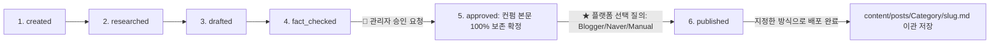

# Blogger 퍼블리싱 및 글 작성 통합 표준 가이드라인 (Blogger Standard Rules)

본 가이드는 당사 블로그 프로젝트에서 준수해야 하는 배포/퍼블리싱의 고정 규칙, 6단계 포스팅 라이프사이클, 관리자 명시적 승인 게이트, 그리고 최종 승인 포스팅 자동 이관 규격을 정리한 **단일 진실 출처(Single Source of Truth) 표준 규칙 문서**입니다.

> 이 문서는 [`AGENTS.md`](../../AGENTS.md) §2~3이 요약·참조하는 SSOT입니다. Agent는 요약이 아니라 이 문서의 전문을 따른다.

---

## 1. 관리자 컨펌 본문 절대 불가침 및 배포 선택 수칙 (Human Approval Unalterable & Platform Choice) 🛑

- **★ 관리자 컨펌 본문 절대 불가침 수칙**:
  - **관리자(사용자)가 검토하고 승인/컨펌한 포스팅 본문(내용, 코드, 다이어그램, 수치 등)은 AI Agent가 임의로 판단하여 축약, 수정, 삭제, 재작성하는 행위를 엄격히 금지합니다.**
  - 파이프라인 검증 에러나 게이트 불합격이 발생한 경우, 컨펌된 마크다운 본문을 임의 수정하는 것은 전면 용납되지 않으며, **오직 파이썬 소스 코드(`src/`)나 게이트 검증 스키마를 수정하여 컨펌된 본문이 100% 보존되도록 소스를 해결해야 합니다.**

- **post 이관 및 배포 방식 질의 수칙**:
  - `fact_checked` 단계가 완료되고 관리자(사용자)가 **"승인/배포/post로 옮겨라"**는 지시를 내렸을 때, **에이전트는 절대로 단독 판단으로 배포하지 않고, 관리자에게 아래 3가지 배포 방식을 다시 물어본 후 진행합니다**:
    1. 🔴 **Blogger**: Blogger REST API를 통한 실서버 자동 퍼블리싱
    2. 🟢 **Naver**: Naver API / 네이버 블로그 포맷으로 전달 및 준비
    3. 🔵 **Manual (수동)**: 실서버 API 푸시 없이 `content/posts/<Category>/${slug}.md`로 이관만 하고 사용자가 수동으로 복사하여 배포하도록 준비

---

## 2. 6단계 포스팅 라이프사이클 & 배포 선택 흐름

모든 포스팅은 시스템 파이프라인(`src/core/types.py`의 `Status` Enum)의 6단계 상태 전환을 100% 이행합니다:

1. **`created`**: 주제 할당, Frontmatter 메타데이터 등록
2. **`researched`**: 공식 표준(POSIX, RFC, 학술 문서 등) 전거 수집
3. **`drafted`**: 표준 마크다운 초안 생성
4. **`fact_checked`**: 팩트 검증 표 작성 후 **`temp/runs/${run_id}/final.md` 100% 필수 생성**
5. **`approved`**: 🛑 **[관리자 승인 게이트]** 관리자가 `final.md` 리뷰 후 승인 명령을 내린 경우 (컨펌 본문 절대 수정 금지)
6. **`published`**: 
   - 관리자에게 **"Blogger로 전송할지, Naver로 전송할지, 수동 배포(Manual)로 이관할지" 질의 후 선택된 방식으로 진행**
   - 배포 직후 `temp/runs/${run_id}/final.md` 원본을 `content/posts/<Category>/${slug}.md` 정식 자산 저장소로 이관 보관(Category는 tags 기준 Basics/Advanced/ETC, 2026-08-23 카테고리화)

---

## 3. Blogger 테마 XML & SAXParseException 트러블슈팅 지식 수칙 ⚠️

- **Blogger SAXParseException 예방 수칙**:
  - 구글 Blogger XML 엔진은 엄격한 SAX 파싱을 수행하므로, 테마 XML 작성 시 자바스크립트나 HTML 속성의 `&` 문자는 반드시 `&amp;&amp;`로 이스케이프하거나 `//<** 및 **[`wiki/rules/blogger_platform_schema.md`](file:///d:/coding-project/2026-project/ai-blogging/wiki/rules/blogger_platform_schema.md)** 지식 문서에 100% 지속 누적 기록 업데이트합니다.

## 관련 세션
- `../sessions/raw/2026-08-16.md:33543-33577` (blogger-api, 2026-08-16)
- `../sessions/raw/2026-08-16.md:33507-33542` (blogger-api, 2026-08-16)
- 전체 인덱스: [Session_Index.md](../Session_Index.md)
